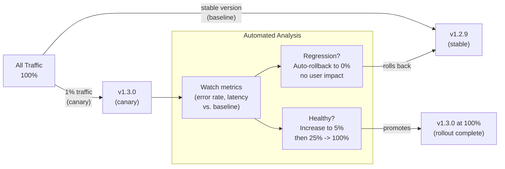

## In simple terms

A **canary deployment** releases new software cautiously, to a small group first. Instead of switching everyone to the new version at once, you send maybe 1% of traffic to it, watch closely, and only widen the rollout — 5%, 25%, 100% — if everything looks healthy. If the new version misbehaves, only that small fraction of users was affected, and you roll back before most people ever saw it. The name comes from the "canary in a coal mine": a small early warning that protects everyone else.

## The Visual Map



## More detail

A canary rollout is a controlled, **gradual traffic shift** with automated checks at each step:

1. Deploy the new version alongside the old one.
2. Route a small percentage of traffic to it.
3. Compare the canary's **metrics** — error rate, latency, resource use — against the stable version (and against your [SLOs](/t/slo-sli-sla)).
4. If healthy, increase the percentage; if not, automatically roll back.

What makes canaries powerful:

- **Limited blast radius** — a bad release harms a small, contained group instead of everyone (the key contrast with [blue-green](/t/blue-green-deployment), which exposes all users at once).
- **Real-traffic validation** — the new version is judged on actual production load and behaviour, not just a staging test.
- **Automation** — modern tools (Argo Rollouts, Flagger, Spinnaker) automate the analyse-and-promote loop based on metrics, so a human isn't watching dashboards by hand.

Canaries pair naturally with [feature flags](/t/feature-flag): the flag controls *who* sees a feature, the canary controls *how much traffic* hits a new deployment — overlapping tools for the same goal of de-risking releases. The main requirement is good [observability](/t/observability): you can only trust a canary if you can accurately compare its health to the baseline.

## Under the Hood

Automated canary analysis — compare canary vs. baseline metrics and decide promote/rollback:

```python
import random, statistics

random.seed(42)

def sample_latency(mean_ms: float, n: int = 100) -> list:
    return [random.expovariate(1/mean_ms) for _ in range(n)]

def sample_error_rate(rate: float, n: int = 100) -> float:
    return sum(1 for _ in range(n) if random.random() < rate) / n

class CanaryAnalyzer:
    def __init__(self, latency_threshold_ms=250, error_rate_threshold=0.02):
        self.lat_thresh = latency_threshold_ms
        self.err_thresh = error_rate_threshold

    def analyse(self, baseline: dict, canary: dict) -> dict:
        lat_p99_delta = canary["lat_p99"] - baseline["lat_p99"]
        err_delta     = canary["error_rate"] - baseline["error_rate"]
        healthy       = (canary["lat_p99"] <= self.lat_thresh and
                         canary["error_rate"] <= self.err_thresh and
                         lat_p99_delta <= 20 and
                         err_delta <= 0.01)
        return {"healthy": healthy,
                "lat_p99_delta_ms": lat_p99_delta,
                "err_delta": err_delta}

def rollout_canary(target_version: str, bug_rate: float = 0.005):
    print(f"\nCanary rollout: {target_version}  (injected bug rate: {bug_rate:.1%})")
    analyzer = CanaryAnalyzer()
    steps    = [1, 5, 25, 50, 100]
    current  = 0

    for pct in steps:
        baseline = {
            "lat_p99":   statistics.quantiles(sample_latency(80), n=100)[98],
            "error_rate": sample_error_rate(0.005)
        }
        canary = {
            "lat_p99":   statistics.quantiles(sample_latency(90 if bug_rate > 0.02 else 80), n=100)[98],
            "error_rate": sample_error_rate(bug_rate)
        }
        result = analyzer.analyse(baseline, canary)
        status = "PROMOTE" if result["healthy"] else "ROLLBACK"
        print(f"  {pct:>3}% canary  lat_p99_delta={result['lat_p99_delta_ms']:>+5.0f}ms  "
              f"err_delta={result['err_delta']:>+.3%}  -> {status}")
        if not result["healthy"]:
            print(f"  Rolled back to 0% canary. {pct}% of users saw the bug.")
            return False
        current = pct
    print(f"  Canary promoted to 100%. Rollout complete.")
    return True

rollout_canary("v1.3.0", bug_rate=0.005)   # healthy
rollout_canary("v1.3.1", bug_rate=0.04)    # buggy: high error rate
```

## Engineering Trade-offs

**Detection lag:** a 1% canary means only 1% of users experience a bug before detection. But if traffic is low (100 requests/hour), 1% = 1 request/hour — too little data to detect a 2% error rate in a reasonable time window. Minimum canary sample size: aim for 100–1000 requests before each promotion decision; adjust percentage accordingly.

**Blast radius of the canary stage:** if the first canary stage is 1%, a catastrophic bug (data corruption, security breach) still affects 1% of users — potentially thousands of people for large services. Some teams use "shadow mode" (mirror traffic, discard canary responses) for the highest-risk changes before any real traffic exposure.

**Session stickiness:** if users are routed to different versions on different requests, they may see inconsistencies (a UI that changes mid-session). Use sticky sessions (route by user ID, not randomly) so each user consistently hits the same version throughout a session.

**Metric collection window:** too short a window → insufficient data → false promotion. Too long a window → slow rollout → teams abandon the process. A good default: 15-30 minutes per stage for steady-state services; 1 hour for services with pronounced traffic patterns (e.g., only busy during business hours).

## Real-world examples

- A service rolls a new build to 1% of users; an automated analysis compares error rates to the stable version; the rollout auto-promotes to 100% over an hour — or auto-rolls-back on a regression.
- Large platforms (Google, Netflix, Meta) canary virtually every production change, often region by region.
- Combining a canary with a [feature flag](/t/feature-flag) so a risky feature is both gradually deployed *and* individually toggleable.

## Common misconceptions

- **"Canary and blue-green are interchangeable."** Both reduce release risk, but a canary shifts traffic *gradually* to limit exposure, while [blue-green](/t/blue-green-deployment) flips *everyone* at once with instant rollback.
- **"A canary needs no monitoring."** It's the opposite — a canary is only as good as your ability to compare its metrics to the baseline; weak observability makes it a guess.

## Try it yourself

Simulate a canary rollout with automated promotion/rollback decisions:

```bash
python3 - <<'EOF'
import random

random.seed(42)

def canary_step(pct: float, baseline_err: float, canary_err: float) -> str:
    # Real canary: compare error rates statistically; here we use a simple threshold
    if canary_err > baseline_err * 2 or canary_err > 0.05:
        return "ROLLBACK"
    return "PROMOTE"

baseline_error_rate = 0.008   # 0.8% baseline
bug_introduced      = False   # try True to see rollback

print(f"Canary rollout simulation  (baseline error rate: {baseline_error_rate:.1%})")
print(f"{'Stage':>8}  {'Canary err':>12}  {'Decision':>10}  {'Users exposed'}")
print("-" * 50)

for pct in [1, 5, 25, 50, 100]:
    canary_err = 0.04 if bug_introduced else baseline_error_rate * random.uniform(0.8, 1.3)
    decision   = canary_step(pct, baseline_error_rate, canary_err)
    exposed    = f"~{pct}% of users"
    print(f"{pct:>7}%  {canary_err:>11.1%}  {decision:>10}  {exposed}")
    if decision == "ROLLBACK":
        print(f"  Rolled back! Only {pct}% of users saw the bug.")
        break
else:
    print("  Full rollout complete.")
EOF
```

## Learn next

- [Blue-green deployment](/t/blue-green-deployment) — the all-at-once alternative: flip all traffic at once with instant rollback rather than gradual exposure; better when you need to minimise version co-existence duration
- [Feature flag](/t/feature-flag) — canaries control traffic percentage; feature flags control which users see a feature within that traffic; using both together gives maximum deployment flexibility
- [Observability](/t/observability) — canary analysis depends on accurate, low-latency metrics; high-cardinality telemetry lets you compare canary vs. baseline across user segments, regions, and feature variants
