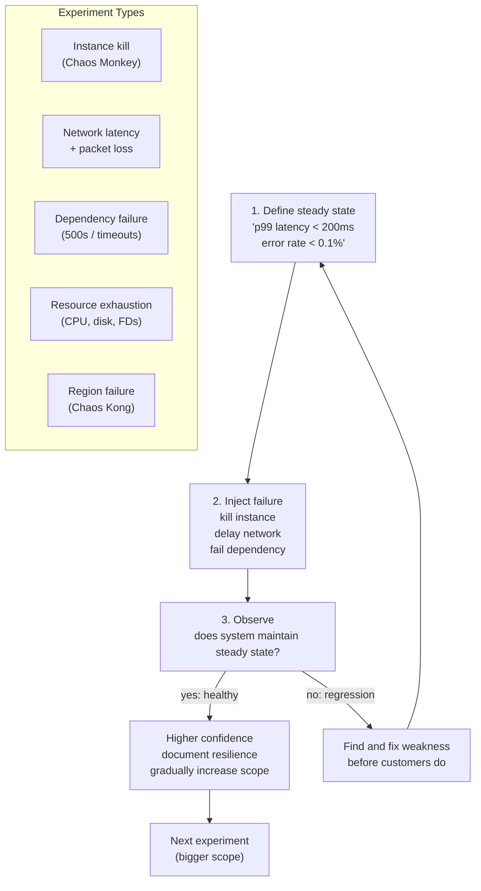

## In simple terms

You can't know if your system is resilient just by looking at it or running unit tests — distributed systems fail in unexpected ways when parts of them break. Chaos Engineering is the practice of deliberately breaking things in production (in a controlled way) to discover how your system actually behaves under failure, before an unplanned outage does it for you. Netflix's "Chaos Monkey" randomly kills virtual machines in production; if your system can't survive the Chaos Monkey, it can't survive a real outage. The goal is to convert unknown-unknowns (surprising failures) into known-knowns (failures you've already handled).

## The Visual Map



## More detail

**The Chaos Engineering process:**

1. **Define steady state:** measure normal system behaviour — error rate, latency, throughput. Establish the hypothesis: "the system maintains steady state under this failure condition."
2. **Hypothesize:** "If we kill one EC2 instance in the API tier, latency stays below 200ms."
3. **Introduce the failure variable:** kill the instance, inject network latency, corrupt a percentage of responses, exhaust disk space, disconnect a database replica.
4. **Observe:** does the system maintain steady state? What actually happened?
5. **Fix or accept:** if the system behaved poorly, fix the weakness. If it behaved well, you have higher confidence and documented evidence.
6. **Gradually increase scope:** start in staging → move to off-peak production → run during peak traffic.

**Types of experiments:**
- **Instance/pod failure:** kill a random EC2 instance, ECS task, or Kubernetes pod.
- **Network partitions:** simulate network loss between services; inject latency (100ms+); drop packets.
- **Dependency failure:** make an upstream service return errors (500s) or time out.
- **Resource exhaustion:** fill disk, exhaust file descriptors, spike CPU.
- **Region failure:** simulate an AWS availability zone or region going down.

**Netflix's Chaos Monkey (2011):** randomly terminates EC2 instances in Netflix's production environment during business hours. Forces engineers to design for instance failure. Netflix later expanded to Chaos Kong (kills an entire AWS region) and Failure Injection Testing.

**Tools:** Chaos Monkey (Netflix), Gremlin (commercial), Chaos Toolkit (open-source/Python), Litmus (CNCF/Kubernetes-native), AWS Fault Injection Simulator, Pumba (Docker/Kubernetes).

**Blast radius control:** chaos experiments must have a kill switch (immediately stop the experiment), a fixed scope (only affect 1% of pods, only in one AZ), and a clear abort criterion (if error rate exceeds X%, stop). Chaos Engineering is not randomly breaking things; it's controlled science.

## Under the Hood

A minimal chaos experiment runner with steady-state checks:

```python
import random, statistics, time

random.seed(42)

class SteadyState:
    def __init__(self, max_error_rate=0.01, max_p99_ms=200):
        self.max_err = max_error_rate
        self.max_p99 = max_p99_ms

    def check(self, requests: list) -> dict:
        errors = sum(1 for r in requests if r["status"] >= 500)
        lats   = [r["ms"] for r in requests]
        p99    = sorted(lats)[int(len(lats)*0.99)]
        err_rate = errors / len(requests)
        ok = err_rate <= self.max_err and p99 <= self.max_p99
        return {"ok": ok, "error_rate": err_rate, "p99_ms": p99}

def simulate_requests(n=200, error_rate=0.005, mean_ms=80):
    return [{"status": 500 if random.random() < error_rate else 200,
             "ms": random.expovariate(1/mean_ms)} for _ in range(n)]

def run_experiment(name: str, injected_error_rate: float, injected_ms: float):
    ss = SteadyState()
    baseline = ss.check(simulate_requests(200, 0.005, 80))
    print(f"\nExperiment: {name}")
    print(f"  Baseline: err={baseline['error_rate']:.1%}  p99={baseline['p99_ms']:.0f}ms  ok={baseline['ok']}")

    # Inject failure
    during = ss.check(simulate_requests(200, injected_error_rate, injected_ms))
    print(f"  Under failure: err={during['error_rate']:.1%}  p99={during['p99_ms']:.0f}ms  ok={during['ok']}")
    outcome = "RESILIENT" if during["ok"] else "WEAKNESS FOUND -- fix before prod"
    print(f"  Result: {outcome}")

run_experiment("Kill one instance (traffic redistributed)",
               injected_error_rate=0.008, injected_ms=95)
run_experiment("Upstream dependency 20% error rate",
               injected_error_rate=0.035, injected_ms=120)
run_experiment("Network latency +300ms injection",
               injected_error_rate=0.005, injected_ms=380)
```

## Engineering Trade-offs

**Staging vs. production experiments:** staging environments often lack realistic traffic patterns, data volumes, and dependency interactions. Production experiments find real weaknesses; staging experiments find synthetic ones. Start in staging for safety, graduate to production to find what matters.

**Blast radius vs. learning value:** a 1% scope experiment is safe but may be insufficient to trigger the failure mode. A 10% scope finds more bugs but affects more users. Use feature flags or traffic shaping to control scope precisely; always have a kill switch.

**Continuous vs. scheduled experiments:** automated continuous chaos (like Chaos Monkey running always) builds operational muscle memory — engineers handle failure constantly and get fast at it. Scheduled quarterly gamedays are easier to staff but train the muscle less. Netflix runs both.

**Error budget interaction:** run chaos experiments when you have spare [error budget](/t/error-budget) — spending budget intentionally (to find weaknesses) is different from accidental budget burn. Pause experiments when budget is low.

## Real-world examples

- Netflix: Chaos Monkey runs continuously in production; every Netflix engineer knows their service must tolerate instance loss.
- Amazon: runs gamedays before Prime Day (July) — chaos experiments to ensure the system handles scale under failure conditions.
- LinkedIn: chaos experiments on Kafka clusters and ZooKeeper to verify fault tolerance.
- Slack: chaos experiments on their message persistence layer to verify data durability.

## Common misconceptions

- **"Chaos Engineering means randomly breaking production."** It means *controlled* experiments with a clear hypothesis, minimal blast radius, and a kill switch. Ad-hoc breaking is just breaking.
- **"Chaos Engineering is only for mature, large companies."** Any distributed system that needs to be reliable benefits from chaos experiments. The earlier you start, the cheaper the fixes.

## Try it yourself

Simulate a chaos experiment: inject failure and check if steady state is maintained:

```bash
python3 - <<'EOF'
import random, statistics

random.seed(42)

def measure(n=300, error_rate=0.005, mean_ms=80):
    lats   = [random.expovariate(1/mean_ms) for _ in range(n)]
    errors = sum(1 for _ in range(n) if random.random() < error_rate)
    p99    = sorted(lats)[int(n*0.99)]
    return {"p99": round(p99), "error_rate": errors/n}

MAX_P99_MS   = 200
MAX_ERR_RATE = 0.01

experiments = [
    ("Baseline",                          0.005, 80),
    ("Kill 1/3 instances",                0.012, 95),
    ("Upstream 10% errors",               0.035, 85),
    ("Network latency +150ms",            0.006, 230),
    ("Full upstream failure + fallback",  0.005, 90),
]

print(f"Chaos experiments  (threshold: p99 < {MAX_P99_MS}ms, err < {MAX_ERR_RATE:.0%})")
print(f"{'Experiment':<35}  {'p99 (ms)':>9}  {'Err rate':>9}  {'Steady state?'}")
print("-" * 72)
for name, err, ms in experiments:
    m  = measure(error_rate=err, mean_ms=ms)
    ok = m["p99"] <= MAX_P99_MS and m["error_rate"] <= MAX_ERR_RATE
    print(f"{name:<35}  {m['p99']:>9}  {m['error_rate']:>8.1%}  {'YES' if ok else 'NO -- fix needed'}")
EOF
```

## Learn next

- [Error budget](/t/error-budget) — chaos experiments consume error budget deliberately; run them when budget is healthy, pause when it's exhausted; the budget is the governor for how aggressively you can experiment
- [Circuit breaker](/t/circuit-breaker) — one of the most common fixes discovered through chaos experiments; when a dependency fails, a circuit breaker stops calling it rather than propagating failure
- [DORA metrics](/t/dora-metrics) — mean time to restore (MTTR) improves directly from chaos engineering; teams that practice failure regularly get faster at recovering when real incidents occur
