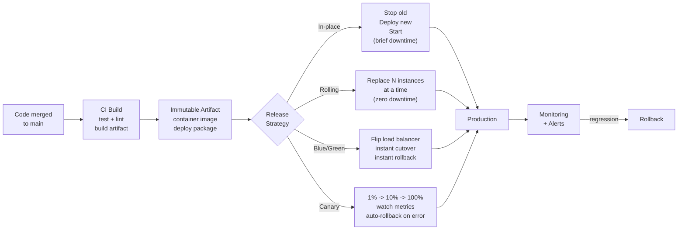

## In simple terms

**Deployment** is everything that happens between "the code is merged" and "users are running it". For a static site that might be one file copy. For a global service serving millions of users it can be a multi-step orchestration involving canaries, traffic shifts, automated health checks, and a one-click rollback if anything looks wrong. Good deployment makes shipping boring: small, frequent, reversible.

## The Visual Map



## More detail

A deployment has three rough phases:

1. **Build artefact** — compile, bundle, containerise. The output is a deterministic, signed artefact that can be installed identically anywhere.
2. **Ship** — copy the artefact to the target hosts (or push it to a registry the targets pull from).
3. **Activate** — start the new version, route traffic to it, drain the old, retire it.

Common deployment strategies, ordered roughly by safety:

| Strategy | What it does | Trade-off |
|---|---|---|
| **In-place** | Stop, replace binary, start | Brief downtime |
| **Rolling** | Replace instances one at a time | Mixed versions briefly serve users |
| **Blue/green** | Run two full environments; flip traffic at once | Doubles infra during rollout |
| **Canary** | Send a small slice of traffic to the new version, ramp if healthy | Best balance; requires metrics |
| **Shadow** | Mirror traffic to new version, discard responses | Lets you load-test in prod |
| **Feature flag** | Deploy disabled; enable per user/cohort | Decouples deploy from release |

Healthy modern deployments share a few traits: **automated** end-to-end, **versioned** immutable artefacts, **observable** (every deploy emits an event dashboards mark), **reversible** (rolling back is one click), **gradual** when scale demands it, and **idempotent** (re-running is safe).

The classical separation between "deploy" and "release" is worth knowing. **Deploy** = the bits are in production. **Release** = users see them. Feature flags let teams do many deploys per day with releases gated by experiment results or marketing schedules.

## Under the Hood

A minimal Python deployment controller — health-check and promote/rollback logic:

```python
import time, random

def health_check(version: str, endpoint: str = "/health") -> bool:
    """Simulate a health check call to a newly deployed instance."""
    # In production: requests.get(f"http://{endpoint}").status_code == 200
    return random.random() > 0.15   # 85% pass rate simulation

def rolling_deploy(instances: list, new_version: str, max_unavailable: int = 1) -> dict:
    """
    Rolling deployment: update one instance at a time.
    Rolls back if health checks fail on any instance.
    """
    healthy   = 0
    failed    = 0
    rolled_back = []

    for i, instance in enumerate(instances):
        print(f"  Deploying {new_version} to {instance}...")
        ok = health_check(new_version, instance)
        if ok:
            healthy += 1
            print(f"  {instance}: health check PASSED")
        else:
            failed += 1
            rolled_back.append(instance)
            print(f"  {instance}: health check FAILED -- rolling back this instance")

    return {"healthy": healthy, "failed": failed, "rolled_back": rolled_back}

random.seed(42)
instances = [f"app-{i}" for i in range(6)]
print("Rolling deployment: v1.2.3 -> v1.3.0")
result = rolling_deploy(instances, "v1.3.0")
print(f"\nResult: {result['healthy']}/{len(instances)} healthy, "
      f"{result['failed']} rolled back: {result['rolled_back']}")
success_rate = result['healthy'] / len(instances)
print(f"Deployment {'SUCCESS' if success_rate > 0.8 else 'FAILED -- manual review required'}")
```

## Engineering Trade-offs

**Deploy frequency vs. batch size:** large, infrequent deploys feel safer but contain more changes per incident — a regression is harder to isolate. Small, frequent deploys each contain a few changes — easy to bisect, smaller blast radius. DORA research consistently shows elite performers deploy on-demand and have lower change-failure rates than low-frequency deployers.

**Immutable vs. mutable artefacts:** mutable deployment (copy a binary in place) is simpler but makes rollback harder — the previous binary is gone. Immutable artefacts (container images, versioned S3 objects) make rollback trivial: re-point to the old version tag. The cost is a registry and slightly more build tooling.

**Zero-downtime complexity:** a rolling deploy that avoids downtime requires the new version to handle in-flight requests from the old load-balancer connection, and the old version to handle new requests after deploy starts. This complicates session handling and database schema changes.

**Database migration timing:** the hardest part of deployment is database schema changes. The expand/contract pattern separates them: first expand the schema to support both versions, deploy code that works with both, then contract by removing old fields after all instances are on the new version. Running a migration that breaks the old code causes an outage during the deploy window.

## Real-world examples

- A serverless function: `git push`, the platform builds, the new code is live in seconds.
- A Kubernetes deployment: a YAML update triggers a rolling update with readiness probes, gating each replica on a health check.
- A major bank: a deploy is a multi-day choreography with change boards, approvals, and a freeze window before holidays — not bad, just a different cost/risk balance.
- Amazon deploys to production thousands of times per day across thousands of services via fully automated pipelines.

## Common misconceptions

- **"Deploys cause incidents, so we should deploy less."** Counter-intuitively, the opposite: *big, infrequent* deploys cause more incidents than *small, frequent* ones, because each contains more change. Smaller deploys = smaller blast radius = faster diagnosis.
- **"Deploy = release."** They can be the same in simple setups, but separating them via feature flags is the foundation of modern continuous delivery.
- **"Zero-downtime deployment is just for big sites."** Modern platforms make it the default — even a small SaaS benefits from rolling or canary deploys to avoid 30-second outages on every push.

## Try it yourself

Model change-failure risk as a function of batch size — why frequent small deploys beat infrequent large ones:

```bash
python3 - <<'EOF'
import random

random.seed(42)

def simulate_deploys(n_changes: int, changes_per_deploy: int, bug_rate: float = 0.02) -> dict:
    """
    Simulate a deployment strategy over n_changes total changes.
    changes_per_deploy: how many changes go into each deployment.
    A deploy fails if ANY change in it has a bug.
    Returns: number of deploys, number of failed deploys, failure rate per deploy.
    """
    n_deploys = max(1, n_changes // changes_per_deploy)
    failures  = 0
    for _ in range(n_deploys):
        has_bug = any(random.random() < bug_rate for _ in range(changes_per_deploy))
        if has_bug:
            failures += 1
    return {"deploys": n_deploys, "failures": failures,
            "failure_rate": failures / n_deploys}

N = 200   # total changes to deploy

print(f"Deploying {N} changes at different batch sizes (bug rate: 2% per change)")
print(f"{'Changes/deploy':>15}  {'Deploys':>8}  {'Failures':>9}  {'Failure rate':>14}")
print("-" * 52)
for size in [1, 5, 10, 25, 50, 200]:
    r = simulate_deploys(N, size)
    print(f"{size:>15}  {r['deploys']:>8}  {r['failures']:>9}  {r['failure_rate']:>13.0%}")
EOF
```

## Learn next

- [CI/CD](/t/ci-cd) — the pipeline that produces deployable artefacts automatically on every merge; CI/CD is what makes frequent, reliable deployment possible at scale
- [Blue-green deployment](/t/blue-green-deployment) — one of the two main zero-downtime strategies: run two environments and flip traffic at once for instant rollback
- [Canary deployment](/t/canary-deployment) — the gradual alternative: ramp traffic to the new version in small increments, watching metrics at each step
- [Monitoring](/t/monitoring) — watches the deployed service after it goes live; the feedback loop that tells you whether a deploy succeeded or needs rollback
