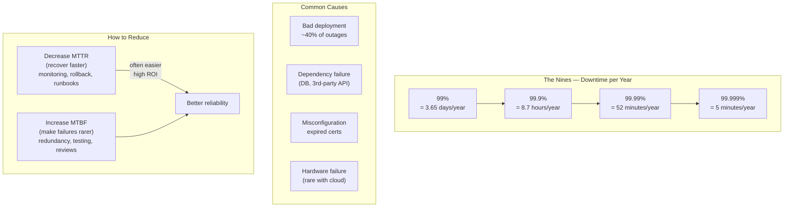

## In simple terms

**Downtime** is any stretch of time when a system isn't working for its users — the site won't load, the app returns errors, the payment won't go through. It's the opposite of **uptime**, and it's the fundamental thing operations and reliability work exists to prevent. Downtime has direct, visible costs: lost revenue, frustrated users, missed deadlines, and damaged trust. Most of the field's practices — monitoring, redundancy, careful deployments — are ultimately about avoiding or shortening it.

## The Visual Map



## More detail

Availability is usually quoted in **"nines"** — the percentage of time a system is up — and the gap between each level is dramatic:

| Availability | Downtime per year | Downtime per month |
|---|---|---|
| 99% ("two nines") | ~3.65 days | ~7.3 hours |
| 99.9% ("three nines") | ~8.8 hours | ~43.8 min |
| 99.99% ("four nines") | ~52 minutes | ~4.4 min |
| 99.999% ("five nines") | ~5 minutes | ~26 sec |

Each extra nine costs disproportionately more to achieve, which is why targets are set deliberately via [SLOs](/t/slo-sli-sla) rather than reflexively chasing 100%.

Downtime is also categorised by intent:

- **Planned downtime** — scheduled maintenance, upgrades, migrations. Modern zero-downtime techniques ([blue-green deployment](/t/blue-green-deployment), rolling updates) aim to eliminate even this.
- **Unplanned downtime** — outages from bugs, hardware failure, dependency failures, traffic spikes, or human error. This is what [incident response](/t/incident-response) handles.

Two metrics frame how teams reduce downtime: **MTBF** (mean time *between* failures — make outages rarer) and **MTTR** (mean time *to recovery* — make them shorter). For most services, getting good at *recovering fast* (MTTR) pays off more than chasing perfect prevention. A 10-minute outage once a week is worse than a 30-minute outage once a month by MTBF, but if MTTR is reduced from 30 minutes to 5 minutes, total downtime drops dramatically.

## Under the Hood

Computing MTBF, MTTR, and availability from an outage log:

```python
def compute_availability(outages: list, period_days: int = 365) -> dict:
    """
    outages: list of {start_min, end_min} relative to period start.
    Returns MTBF, MTTR, and availability percentage.
    """
    total_min     = period_days * 24 * 60
    downtime_min  = sum(o["end"] - o["start"] for o in outages)
    uptime_min    = total_min - downtime_min
    n             = len(outages)

    mtbf = uptime_min / n if n else float("inf")   # mean time BETWEEN failures
    mttr = downtime_min / n if n else 0              # mean time TO RESTORE
    avail = uptime_min / total_min * 100

    return {"avail": avail, "mtbf_min": mtbf, "mttr_min": mttr,
            "downtime_min": downtime_min, "n": n}

# Scenario A: few, long outages
outages_a = [{"start": 1000, "end": 1045},
             {"start": 5000, "end": 5062},
             {"start": 8000, "end": 8031}]

# Scenario B: same total downtime, shorter individual outages (better MTTR)
outages_b = [{"start": i*2000, "end": i*2000+10} for i in range(14)]

for label, outages in [("Scenario A (few long)", outages_a),
                        ("Scenario B (many short)", outages_b)]:
    r = compute_availability(outages)
    print(f"{label}:")
    print(f"  Incidents: {r['n']}  Downtime: {r['downtime_min']:.0f} min")
    print(f"  MTBF:  {r['mtbf_min']:.0f} min  MTTR: {r['mttr_min']:.0f} min")
    print(f"  Availability: {r['avail']:.4f}%")
    print()
```

## Engineering Trade-offs

**MTBF vs. MTTR investment:** reducing incident frequency (MTBF) often requires deep architectural work — adding redundancy, eliminating single points of failure, improving testing. Reducing incident duration (MTTR) requires monitoring, runbooks, and rollback tooling — much cheaper to implement. Most teams achieve better availability per dollar by investing in MTTR first.

**Planned vs. zero-downtime deployments:** planned maintenance windows feel safe but add predictable downtime. Modern deployment strategies (rolling, blue-green, canary) achieve zero-downtime even for significant infrastructure changes. The engineering cost of zero-downtime deploys pays back quickly in availability SLOs.

**Cloud vs. bare-metal availability:** a single bare-metal server has higher MTBF than cloud VMs but zero redundancy — a hardware failure means complete downtime. Cloud instances fail more often individually but support easy redundancy at the infrastructure layer. Multi-region architectures achieve near-continuous availability by routing around regional failures.

**Cascading failures:** dependencies create correlated failure modes. If your payment service depends on a single database, a database outage causes payment downtime even if all other services are up. Circuit breakers and graceful degradation limit cascading — serving "payment temporarily unavailable" instead of a full outage.

## Real-world examples

- A major cloud region outage taking down dozens of dependent websites and apps for hours — a recurring, high-profile kind of downtime.
- An **expired TLS certificate** silently causing an outage at midnight — one of the most common and avoidable causes; automate certificate renewal.
- A retailer calculating that a few minutes of checkout downtime on a peak shopping day costs more than a year of extra reliability investment — this math drives the SLO decision.

## Common misconceptions

- **"We should aim for zero downtime / 100% uptime."** The cost of each additional nine grows steeply, and beyond a point users can't tell the difference; the right target is a deliberate [SLO](/t/slo-sli-sla), not perfection.
- **"Downtime only means a total crash."** Partial degradation — slow responses, some failing requests, one broken feature — is downtime too, often measured against an error-rate or latency objective rather than a binary up/down.

## Try it yourself

Compute availability and downtime budget for different reliability targets:

```bash
python3 - <<'EOF'
YEAR_MIN  = 365 * 24 * 60
MONTH_MIN = 30  * 24 * 60

print(f"Availability vs. downtime budget")
print(f"{'SLO':>8}  {'Year (min)':>12}  {'Month (min)':>13}  {'Month (sec)':>13}  {'Label'}")
print("-" * 65)
targets = [
    (99.0,   "two nines"),
    (99.5,   "two-and-half nines"),
    (99.9,   "three nines"),
    (99.95,  "three-and-half nines"),
    (99.99,  "four nines"),
    (99.999, "five nines"),
]
for slo, label in targets:
    yr  = (1 - slo/100) * YEAR_MIN
    mo  = (1 - slo/100) * MONTH_MIN
    print(f"{slo:>7}%  {yr:>12.1f}  {mo:>13.2f}  {mo*60:>13.0f}  {label}")
EOF
```

## Learn next

- [SLO, SLI, SLA](/t/slo-sli-sla) — the formal way to define how much downtime is acceptable and turn that into measurable targets and customer contracts
- [Incident response](/t/incident-response) — when downtime happens, the incident response process governs detection, mitigation, and learning — the primary lever on MTTR
- [Blue-green deployment](/t/blue-green-deployment) — eliminates planned downtime from deployments with instant traffic switching and rollback; one of the most impactful single changes for reducing deployment-caused outages
