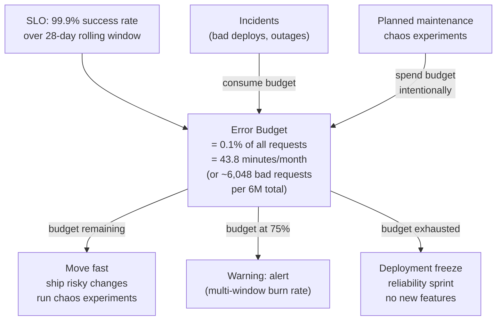

## In simple terms

If your service has a 99.9% uptime SLO, you're allowed 8.7 hours of downtime per year. That 8.7 hours is your error budget — you can "spend" it on planned maintenance, risky deployments, and experimental features. If you've used 8.5 hours in 11 months, you're nearly out of budget; stop making risky changes and focus on reliability. If you've used only 1 hour, your service is more reliable than required; feel free to move fast. Error budgets turn reliability from a moral argument ("we should be more careful") into a quantitative one ("we have 30 minutes of budget left this quarter").

## The Visual Map



## More detail

**From SLO to error budget:**

- **SLI (Service Level Indicator):** a measure of a service's performance — request latency, error rate, availability (% of successful requests), throughput.
- **SLO (Service Level Objective):** a target for the SLI: "99.9% of requests succeed," "99th-percentile latency < 200ms." An SLO is internal; it drives engineering decisions.
- **SLA (Service Level Agreement):** a contract with a customer defining consequences of SLO breach. SLAs are typically less strict than SLOs.

**Error budget:** `error budget = 100% - SLO%` of total requests or time.
- 99.9% SLO → 0.1% error budget → 43.8 minutes/month of errors/downtime.
- 99.99% SLO → 0.01% budget → 4.38 minutes/month.
- 99.999% SLO → 0.001% budget → 26.3 seconds/month.

**Burn rate:** the rate at which the budget is consumed. If an incident causes 1% of all requests to fail for 2 hours, and the monthly budget for a 99% SLO is 7.2 hours, that incident consumed 28% of the monthly budget.

**Alert on burn rate, not instantaneous error rate:** a 1% error spike lasting 5 minutes is fine; a 0.5% error persisting for 3 hours consumes significant budget. Google's multi-window burn rate alerting fires when: 14.4× burn rate (consuming budget 14.4× faster than sustainable) — alert immediately.

**Development freeze:** when the error budget is exhausted, the engineering team freezes feature deployments until reliability is restored. This removes the subjective argument ("should we deploy?") and creates a shared incentive between product and reliability engineering.

**Budget unused:** if the budget is consistently unconsumed, the team is being too conservative — they could ship more features. An SLO consistently exceeded by a large margin may be too conservative; consider loosening it.

## Under the Hood

Computing burn rate and multi-window alerting — the Google SRE approach:

```python
def error_budget_minutes(slo_pct: float, window_days: int = 28) -> float:
    return (1 - slo_pct / 100) * window_days * 24 * 60

def burn_rate(actual_error_pct: float, slo_pct: float) -> float:
    """
    Burn rate: how many times faster than sustainable we're consuming budget.
    burn_rate = 1 means consuming budget at exactly the SLO-allowed rate.
    """
    allowed_error_pct = 100 - slo_pct
    return actual_error_pct / allowed_error_pct if allowed_error_pct else float("inf")

def budget_alert(current_error_pct: float, slo_pct: float = 99.9) -> str:
    """
    Multi-window burn rate alerting (simplified Google model).
    Short window: detect fast burns. Long window: detect slow burns.
    """
    br = burn_rate(current_error_pct, slo_pct)
    if br >= 14.4:  return "PAGE NOW (14.4x burn: 5% budget gone in 1 hour)"
    if br >= 6.0:   return "TICKET (6x burn: 20% budget gone in 6 hours)"
    if br >= 3.0:   return "MONITOR (3x burn: watch carefully)"
    return "OK"

SLO = 99.9
budget = error_budget_minutes(SLO)
print(f"SLO: {SLO}%  Error budget: {budget:.1f} min/28-day window")
print()
print(f"{'Error rate':>12}  {'Burn rate':>12}  {'Alert status'}")
print("-" * 50)
for err_pct in [0.02, 0.05, 0.1, 0.5, 1.0, 2.0, 5.0]:
    br     = burn_rate(err_pct, SLO)
    alert  = budget_alert(err_pct, SLO)
    print(f"{err_pct:>11.2f}%  {br:>11.1f}x  {alert}")
```

## Engineering Trade-offs

**Budget as negotiation:** error budgets resolve the perennial product vs. engineering tension without ongoing negotiation. Teams with exhausted budgets can say "no" to feature deploys with an objective number, not an opinion. Teams with full budgets can say "yes" to risky changes without guilt.

**Multi-window alerting:** single-window alerting (alert when 1-hour error rate > X%) is noisy (false positives from short spikes) or slow (slow burns consume budget before detection). Multi-window (1h and 6h) catches fast burns early and slow burns before 20% of budget is gone.

**SLO tightness:** a 99.99% SLO gives 4.4 minutes of budget per month — one minor incident exhausts it. Teams that set SLOs tighter than their actual reliability end up in permanent freeze mode. Set SLOs based on user-visible impact, not engineering aspiration.

**Budget tracking cadence:** monthly budget windows are common but misalign with incident timing. A long outage on the last day of the month resets the next month's budget — the team doesn't feel the consequence. Rolling 28-day windows ensure incidents always matter regardless of calendar timing.

## Real-world examples

- Google: every internal service has SLOs and error budgets; product teams negotiate their SLOs annually.
- Datadog / PagerDuty / New Relic: SLO tracking and burn rate alerting built into monitoring platforms.
- Spotify: uses error budgets to align product teams and SREs on reliability investment decisions.
- Netflix: error budgets inform when [chaos engineering](/t/chaos-engineering) experiments are safe to run (excess budget) vs. when to pause (depleted budget).

## Common misconceptions

- **"99.99% SLO means near-zero failures."** 99.99% allows 4.38 minutes/month of downtime — which sounds small but adds up if incidents aren't resolved quickly.
- **"Exhausting the error budget means the team failed."** Budget exhaustion can be intentional (moving fast, taking risks) or accidental (incident). The budget tracks consumption; the policy determines consequences.

## Try it yourself

Simulate 28 days of error budget consumption and decide when to freeze deployments:

```bash
python3 - <<'EOF'
import random

random.seed(42)

SLO         = 99.9
WINDOW_DAYS = 28
BUDGET_MIN  = (1 - SLO/100) * WINDOW_DAYS * 24 * 60
print(f"28-day error budget simulation  (SLO={SLO}%, budget={BUDGET_MIN:.1f} min)")
print()

budget_used = 0
freeze      = False

for day in range(1, WINDOW_DAYS + 1):
    if freeze:
        # In freeze mode: focus on reliability, fewer incidents
        incident_prob = 0.05
        duration_min  = random.uniform(1, 5)
    else:
        incident_prob = 0.20
        duration_min  = random.uniform(5, 45)

    if random.random() < incident_prob:
        budget_used += duration_min
        pct_used = budget_used / BUDGET_MIN * 100
        status   = ""
        if pct_used >= 100 and not freeze:
            freeze = True
            status = " *** DEPLOYMENT FREEZE TRIGGERED ***"
        elif pct_used >= 75:
            status = " [WARNING: 75% consumed]"
        print(f"  Day {day:>2}: incident {duration_min:>4.0f}min  total {budget_used:>6.1f}/{BUDGET_MIN:.0f}min ({pct_used:>5.1f}%){status}")

print(f"\nFinal: {budget_used:.1f}/{BUDGET_MIN:.1f} min used ({budget_used/BUDGET_MIN*100:.0f}%)")
print(f"Deployment freeze: {'YES' if freeze else 'NO'}")
EOF
```

## Learn next

- [Chaos engineering](/t/chaos-engineering) — deliberately spends error budget to discover system weaknesses; best run when budget is healthy, and paused when budget is exhausted
- [Toil](/t/toil) — repetitive operational work consumes engineering time that could be spent improving reliability; reducing toil directly reduces unplanned budget burn from recurring incidents
- [DORA metrics](/t/dora-metrics) — change failure rate and MTTR are the primary inputs to error budget consumption; improving DORA metrics directly extends how long your budget lasts
