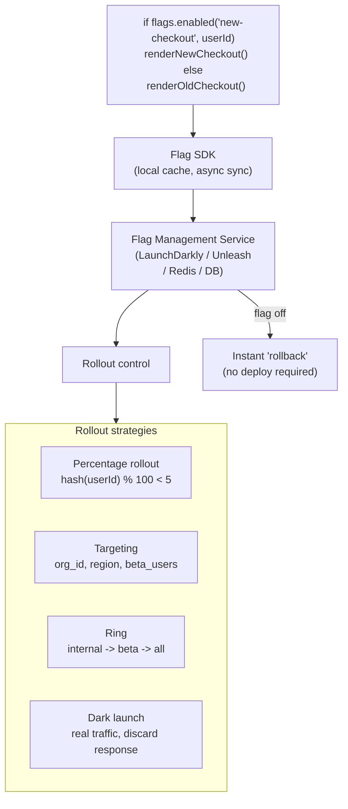

## In simple terms

Normally, deploying code = releasing a feature. Feature flags separate these two things: you deploy code with a new feature but behind a flag that is off by default. You can then turn the flag on for 1% of users, watch for errors, then 10%, then 50%, then 100% — without redeployment. If something goes wrong, flip the flag to off in seconds — no rollback, no hotfix, no deployment required. This makes deployment safer, enables A/B testing, and allows teams to merge code continuously without "releasing" half-finished features.

## The Visual Map



## More detail

**Core concept:** a feature flag is a conditional in code:

```javascript
if (featureFlags.isEnabled('new-checkout-flow', userId)) {
  return renderNewCheckout();
} else {
  return renderOldCheckout();
}
```

The flag's state is controlled externally — a flag management service, environment variable, or database — not by code changes.

**Types of feature flags:**

*Release flags (temporary):* enable/disable a feature for gradual rollout. Removed once the feature is fully launched. The most common type.

*Experiment flags (A/B test):* route a percentage of users to variant A or B; measure metrics; pick the winner. Permanent until experiment is complete.

*Ops flags (circuit breaker):* enable "degraded mode" by turning off expensive features during an incident or traffic spike. Permanent; operationally driven.

*Permission flags:* enable features for specific user groups (beta users, internal staff, paid tier). Long-lived; access-control driven.

**Rollout strategies:**

*Percentage rollout:* expose the feature to X% of users, increasing over time. `if (hash(userId) % 100 < rolloutPercentage)`.

*Targeting:* expose to specific users, organisations, or geographic regions.

*Gradual increments:* 1% → 5% → 25% → 50% → 100%, with monitoring at each step. If error rate spikes, pause or roll back.

*Dark launch:* deploy a feature but discard the results — used to test performance without exposing users. Common for database migrations, algorithm changes.

**Key benefits:** trunk-based development (merge to main continuously; half-finished features are hidden), instant rollback (flip flag to off in seconds, MTTR drops from minutes to seconds), safer deployments, and A/B testing capability.

**Risks:** *flag debt* — flags accumulate if not removed after launch. Code littered with `if (flag_enabled(...))` becomes hard to reason about. Define a flag lifecycle: create, rollout, launch, cleanup. *Testing complexity:* every flag doubles the number of code paths; 10 flags = 1024 combinations.

## Under the Hood

A minimal feature flag system with percentage rollout and targeting:

```python
import hashlib

class FeatureFlag:
    def __init__(self, name: str, rollout_pct: float = 0.0,
                 allowed_users: list = None):
        self.name         = name
        self.rollout_pct  = rollout_pct         # 0-100
        self.allowed_users = set(allowed_users or [])

    def is_enabled(self, user_id) -> bool:
        # Targeted users always get the flag
        if user_id in self.allowed_users:
            return True
        # Stable hash-based percentage rollout (same user always same bucket)
        bucket = int(hashlib.md5(f"{self.name}:{user_id}".encode()).hexdigest(), 16) % 100
        return bucket < self.rollout_pct

class FlagManager:
    def __init__(self):
        self._flags = {}

    def register(self, flag: FeatureFlag):
        self._flags[flag.name] = flag

    def enabled(self, flag_name: str, user_id) -> bool:
        flag = self._flags.get(flag_name)
        return flag.is_enabled(user_id) if flag else False

flags = FlagManager()
flags.register(FeatureFlag("new-checkout", rollout_pct=20,
                            allowed_users=["beta_user_1", "beta_user_2"]))

# Simulate 20 users
users = [f"user_{i}" for i in range(20)] + ["beta_user_1", "beta_user_2"]
enabled = [u for u in users if flags.enabled("new-checkout", u)]

print(f"Feature flag 'new-checkout' (20% rollout + 2 beta users):")
print(f"  Users: {len(users)}")
print(f"  Enabled: {len(enabled)} ({len(enabled)/len(users)*100:.0f}%)")
print(f"  Enabled for: {enabled[:5]}{'...' if len(enabled)>5 else ''}")
print(f"  Beta users always enabled: beta_user_1={flags.enabled('new-checkout','beta_user_1')}")
```

## Engineering Trade-offs

**Flag debt:** every flag that isn't removed after launch is a maintenance burden and a test path. A codebase with 200 old flags is hard to reason about and hard to test. Define a cleanup SLA: release flags must be removed within 30 days of full rollout. Use your tracking tool's "stale flag" report.

**SDK latency:** flag evaluation must be nanoseconds-fast on the hot path. LaunchDarkly and similar SDKs maintain a local in-memory cache of flag states, sync asynchronously. A flag evaluation that blocks on a network call would be catastrophic for latency. Never evaluate flags synchronously against a remote service on each request.

**A/B test validity:** a flag-driven A/B test is only valid if the assignment is: (1) stable (same user always sees the same variant), (2) independent (flag assignment doesn't correlate with other flags), and (3) has sufficient sample size before making a decision. The biggest pitfall is stopping an A/B test early (p-hacking).

**Trunk-based development enabler:** the core reason big tech companies use flags heavily is trunk-based development — everyone commits to main, and flags hide half-finished code. This eliminates long-lived feature branches (and the merge conflicts they cause). Flags enable continuous integration at scale.

## Real-world examples

- Facebook: every feature is gated behind a feature flag; "Facebook for Everyone" launches often start as internal-only flags for months.
- Netflix: A/B tests virtually every UI change; feature flags route users to different UI variants while metrics are collected.
- GitHub: uses flags to release GitHub Copilot features to different user tiers and regions.
- Spotify: "Green-Yellow" system — features deployed but disabled; QA verifies in production behind a flag before customer-facing release.

## Common misconceptions

- **"Feature flags require a paid service."** Simple boolean flags can be implemented with a database or Redis and a wrapper function. LaunchDarkly adds targeting, analytics, and SDKs, but the concept is implementable without it.
- **"Feature flags are only for UI features."** Ops flags (circuit breakers), backend algorithm rollouts, database schema migrations, and infrastructure experiments all benefit from flags.

## Try it yourself

Simulate a percentage-based flag rollout and verify stable user assignment:

```bash
python3 - <<'EOF'
import hashlib

def flag_enabled(flag_name: str, user_id: str, rollout_pct: float) -> bool:
    """Stable percentage rollout: same user always gets same result."""
    bucket = int(hashlib.md5(f"{flag_name}:{user_id}".encode()).hexdigest(), 16) % 100
    return bucket < rollout_pct

N = 1000
flag = "new-checkout"

for pct in [1, 5, 10, 25, 50, 100]:
    users   = [f"user_{i}" for i in range(N)]
    enabled = sum(1 for u in users if flag_enabled(flag, u, pct))
    # Verify stability: same user same result on second call
    stable  = all(flag_enabled(flag, u, pct) == flag_enabled(flag, u, pct) for u in users[:10])
    print(f"Rollout {pct:>3}%: {enabled:>4}/{N} users enabled ({enabled/N*100:>5.1f}%)  stable={stable}")
EOF
```

## Learn next

- [DORA metrics](/t/dora-metrics) — feature flags directly improve deployment frequency and MTTR; trunk-based development (enabled by flags) is a DORA high-performance predictor
- [Chaos engineering](/t/chaos-engineering) — ops flags (circuit breaker flags) are a key chaos mitigation tool: flip a flag to disable a failing feature without deploying a fix, buying time to repair
- [Error budget](/t/error-budget) — instant flag rollback (MTTR: seconds) preserves error budget that a slow hotfix-and-redeploy cycle (MTTR: 30+ min) would have consumed
