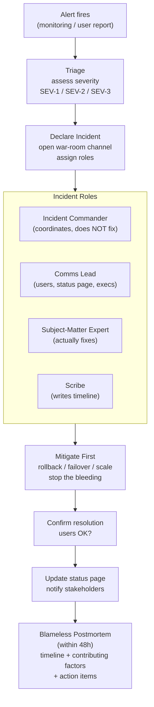

## In simple terms

An **incident** is when a production system isn't doing what it should — a site is down, a feature is broken, performance has collapsed. **Incident response** is how the team finds out, coordinates, fixes it, communicates with users, and learns from the experience without blaming individuals. A good process turns a chaotic emergency into a structured procedure: who is in charge, who is communicating, who is debugging, and what are the steps.

## The Visual Map



## More detail

A common shape of an incident:

1. **Detection** — an alert fires, or a user reports a problem. The clock starts (MTTD).
2. **Triage** — assess severity (SEV-1 = full outage, SEV-2 = degraded, SEV-3 = minor). Assemble the right people.
3. **Coordination** — declare an incident, open a war-room channel, designate an **incident commander** whose only job is to coordinate, not fix.
4. **Mitigation** — restore service. Roll back. Failover. Scale. Disable feature. *Stop the bleeding before finding the root cause.*
5. **Resolution** — confirm the symptom is gone; users are satisfied.
6. **Communication** — keep affected users informed via status page; explain after.
7. **Postmortem** — within 48 hours, write a blameless analysis: timeline, contributing factors, what went well, action items to make recurrence less likely.

Roles used during an incident:

- **Incident Commander (IC)** — coordinator. Asks questions, delegates, doesn't fix.
- **Communications Lead** — talks to users, executives, support.
- **Subject-matter experts** — actually fix the thing.
- **Scribe** — keeps a timeline of every action and observation.

Key cultural rule: **blameless**. The goal is to make the system more robust, not punish individuals. People who fear blame hide information; people who don't, share it. This is the foundation of a learning culture.

Key metrics:
- **MTTD** — Mean Time To Detect.
- **MTTR** — Mean Time To Restore (or Resolve).

## Under the Hood

A minimal incident tracking structure — timeline, severity, and postmortem:

```python
import time

class Incident:
    SEV = {1: "CRITICAL (full outage)", 2: "HIGH (degraded)", 3: "LOW (minor)"}

    def __init__(self, id: str, severity: int, description: str):
        self.id          = id
        self.severity    = severity
        self.description = description
        self.declared_at = time.time()
        self.resolved_at = None
        self.timeline    = []
        self.action_items = []

    def log(self, actor: str, event: str):
        entry = {"t": time.strftime("%H:%M:%S"), "actor": actor, "event": event}
        self.timeline.append(entry)
        print(f"[{entry['t']}] {actor}: {event}")

    def resolve(self, resolution: str):
        self.resolved_at = time.time()
        self.log("IC", f"Resolved: {resolution}")

    def mttr_minutes(self):
        if not self.resolved_at: return None
        return (self.resolved_at - self.declared_at) / 60

    def postmortem(self):
        print(f"\n--- Blameless Postmortem: {self.id} ---")
        print(f"Severity: SEV-{self.severity} ({self.SEV[self.severity]})")
        print(f"MTTR: {self.mttr_minutes():.1f} min" if self.mttr_minutes() else "Unresolved")
        print(f"\nTimeline ({len(self.timeline)} events):")
        for e in self.timeline:
            print(f"  {e['t']}  [{e['actor']}]  {e['event']}")
        print(f"\nAction items:")
        for item in self.action_items:
            print(f"  - {item}")

# Simulate a deployment-caused incident
inc = Incident("INC-2026-001", severity=2, description="Checkout latency spike after v1.3.0 deploy")

inc.log("Monitor", "Alert: p99 latency > 2000ms on /checkout")
time.sleep(0.01)
inc.log("IC", "Incident declared, war-room opened, on-call assembled")
inc.log("SME", "Checking logs -- spike correlates with v1.3.0 deploy at 14:32")
inc.log("SME", "Root cause: new N+1 query in checkout flow")
inc.log("IC", "Decision: rollback to v1.2.9 immediately")
inc.log("SME", "Rollback initiated via kubectl rollout undo")
inc.resolve("v1.2.9 restored, latency back to baseline, error rate 0%")

inc.action_items = [
    "Add DB query count assertion to CI pipeline",
    "Add p99 latency alert threshold at 500ms (was 2000ms)",
    "Write runbook for checkout latency incidents"
]
inc.postmortem()
```

## Engineering Trade-offs

**Speed vs. correctness during mitigation:** the first priority in an incident is to restore service — roll back, failover, disable the feature. Fixing the root cause comes second. Teams that try to fix the root cause during a live outage often make it worse. Prioritise MTTR over elegance.

**Severity calibration:** too many SEV-1 alerts create fatigue; too few miss genuine emergencies. Calibrate severity based on user impact (number of users affected, business criticality, financial exposure), not engineer stress level.

**Blameless postmortems vs. accountability:** blameless does not mean action-item-free. It means the focus is on system and process improvements, not on punishing individuals. Action items are tracked and owned — if they slip, that's the next thing to fix. Blame suppresses information; accountability without blame drives improvement.

**Incident runbooks:** the first time you handle a class of incident, you're flying blind. The second time, you should have a [runbook](/t/runbook). The third time, the runbook should be automated. Incidents that recur without improving process are wasted pain.

## Real-world examples

- A bad deploy at 09:55 → rolled back at 10:02 → root cause analysis later that week → guardrail in CI to prevent the same change shape. That's a healthy incident response.
- Honeycomb publishes its postmortems publicly as a learning resource — a great way to study how a healthy engineering organisation thinks during and after an outage.

## Common misconceptions

- **"Blameless means no accountability."** It means the system, not a person, is on trial. Action items are owned and tracked.
- **"Postmortems are paperwork."** They are the main mechanism by which a team gets safer over time. A team that skips postmortems will keep hitting the same classes of incident.

## Try it yourself

Compute MTTD and MTTR from a simulated incident log:

```bash
python3 - <<'EOF'
incidents = [
    {"id": "INC-001", "start": 0,   "detected": 4,   "resolved": 22},
    {"id": "INC-002", "start": 100, "detected": 100, "resolved": 108},
    {"id": "INC-003", "start": 250, "detected": 260, "resolved": 310},
    {"id": "INC-004", "start": 400, "detected": 402, "resolved": 407},
]

mttds = []
mttrs = []
for inc in incidents:
    mttd = inc["detected"] - inc["start"]
    mttr = inc["resolved"] - inc["detected"]
    mttds.append(mttd)
    mttrs.append(mttr)
    print(f"{inc['id']}: MTTD={mttd:3d}min  MTTR={mttr:3d}min")

print(f"\nAvg MTTD: {sum(mttds)/len(mttds):.1f} min  (lower = better monitoring)")
print(f"Avg MTTR: {sum(mttrs)/len(mttrs):.1f} min  (lower = better runbooks + practice)")
print(f"Total outage time: {sum(mttrs)} min across {len(incidents)} incidents")
EOF
```

## Learn next

- [Logging](/t/logging) — logs are the primary investigation tool during an incident; a correlation ID lets responders reconstruct what happened across services
- [Runbook](/t/runbook) — pre-written step-by-step procedures for specific failure modes; good runbooks cut MTTR by removing guesswork at 3 a.m.
- [SRE](/t/sre) — the engineering discipline that provides the framework (blameless postmortems, error budgets, toil reduction) that makes incident response systematic rather than reactive
