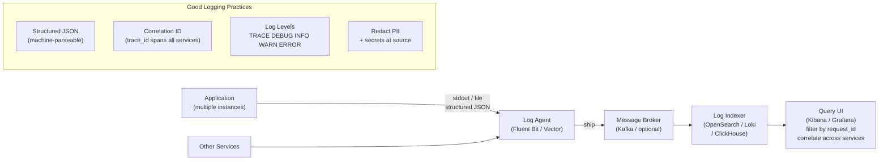

## In simple terms

A **log** is a stream of timestamped events produced by a running program: "request received", "DB query took 312 ms", "user 42 deleted file X", "ERROR: payment gateway timeout". Logs are the system's running journal — invaluable when debugging, irreplaceable during an incident. While [monitoring](/t/monitoring) tells you *that* something is wrong, logs tell you *what exactly happened*, request by request.

## The Visual Map



## More detail

Modern good practice:

- **Structured logging** — emit JSON (or similar), not free-form text. Lets you filter and aggregate across thousands of log lines.
- **Levels** — `TRACE`, `DEBUG`, `INFO`, `WARN`, `ERROR`. Production usually defaults to INFO; raise it temporarily during investigation.
- **Correlation IDs** — every log line for a single request carries the same `request_id` or `trace_id`. Lets you reconstruct a journey across services.
- **Don't log secrets** — passwords, tokens, full credit card numbers. Redact at source, not in the pipeline.
- **Don't log PII unnecessarily** — and even where you must, treat it like the regulated data it is.
- **Sample noisy lines** — full-rate "health check OK" logs drown the signal. Sample at 1% or 10%.

Pipeline shape (one of many):

```
app  → stdout / file → agent (Fluent Bit, Vector) → message broker (Kafka)
     → indexer (OpenSearch, Loki, ClickHouse) → UI (Kibana, Grafana, Datadog)
```

Logs are the "what exactly happened" signal. Metrics tell you that something is wrong; logs tell you what; traces tell you where across service boundaries.

Centralised logging is essential the moment you have more than one server — chasing logs across many machines by hand is hopeless.

## Under the Hood

A structured logging implementation with correlation IDs and sampling:

```python
import json, time, uuid, random

LOG_LEVEL_RANK = {"TRACE": 0, "DEBUG": 1, "INFO": 2, "WARN": 3, "ERROR": 4}
MIN_LEVEL      = "INFO"   # only emit >= INFO in production

def log(level: str, message: str, **extra):
    if LOG_LEVEL_RANK[level] < LOG_LEVEL_RANK[MIN_LEVEL]:
        return   # filter below threshold
    record = {
        "ts":      time.strftime("%Y-%m-%dT%H:%M:%SZ", time.gmtime()),
        "level":   level,
        "message": message,
        **extra
    }
    print(json.dumps(record))

def handle_request(method: str, path: str, user_id: int):
    request_id = str(uuid.uuid4())[:8]
    t_start    = time.perf_counter_ns()

    log("INFO", "request_start", request_id=request_id,
        method=method, path=path, user_id=user_id)

    # Simulate downstream call
    db_ms = random.uniform(5, 200)
    if db_ms > 150:
        log("WARN", "slow_db_query", request_id=request_id,
            duration_ms=round(db_ms, 1), threshold_ms=150)

    # Simulate random error
    if random.random() < 0.1:
        log("ERROR", "payment_gateway_timeout", request_id=request_id,
            gateway="stripe", timeout_ms=5000)
        return 500

    elapsed_ms = (time.perf_counter_ns() - t_start) / 1e6 + db_ms
    log("INFO", "request_end", request_id=request_id,
        status=200, duration_ms=round(elapsed_ms, 1))
    return 200

random.seed(42)
print("--- Structured log output (JSON, machine-parseable) ---")
for path in ["/checkout", "/home", "/api/cart"]:
    handle_request("GET", path, user_id=random.randint(100, 999))
```

## Engineering Trade-offs

**Volume vs. cost:** logs are cheap to write but expensive to store and index. A high-traffic service can generate terabytes per day. Strategies: sample low-priority logs (DEBUG, INFO for health checks), compress before shipping, route hot-path logs to a cheap cold store (S3) and index only errors and warnings.

**Centralised vs. per-service:** storing logs centrally (ELK stack, Loki, Datadog) makes cross-service queries possible — essential for tracing a `request_id` through 7 microservices. Per-service storage (just rotate files on the host) is simpler but hopeless for multi-service incidents.

**Structured vs. unstructured:** free-text logs are easy to write but hard to query — grepping for "payment failed" in 10 GB of text is slow and fragile. Structured JSON means you can filter by `"status": 500` and aggregate instantly. The migration cost (updating logging calls) pays back in the first serious incident.

**Log vs. metric:** if you only need "how many errors this minute?", emit a metric counter, not a log line — metrics aggregate cheaply. Logs are for the details you need when diagnosing *which* errors and *why*. Use both, not one or the other.

## Real-world examples

- A 500 error in a single request, traced back through 7 services by a shared `trace_id`.
- A retroactive analysis of "how many users hit this bug yesterday?" answered with a single log query.
- A compliance audit asking "what did this admin do last Tuesday?" answered from access logs.
- GDPR and HIPAA both treat log files containing personal data as in-scope for compliance — most modern logging pipelines strictly redact at source rather than relying on downstream filtering.

## Common misconceptions

- **"Log everything."** Eventually unaffordable in storage and unfindable in search. Pick what matters; sample the rest.
- **"Logs are just for debugging."** They are also evidence for postmortems, security forensics, and product analytics.

## Try it yourself

Parse a log stream to count error rates by path — the basic query any log tool performs:

```bash
python3 - <<'EOF'
import json, random, collections

random.seed(42)

def gen_log(path, status):
    return json.dumps({"path": path, "status": status, "ms": random.randint(5, 300)})

paths   = ["/api/checkout", "/api/cart", "/home", "/api/user"]
weights = [0.3, 0.3, 0.3, 0.1]
logs    = []

for _ in range(500):
    path = random.choices(paths, weights)[0]
    # checkout has higher error rate
    err_rate = 0.15 if path == "/api/checkout" else 0.02
    status   = 500 if random.random() < err_rate else 200
    logs.append(gen_log(path, status))

totals = collections.defaultdict(int)
errors = collections.defaultdict(int)
for line in logs:
    r = json.loads(line)
    totals[r["path"]] += 1
    if r["status"] >= 500:
        errors[r["path"]] += 1

print(f"{'Path':<20}  {'Requests':>10}  {'Errors':>8}  {'Error %':>10}")
print("-" * 55)
for path in sorted(totals):
    err_pct = errors[path] / totals[path] * 100
    flag = " <-- investigate" if err_pct > 5 else ""
    print(f"{path:<20}  {totals[path]:>10}  {errors[path]:>8}  {err_pct:>9.1f}%{flag}")
EOF
```

## Learn next

- [Monitoring](/t/monitoring) — the other major signal: metrics aggregate log events into numbers and drive alerts; monitoring and logging are complementary, not competing tools
- [Incident response](/t/incident-response) — logs are the primary investigation tool during an incident; a correlation ID in logs is what lets responders reconstruct exactly what happened across services
- [Observability](/t/observability) — the broader discipline that combines metrics, logs, and traces into the ability to answer arbitrary questions about system behaviour after the fact
