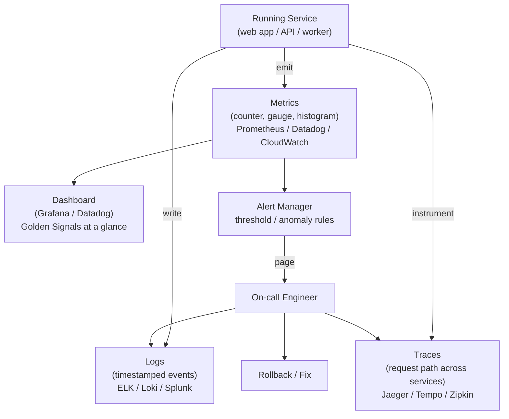

## In simple terms

**Monitoring** is what you do so you find out a service is broken before your users (or your boss) do. You collect numbers — request rate, error rate, latency, queue depth, CPU, memory — and you set alarms that fire when those numbers go where they shouldn't. Without monitoring you are flying blind; with it you can detect problems in seconds and often fix them before most users are affected.

## The Visual Map



## More detail

Most monitoring stacks combine three signal types:

- **Metrics** — numeric, low-cardinality, sampled at intervals. Time-series databases (Prometheus, InfluxDB, Datadog, CloudWatch).
- **Logs** — discrete events with rich context. See [logging](/t/logging).
- **Traces** — the path of a single request through many services. Distributed tracing (Jaeger, Zipkin, Tempo).

Together these are usually called **observability** — the broader umbrella.

The classic four **Golden Signals** (Google SRE book):

1. **Latency** — how long requests take.
2. **Traffic** — how many requests per second.
3. **Errors** — fraction of requests failing.
4. **Saturation** — how full the system is (CPU %, queue depth, etc.).

Layered on top:

- **Dashboards** for at-a-glance status and incident response.
- **Alerts** that page humans only when needed. Bad alerting is worse than no alerting: alert fatigue makes everyone ignore the next one.
- **SLOs** (Service Level Objectives) — concrete targets like "99.9% of requests under 300 ms in any rolling 30-day window" — that frame what's worth alerting on.

## Under the Hood

A minimal Prometheus-style metrics server simulation showing counter/gauge/histogram patterns:

```python
import time, statistics

class Counter:
    def __init__(self): self._value = 0
    def inc(self, n=1): self._value += n
    def get(self): return self._value

class Gauge:
    def __init__(self): self._value = 0
    def set(self, v): self._value = v
    def get(self): return self._value

class Histogram:
    def __init__(self, buckets): self._buckets = buckets; self._samples = []
    def observe(self, v): self._samples.append(v)
    def p(self, pct):
        if not self._samples: return 0
        return sorted(self._samples)[int(len(self._samples)*pct/100)]

# Simulate one minute of request traffic
requests_total = Counter()
error_total    = Counter()
active_conns   = Gauge()
latency_hist   = Histogram(buckets=[10, 50, 100, 250, 500])

import random
random.seed(42)

for i in range(500):   # 500 requests in one scrape window
    lat = random.expovariate(1/80)   # mean 80ms
    requests_total.inc()
    latency_hist.observe(lat)
    if random.random() < 0.02:   # 2% error rate
        error_total.inc()
active_conns.set(random.randint(30, 60))

# Prometheus-style /metrics output
print("# Simulated Prometheus /metrics scrape")
print(f"http_requests_total {requests_total.get()}")
print(f"http_errors_total   {error_total.get()}")
print(f"active_connections  {active_conns.get()}")
print(f"http_latency_p50    {latency_hist.p(50):.1f} ms")
print(f"http_latency_p99    {latency_hist.p(99):.1f} ms")
print(f"error_rate          {error_total.get()/requests_total.get()*100:.2f}%")

# Alert check (Golden Signals)
p99 = latency_hist.p(99)
err_rate = error_total.get() / requests_total.get()
print(f"\nAlert status:")
print(f"  Latency p99  {p99:.0f}ms  {'FIRING (>200ms)' if p99 > 200 else 'OK'}")
print(f"  Error rate   {err_rate*100:.1f}%  {'FIRING (>5%)' if err_rate > 0.05 else 'OK'}")
```

## Engineering Trade-offs

**More metrics vs. signal quality:** past a point, more metrics are noise. A team with 10,000 metrics and 500 alerts that page constantly has worse monitoring than a team with 20 metrics and 5 well-calibrated alerts. Pick the Golden Signals, tune thresholds carefully, and delete unused dashboards.

**Push vs. pull:** Prometheus scrapes (pulls) metrics from services on a schedule; Datadog/CloudWatch use push (services send metrics). Pull makes service health visible at scrape time and simplifies network security rules. Push scales better across dynamic environments where services appear and disappear rapidly.

**Alert on symptoms, not causes:** alerting on "CPU > 80%" is a cause; alerting on "error rate > 0.1% for 5 minutes" is a symptom users feel. Symptom-based alerts reduce false positives and make on-call more sustainable. Reserve cause-based alerts for things that always lead to user-visible problems.

**Cardinality cost:** labelling metrics with high-cardinality dimensions (user ID, trace ID, request path) can cause exponential growth in time-series count and makes Prometheus run out of memory. Keep label cardinality low (< 100 distinct values per label).

## Real-world examples

- A spike in 5xx errors after a deploy pages the on-call engineer, who rolls back.
- A latency histogram showing p99 climbing for hours while p50 stays flat — usually a tail-latency or outlier problem.
- The Cloudflare dashboard during the 2017 "Cloudbleed" incident: engineers spotted, isolated, and rolled back the bad config in under an hour using monitoring data.

## Common misconceptions

- **"More metrics = better monitoring."** Past a point, more is noise. Pick the few that matter and watch them well.
- **"Monitoring tells you why."** It tells you *what* and *when*. *Why* comes from logs, traces, and human investigation — that's [observability](/t/observability).

## Try it yourself

Compute the Golden Signals from simulated request data:

```bash
python3 - <<'EOF'
import random, statistics

random.seed(42)
N = 1000  # requests in a 1-minute window

latencies = [random.expovariate(1/100) for _ in range(N)]  # mean 100ms
errors    = sum(1 for _ in range(N) if random.random() < 0.025)

sorted_lat = sorted(latencies)
p50  = sorted_lat[N//2]
p99  = sorted_lat[int(N*0.99)]
rps  = N / 60.0

print(f"Golden Signals (1-minute window, {N} requests):")
print(f"  Latency  p50={p50:.0f}ms  p99={p99:.0f}ms  max={max(latencies):.0f}ms")
print(f"  Traffic  {rps:.1f} req/s")
print(f"  Errors   {errors}/{N}  ({errors/N*100:.1f}%)")
print(f"  Saturation not modeled (CPU/queue depth)")
print()
print("Alert evaluation:")
print(f"  p99 > 500ms?  {'YES - page!' if p99 > 500 else 'no'}")
print(f"  Error > 1%?   {'YES - page!' if errors/N > 0.01 else 'no'}")
EOF
```

## Learn next

- [Logging](/t/logging) — the other major signal: while monitoring tells you *what* and *when*, logs tell you exactly *what happened* event by event — essential for incident investigation
- [Incident response](/t/incident-response) — what you do when monitoring alerts fire; the monitoring system is the detection mechanism for the incident response process
- [Observability](/t/observability) — the broader discipline that wraps monitoring, logs, and traces into the ability to understand *why* something went wrong, not just that it did
