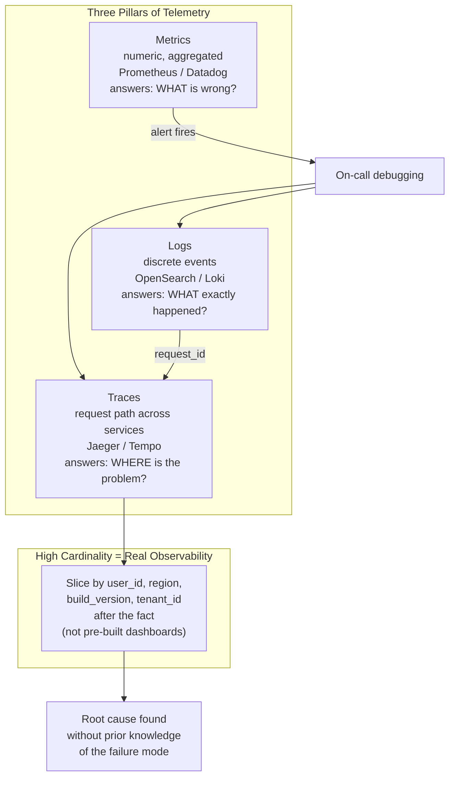

## In simple terms

**Observability** is how well you can understand what's happening *inside* a running system just by looking at the data it produces. [Monitoring](/t/monitoring) tells you *that* something is wrong ("error rate is up"); observability is what lets you figure out *why* ("requests from this region, hitting this service, calling this slow database query"). The distinction matters most for the failures you never predicted — in a complex system, you can't pre-build a dashboard for every possible problem, so you need to be able to ask new questions of your data after the fact.

## The Visual Map



## More detail

Observability is conventionally built on **three pillars** of telemetry:

- **Metrics** — numeric measurements over time (request rate, latency, CPU). Cheap to store, great for dashboards and alerts, but aggregated — they tell you *what*, not *which*.
- **Logs** — timestamped records of discrete events. Rich detail, but high volume and hard to search at scale. (See [logging](/t/logging).)
- **Traces** — the path of a single request as it hops across services, with timing at each step. Essential for debugging latency in microservices, where one user action touches a dozen systems.

The key idea separating observability from plain monitoring is **high-cardinality, ad-hoc querying**: being able to slice telemetry by arbitrary dimensions (user ID, build version, region) you didn't decide on in advance. That's what lets you debug "unknown unknowns."

Standards and tooling have consolidated: **OpenTelemetry** provides vendor-neutral instrumentation; platforms like Prometheus/Grafana, Honeycomb, Datadog, and Jaeger store and query the data. An "o11y stack" typically means all three pillars connected by a common trace ID so you can jump from a metric spike to the relevant log lines to the offending trace.

## Under the Hood

Simulating the three-pillar correlation — finding a slow service from a metric spike → trace:

```python
import random, uuid, time

random.seed(42)

class TraceSpan:
    def __init__(self, service: str, operation: str, duration_ms: float,
                 trace_id: str, parent_id: str = None):
        self.service    = service
        self.operation  = operation
        self.duration   = duration_ms
        self.trace_id   = trace_id
        self.parent_id  = parent_id
        self.span_id    = str(uuid.uuid4())[:8]

def simulate_request(trace_id: str, slow_service: str = None) -> list:
    """Simulate a distributed request across 3 services."""
    spans = []
    services = [
        ("api-gateway",   "handle_request",   random.uniform(1, 5)),
        ("checkout-svc",  "process_order",    random.uniform(5, 20)),
        ("payments-svc",  "charge_card",      random.uniform(20, 50)),
    ]
    parent = None
    for svc, op, dur in services:
        if svc == slow_service:
            dur = random.uniform(500, 1000)   # inject slowness
        span = TraceSpan(svc, op, round(dur, 1), trace_id, parent)
        spans.append(span)
        parent = span.span_id
    return spans

# Simulate 5 requests; one with a slow payments service
traces = {}
for i in range(5):
    tid = str(uuid.uuid4())[:8]
    slow = "payments-svc" if i == 2 else None
    traces[tid] = simulate_request(tid, slow)

# Metric: aggregate p99 latency
total_durations = []
for tid, spans in traces.items():
    total = sum(s.duration for s in spans)
    total_durations.append(total)
p99 = sorted(total_durations)[int(len(total_durations)*0.99)-1]

print(f"METRIC: p99 total latency = {p99:.0f}ms  (>100ms threshold: ALERT)")
print()
# Trace investigation: find slow spans
print("TRACE investigation - slow request details:")
for tid, spans in traces.items():
    total = sum(s.duration for s in spans)
    if total > 200:   # investigate slow traces
        print(f"  Trace {tid} ({total:.0f}ms total):")
        for s in spans:
            flag = " <-- SLOW" if s.duration > 100 else ""
            print(f"    [{s.service}] {s.operation}: {s.duration:.0f}ms{flag}")
```

## Engineering Trade-offs

**Observability vs. monitoring:** monitoring is pre-configured dashboards and alerts for known failure modes. Observability is the ability to investigate unknown failures by querying rich telemetry. A mature system needs both: monitoring catches the expected failures; observability handles the surprises. Teams often start with monitoring and graduate to full observability as their systems become more complex.

**Cardinality cost:** high-cardinality dimensions (user ID, session ID, request path) make traces powerful but expensive. Time-series databases have O(n_series) storage cost; Prometheus with millions of unique metric series runs out of memory. Trace backends (Jaeger, Honeycomb) are built for high cardinality; Prometheus is not. Pick the right tool for each pillar.

**Sampling:** at high request rates (thousands per second), storing every trace is impractical. Head-based sampling (randomly drop X% of requests) is simple. Tail-based sampling (keep 100% of slow/errored requests, sample the rest) is better — you never lose the interesting traces. Implement tail sampling in the trace collector layer (OpenTelemetry Collector with tail sampling processor).

**Cost:** a full o11y stack at scale is expensive. Log storage is the biggest cost driver for most companies. Strategies: short retention for debug-level logs (7 days), longer for errors (90 days), cold archival for compliance (7 years). Sample aggressively at source.

## Real-world examples

- A distributed trace showing a slow checkout was caused by one downstream service's database call, not the checkout service itself.
- Slicing latency metrics by app version to discover a regression appeared only in the latest deploy.
- OpenTelemetry instrumentation feeding traces, metrics, and logs into a single platform an on-call engineer queries during an incident.

## Common misconceptions

- **"Observability is just monitoring with a fancier name."** Monitoring watches known signals and alerts; observability is about being able to investigate *unanticipated* problems by querying rich telemetry freely.
- **"Collect everything and you'll have observability."** Volume isn't insight — without good instrumentation, useful dimensions, and the ability to correlate across signals, you just have expensive noise.

## Try it yourself

Model the value of high-cardinality tracing — finding which user or region a bug affects:

```bash
python3 - <<'EOF'
import random, collections

random.seed(42)

N = 500
regions  = ["us-east", "eu-west", "ap-south"]
versions = ["v1.2.9", "v1.3.0"]

requests = []
for _ in range(N):
    region  = random.choice(regions)
    version = "v1.3.0" if random.random() < 0.3 else "v1.2.9"
    # Bug in v1.3.0 for ap-south region only
    err = (version == "v1.3.0" and region == "ap-south" and random.random() < 0.6)
    requests.append({"region": region, "version": version, "error": err})

# Aggregate error rate by region x version (high-cardinality slice)
counts = collections.defaultdict(lambda: {"total": 0, "errors": 0})
for r in requests:
    key = (r["region"], r["version"])
    counts[key]["total"]  += 1
    counts[key]["errors"] += r["error"]

print(f"{'Region':<12}  {'Version':<10}  {'Requests':>10}  {'Errors':>8}  {'Error %':>9}")
print("-" * 55)
for (region, version), v in sorted(counts.items()):
    pct = v["errors"] / v["total"] * 100
    flag = " <-- BUG" if pct > 20 else ""
    print(f"{region:<12}  {version:<10}  {v['total']:>10}  {v['errors']:>8}  {pct:>8.1f}%{flag}")
print("\nHigh-cardinality slice reveals: bug in v1.3.0 on ap-south only")
EOF
```

## Learn next

- [Logging](/t/logging) — one of the three pillars: discrete event records that answer "what exactly happened" — the logs pillar of an o11y stack
- [SRE](/t/sre) — the engineering discipline that operationalises observability through SLIs, SLOs, and error budgets; observability is the instrumentation layer that makes SLO measurement possible
- [Incident response](/t/incident-response) — observability is primarily exercised during incidents; the ability to slice traces and logs by arbitrary dimensions is what makes MTTR short
