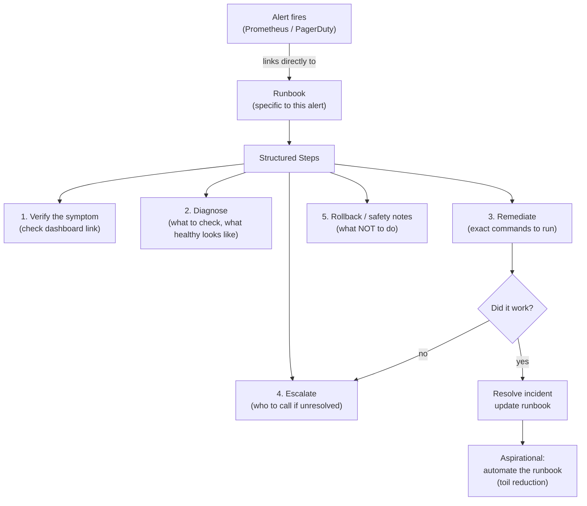

## In simple terms

A **runbook** is a written recipe for a specific operational situation: "if the queue backs up, here's exactly what to check and what to do." When something breaks at 3 a.m., the on-call engineer shouldn't have to figure out the response from scratch — a good runbook walks them through diagnosis and remediation step by step. It captures the hard-won knowledge of "how we fix this" so it isn't trapped in one expert's head.

## The Visual Map



## More detail

A useful runbook is concrete and actionable, not a vague overview. It typically includes:

- **When to use it** — the symptom or alert that triggers it ("API latency alert firing").
- **Diagnosis steps** — specific dashboards to check, queries to run, what healthy vs. unhealthy looks like.
- **Remediation steps** — the actual commands or actions to take, in order, with expected results.
- **Escalation** — who to call and when to escalate if the steps don't resolve it.
- **Rollback / safety notes** — how to undo, and what *not* to do.

Runbooks are most valuable when they're **linked directly from alerts** — the alert that wakes you up points straight at the runbook for that exact problem. They're living documents: every incident and postmortem is a chance to create a new runbook or fix an outdated one.

The aspirational end state is **automation**. A runbook that's followed identically every time is a script waiting to be written; mature teams progressively turn manual runbooks into automated remediation ("auto-healing"), leaving humans for the genuinely novel problems. This connects to the [SRE](/t/sre) goal of reducing **toil** — repetitive manual operational work.

## Under the Hood

A structured runbook representation with validation that steps are executable:

```python
import dataclasses
from typing import List, Optional

@dataclasses.dataclass
class RunbookStep:
    description: str
    command:     Optional[str] = None   # actual command to run
    expected:    Optional[str] = None   # what success looks like
    rollback:    Optional[str] = None   # how to undo this step

@dataclasses.dataclass
class Runbook:
    title:       str
    alert_name:  str
    severity:    str   # SEV-1, SEV-2, SEV-3
    steps:       List[RunbookStep] = dataclasses.field(default_factory=list)
    escalation:  Optional[str] = None
    last_used:   Optional[str] = None

    def validate(self) -> list:
        errors = []
        if not self.steps:
            errors.append("No steps defined")
        for i, step in enumerate(self.steps, 1):
            if not step.description:
                errors.append(f"Step {i}: missing description")
        if not self.escalation:
            errors.append("Missing escalation contact")
        return errors

    def render(self):
        print(f"\n{'='*55}")
        print(f"RUNBOOK: {self.title}")
        print(f"Alert:   {self.alert_name}  [{self.severity}]")
        print(f"{'='*55}")
        for i, step in enumerate(self.steps, 1):
            print(f"\nStep {i}: {step.description}")
            if step.command:   print(f"  $ {step.command}")
            if step.expected:  print(f"  Expected: {step.expected}")
            if step.rollback:  print(f"  Rollback: {step.rollback}")
        print(f"\nEscalate to: {self.escalation}")

rb = Runbook(
    title      = "Checkout API High Latency",
    alert_name = "checkout_p99_latency_high",
    severity   = "SEV-2",
    escalation = "#oncall-platform  /  @site-reliability-lead",
    steps      = [
        RunbookStep(
            description = "Verify alert is real (not noise)",
            command     = "# Check Grafana: dashboard/checkout-golden-signals",
            expected    = "p99 latency > 500ms for > 5 min"
        ),
        RunbookStep(
            description = "Check for recent deployments",
            command     = "kubectl rollout history deploy/checkout-api",
            expected    = "Recent deployment within last 30 min = suspect",
            rollback    = "kubectl rollout undo deploy/checkout-api"
        ),
        RunbookStep(
            description = "Check database connection pool",
            command     = "kubectl exec -it deploy/checkout-api -- curl localhost:8080/metrics | grep db_pool",
            expected    = "pool_waiting < 5; if > 50: DB is bottleneck"
        ),
    ]
)
errors = rb.validate()
print(f"Runbook validation: {'OK' if not errors else 'ERRORS: ' + str(errors)}")
rb.render()
```

## Engineering Trade-offs

**Specificity vs. maintenance burden:** a runbook that says "check the logs" is useless; one with exact `kubectl` commands and dashboard links is invaluable. But highly specific runbooks rot as infrastructure changes — a stale command that fails under stress is worse than none. Balance: link to dashboards by name (not URL), keep commands generic where possible, review runbooks quarterly.

**Manual runbooks vs. auto-remediation:** any runbook that's executed identically more than 3 times should be automated. Auto-remediation (triggered directly by the alert) eliminates the human delay. But automated fixes can make things worse — add safeguards (check error rate before restarting, abort if more than 20% of instances are affected) and log every automated action for the postmortem.

**Alert → runbook linkage:** a runbook that isn't linked from its alert doesn't get used at 3 a.m. Every alert title should link to a runbook. PagerDuty, OpsGenie, and Alertmanager support alert annotations for this purpose.

**Runbook debt:** teams that never delete runbooks accumulate hundreds of stale documents. A runbook for a decommissioned service is confusion at the worst moment. Tie runbook lifecycle to service lifecycle — if the service dies, archive the runbook.

## Real-world examples

- An alert for "disk usage above 90%" linking to a runbook that lists exactly which logs to rotate and how to expand the volume.
- A new on-call engineer resolving a database failover by following the runbook step by step, without needing to wake a senior engineer.
- A team converting a frequently-used manual runbook into an automated script that runs on the alert, eliminating the toil entirely.

## Common misconceptions

- **"A runbook is just documentation."** General docs explain how a system works; a runbook is a *procedure* for a specific situation, written to be followed under stress with minimal thinking.
- **"Write it once and you're done."** Stale runbooks are dangerous — they send engineers down wrong paths during incidents. They must be maintained and validated as the system changes.

## Try it yourself

Simulate runbook execution with validation checks:

```bash
python3 - <<'EOF'
import random, time

random.seed(42)

def check_step(description: str, check_fn, rollback: str = None) -> bool:
    print(f"  [{description}]", end=" ")
    ok = check_fn()
    print("OK" if ok else "FAILED")
    if not ok and rollback:
        print(f"    -> executing rollback: {rollback}")
    return ok

def run_runbook(incident: str):
    print(f"\nRunbook: {incident}")
    print("-" * 40)
    steps = [
        ("Verify alert is real",
         lambda: random.random() > 0.2,
         None),
        ("Check for recent deploys",
         lambda: random.random() > 0.3,
         "kubectl rollout undo deploy/api"),
        ("Check DB connection pool",
         lambda: random.random() > 0.4,
         None),
        ("Restart affected pods",
         lambda: random.random() > 0.1,
         "kubectl scale deploy/api --replicas=0 then =3"),
    ]
    for desc, check, rollback in steps:
        ok = check_step(desc, check, rollback)
        if ok:
            print("  Resolved.")
            return True
    print("  Escalating to on-call lead.")
    return False

run_runbook("checkout-api-latency-high")
EOF
```

## Learn next

- [SRE](/t/sre) — the engineering discipline that frames runbooks as a temporary measure on the path to automation; SRE's toil reduction goal is what drives teams to convert runbooks into code
- [Monitoring](/t/monitoring) — the alert system that should link directly to each runbook; without good monitoring, the runbook never gets surfaced at the right moment
- [Toil](/t/toil) — the SRE concept that captures repetitive manual work; a runbook followed more than 3 times is toil that should be automated away
