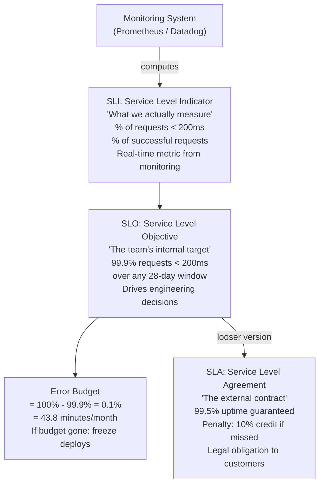

## In simple terms

These three acronyms are how reliability gets turned from a vague wish ("the site should be up") into something measurable and negotiable. An **SLI** is a *measurement* of how the service is actually doing (e.g., "99.95% of requests succeeded this month"). An **SLO** is the *target* you set for that measurement ("99.9% should succeed"). An **SLA** is a *contract* with a customer that promises a level of service and spells out what happens — usually refunds — if you miss it. In short: SLI = the number, SLO = the goal, SLA = the promise.

## The Visual Map



## More detail

- **SLI — Service Level Indicator.** A carefully chosen metric reflecting user experience: availability, latency (e.g., 95th-percentile response time), error rate, throughput. Good SLIs measure what users actually feel, not internal vanity metrics ("we had 100% uptime" is useless if 10% of requests returned errors).
- **SLO — Service Level Objective.** The target value for an SLI over a window ("99.9% availability over 28 days"). Internal, owned by the team, and the basis for alerting and prioritisation.
- **SLA — Service Level Agreement.** An external, contractual commitment to customers, with financial or legal consequences for breaches. SLAs are deliberately set *looser* than SLOs, so the team gets an internal warning well before a contract is at risk.

The most powerful idea built on these is the **error budget**: if your SLO is 99.9%, you're *allowed* 0.1% unreliability — that's your budget. As long as you're within it, you can ship fast and take risks. Burn through it, and the policy shifts to stability: freeze risky launches and focus on reliability. This reframes the classic tension between feature velocity and reliability as a shared, quantified trade-off rather than an argument.

A crucial reality check: **100% is the wrong target.** Chasing perfect reliability costs exponentially more for diminishing returns, and users usually can't tell the difference between 99.9% and 99.99% given everything else (their own network) that can fail.

## Under the Hood

Computing SLI from request data and checking against SLO thresholds:

```python
import time

def compute_sli(requests: list, slo_pct: float = 99.9) -> dict:
    """
    SLI: fraction of requests with latency < 200ms and status 200.
    SLO: SLI must be >= slo_pct over the measurement window.
    """
    good  = sum(1 for r in requests if r["status"] == 200 and r["ms"] < 200)
    total = len(requests)
    sli   = good / total * 100 if total else 0
    err_budget_pct = 100 - slo_pct
    remaining_pct  = sli - slo_pct   # positive = under budget; negative = overrun
    return {
        "sli":           round(sli, 4),
        "slo":           slo_pct,
        "good":          good,
        "total":         total,
        "slo_met":       sli >= slo_pct,
        "budget_used_pct": max(0, (err_budget_pct - max(0, sli - slo_pct)) / err_budget_pct * 100)
    }

import random
random.seed(42)

# 28-day window: 1M requests
requests = [
    {"status": 200 if random.random() > 0.002 else 500,
     "ms": random.expovariate(1/80)}
    for _ in range(10_000)
]

result = compute_sli(requests, slo_pct=99.9)
print(f"SLI: {result['sli']:.4f}%  ({result['good']:,} good / {result['total']:,} total)")
print(f"SLO: {result['slo']}%  {'MET' if result['slo_met'] else 'BREACHED'}")
print(f"Error budget used: {result['budget_used_pct']:.1f}%")
print()
# Show the nines table
print("Downtime per SLO target (28-day window):")
for slo in [99.0, 99.5, 99.9, 99.95, 99.99, 99.999]:
    budget_min = (1 - slo/100) * 28 * 24 * 60
    print(f"  {slo:.3f}%  = {budget_min:>7.1f} min budget  "
          f"({budget_min*60:.0f} sec  /  {budget_min/60:.1f} hr)")
```

## Engineering Trade-offs

**SLO vs. SLA strictness:** SLOs are deliberately tighter than SLAs. If you promise 99.5% to customers (SLA) but target 99.9% internally (SLO), you have 0.4% headroom before a customer-visible breach. Without this buffer, you're forever dangerously close to penalties.

**Latency vs. availability as SLIs:** availability (fraction of successful requests) is the most common SLI. But latency is often the more user-visible dimension — a slow checkout that succeeds at 5 seconds degrades user experience as much as a 0.1% error rate. Good SLI design captures both.

**SLO window length:** longer windows (28–90 days) smooth out short spikes and give more budget to operate in. Shorter windows (1 day, 1 week) are more reactive but give less room. Burn-rate alerting bridges the gap: alert when you're consuming budget faster than sustainable rather than when the budget is already gone.

**100% SLO antipattern:** teams that target 100% availability spend engineering time chasing a mathematical impossibility and block feature work indefinitely after any incident. The right target is "reliable enough that users don't notice" — typically 99.9% for B2C products, 99.99% for financial or safety-critical services.

## Real-world examples

- A cloud provider's SLA promising 99.95% monthly uptime, with service credits if they fall short.
- A team setting a 99.9% SLO on checkout latency and using the error budget to decide whether to freeze deploys after a rough week.
- An SLI defined as "proportion of requests served in under 300 ms," tracked on a [monitoring](/t/monitoring) dashboard.

## Common misconceptions

- **"SLA, SLO, and SLI are interchangeable."** They're a deliberate hierarchy: the indicator (measurement), the objective (internal goal), and the agreement (external contract) are distinct and set at different strictness.
- **"Aim for 100% reliability."** Perfect uptime is prohibitively expensive and usually pointless; the right target is "reliable enough that users don't notice," which the error budget makes explicit.

## Try it yourself

Compute downtime budgets and check which SLO tiers an incident would breach:

```bash
python3 - <<'EOF'
WINDOW_DAYS = 28

def minutes_budget(slo_pct):
    return (1 - slo_pct / 100) * WINDOW_DAYS * 24 * 60

# Scenario: a 47-minute outage this month
OUTAGE_MIN = 47

print(f"Outage: {OUTAGE_MIN} minutes in a {WINDOW_DAYS}-day window")
print()
print(f"{'SLO target':>12}  {'Budget (min)':>14}  {'Status':>20}")
print("-" * 50)
for slo in [99.0, 99.5, 99.9, 99.95, 99.99]:
    budget = minutes_budget(slo)
    ok = OUTAGE_MIN <= budget
    status = f"OK  ({budget-OUTAGE_MIN:.1f}min remaining)" if ok else f"BREACHED by {OUTAGE_MIN-budget:.1f}min"
    print(f"{slo:>11}%  {budget:>14.1f}  {status}")
EOF
```

## Learn next

- [Monitoring](/t/monitoring) — SLIs are computed from monitoring data; without good metrics collection you can't track whether you're meeting your SLO
- [Observability](/t/observability) — SLO burn is often diagnosed through high-cardinality telemetry; observability tools answer *why* the SLI is declining, not just that it is
- [Error budget](/t/error-budget) — the operational consequence of an SLO: the 0.1% of unreliability you're allowed, and the policy (deployment freeze) that kicks in when you spend it
