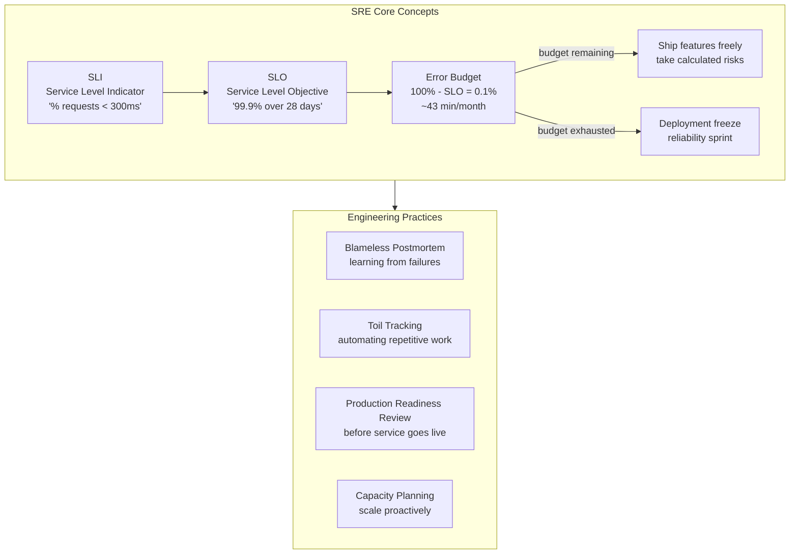

## In simple terms

**Site Reliability Engineering (SRE)** is what you get when you assign software engineers to do operations work. Instead of treating "keep the lights on" as a separate, manual job, SREs write code to automate it, define **explicit reliability targets**, and use the gap between the target and reality to govern release pace.

## The Visual Map



## More detail

Coined and popularised at Google (Beyer et al., *Site Reliability Engineering*, 2016). The defining ideas:

- **SLI / SLO / SLA**:
  - **SLI** (Indicator) — a metric measuring reliability ("fraction of HTTP requests with status < 500 served in < 300 ms").
  - **SLO** (Objective) — the target for the SLI ("99.9% over any 30-day window").
  - **SLA** (Agreement) — the contractually-promised version, usually one notch weaker than the SLO.
- **Error budget** — `1 - SLO`. The amount of unreliability you've decided is acceptable. When you've spent the budget, you stop shipping risky changes until reliability recovers. This is the lever that lets engineering and product agree on velocity vs. reliability.
- **Toil elimination** — toil is repetitive, manual operational work that scales linearly with the service. SREs measure toil and automate it away.
- **Blameless postmortems** — see [incident response](/t/incident-response).
- **Capacity planning** as engineering work, not guesswork.
- **Production readiness reviews** before a service goes live.

SRE is one model among several; you'll also see "DevOps" (broader cultural movement, fewer concrete practices), "Platform Engineering" (building internal developer platforms), and traditional ops teams. Many organisations blend them.

## Engineering Trade-offs

**50% toil cap:** Google's SRE model caps operational (toil) work at 50% of an SRE's time. Above 50%, the SRE manager must act — automate toil or hire more SREs. Without this cap, SRE teams drift into pure ops and never improve the system.

**SLO target vs. 100%:** the right SLO is not 100%. Chasing perfection costs exponentially more for diminishing returns, and users can't distinguish between 99.9% and 99.99% given everything else (their network, their device) that can fail. An SLO that is always exceeded is too conservative — loosen it to give the team more error budget to innovate.

**SRE vs. DevOps:** DevOps is a culture and philosophy; SRE is a concrete job role with specific practices (SLOs, error budgets, toil tracking). Many teams call themselves DevOps but practice SRE mechanics. The overlap is large; the distinction is mostly useful for hiring and organisational design.

**On-call sustainability:** SRE on-call works if the alert-to-action ratio is sane. If every page requires a manual intervention, on-call becomes toil that burns out engineers. Healthy SRE on-call: <2 pages per shift that require action; most others auto-resolve.

## Real-world examples

- A team with a 99.9% latency SLO has ~43 minutes of error budget per month. A risky migration that costs 30 minutes leaves only 13 — risky changes pause until budget regenerates.
- Google's SRE org famously caps "ops work" per engineer at 50%, with the rest spent on automation and engineering.
- A "production readiness review" might block a launch because the service has no SLOs, no on-call rotation, or no rollback procedure.
- Google's published SRE workbook (sre.google/workbook) has become the canonical reference — concepts like SLO, error budget, and blameless postmortem are now industry-standard far beyond Google.

## Common misconceptions

- **"SRE = ops with a fancy name."** SRE is engineering-led ops with explicit targets and an error budget. Without those, it's just ops.
- **"100% reliability is the goal."** It is not — past a point, more nines cost more than they're worth, and slow product development to nothing. SLOs are deliberately less than 100%.

## Try it yourself

Calculate error budget burn and determine whether to freeze deployments:

```bash
python3 - <<'EOF'
def error_budget(slo_pct: float, window_days: int = 28) -> float:
    """Return error budget in minutes for a given SLO and rolling window."""
    return (1 - slo_pct/100) * window_days * 24 * 60

def budget_status(slo_pct, budget_used_min, window_days=28):
    total = error_budget(slo_pct, window_days)
    remaining = total - budget_used_min
    pct_used  = budget_used_min / total * 100
    status    = "FREEZE DEPLOYS" if pct_used >= 100 else ("WARNING" if pct_used >= 75 else "OK")
    return total, remaining, pct_used, status

print(f"Error budget calculator (28-day rolling window)")
print(f"{'SLO':>7}  {'Budget (min)':>14}  {'Used (min)':>12}  {'% Used':>8}  {'Status'}")
print("-" * 60)
scenarios = [
    (99.9,  20),
    (99.9,  35),
    (99.9,  50),
    (99.99,  2),
    (99.99,  5),
]
for slo, used in scenarios:
    total, rem, pct, status = budget_status(slo, used)
    print(f"{slo:>6}%  {total:>14.1f}  {used:>12.1f}  {pct:>7.0f}%  {status}")
EOF
```

## Learn next

- [SLO, SLI, SLA](/t/slo-sli-sla) — the measurement vocabulary that makes reliability engineering quantitative: SLIs measure it, SLOs target it, SLAs contractualise it
- [Incident response](/t/incident-response) — SRE's framework for handling failures: blameless postmortems, incident commanders, and MTTR as a key metric
- [Toil](/t/toil) — the SRE concept that distinguishes operational grunt work from engineering; reducing toil is what keeps SRE teams effective rather than becoming ops firefighters
