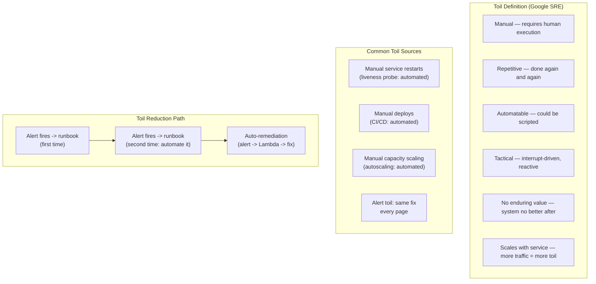

## In simple terms

Toil is the grunt work of operations: manually restarting a crashed service, provisioning a server by clicking through a console, responding to the same alert for the third time this week by running the same script. Toil is not inherently bad — some of it is unavoidable — but it is not engineering: it doesn't leave a lasting improvement. Google's SRE model says: if SREs spend more than 50% of their time on toil, they're not doing SRE — they're doing Ops, and the system will never get better. Toil is a debt that compounds.

## The Visual Map



## More detail

**Google's definition of toil** (from *Site Reliability Engineering*, Betsy Beyer et al.):
Toil is work that is: **manual**, **repetitive**, **automatable**, **tactical** (interrupt-driven, reactive), **devoid of enduring value** (completing the task doesn't improve the system), and **scales with service growth** (more traffic → more instances to manage → more toil).

*Not toil:* novel problem-solving, improving monitoring, writing automation, capacity planning, code review. These are engineering; they leave lasting improvements.

**Why toil is harmful:**
- It crowds out engineering work (automation, reliability improvements).
- It doesn't compound — the same work is done again next time.
- It causes burnout. On-call engineers drowning in alert toil are exhausted and make errors.
- It obscures real problems — if every alert requires a manual response, you stop improving the system that produces alerts.

**Sources of toil:**
- **Alerts that require manual intervention** — every page that resolves with "run this script" or "restart this service" is a toil generator. The correct response: automate the remediation.
- **Manual deploys** — any deployment requiring a human to run commands step-by-step.
- **Manual capacity provisioning** — adding servers, increasing quotas manually.
- **Data migrations run by hand** — copying data, updating schemas manually.

**The 50% rule:** Google's SRE model requires SREs to track their toil and engineering time split. If toil exceeds 50%, the SRE team's manager must act: either reduce toil (automation sprint) or add SRE capacity. This prevents SRE teams from drifting into pure operations roles.

**Toil reduction strategies:**
- **Automate the runbook:** if an alert has a documented runbook, automate it. Event-driven remediation: alert → Lambda → restart.
- **Eliminate noisy alerts:** alerts that don't require human action should be silenced or converted to metrics.
- **Self-healing systems:** health checks + restart policies (Kubernetes liveness probes) eliminate a class of manual restarts.
- **Infrastructure as code:** Terraform, Pulumi — eliminate manual cloud console clicks.

## Under the Hood

A toil tracker that categorises work and flags if the 50% rule is violated:

```python
from dataclasses import dataclass, field
from typing import List

@dataclass
class WorkEntry:
    description: str
    hours: float
    is_toil: bool

@dataclass
class ToilTracker:
    entries: List[WorkEntry] = field(default_factory=list)
    TOIL_CAP = 0.50   # Google's 50% rule

    def log(self, description: str, hours: float, is_toil: bool):
        self.entries.append(WorkEntry(description, hours, is_toil))

    def summary(self) -> dict:
        total      = sum(e.hours for e in self.entries)
        toil_hrs   = sum(e.hours for e in self.entries if e.is_toil)
        eng_hrs    = total - toil_hrs
        toil_pct   = toil_hrs / total if total else 0
        return {"total": total, "toil": toil_hrs, "engineering": eng_hrs,
                "toil_pct": toil_pct, "over_cap": toil_pct > self.TOIL_CAP}

tracker = ToilTracker()

# Simulate one sprint of SRE work
tracker.log("Restart crashed service (3rd time this week)", 0.5, is_toil=True)
tracker.log("Manual certificate renewal on 5 servers",     2.0, is_toil=True)
tracker.log("Respond to flapping alert: restart + monitor", 1.0, is_toil=True)
tracker.log("Write auto-remediation for flapping alert",    4.0, is_toil=False)
tracker.log("Capacity planning for Q3",                     3.0, is_toil=False)
tracker.log("Update SLO dashboard + alerts",                2.0, is_toil=False)
tracker.log("Manual deploy (no CI/CD yet)",                 1.5, is_toil=True)
tracker.log("Improve monitoring coverage",                  2.5, is_toil=False)

s = tracker.summary()
print(f"Sprint summary: {s['total']:.1f}h total")
print(f"  Toil:        {s['toil']:.1f}h  ({s['toil_pct']:.0%})")
print(f"  Engineering: {s['engineering']:.1f}h  ({1-s['toil_pct']:.0%})")
print()
if s["over_cap"]:
    print(f"50% RULE VIOLATED ({s['toil_pct']:.0%} toil) -- action required:")
    print("  Options: automate top toil items | hire SRE capacity")
    print()
    print("Top toil items to automate:")
    toil_items = [(e.description, e.hours) for e in tracker.entries if e.is_toil]
    for desc, hrs in sorted(toil_items, key=lambda x: -x[1]):
        print(f"  {hrs:.1f}h  {desc}")
else:
    print(f"50% rule met. Engineering time available for reliability work.")
```

## Engineering Trade-offs

**Automation cost vs. toil volume:** not all toil is worth automating. A task that takes 30 minutes but happens once a year is not worth building a Lambda function for. Use the rule: if a runbook is followed more than 3 times, automate it. Estimate: automation takes 1 day, saves 15 min × 100 occurrences = 25 hours/year. Break-even in under 2 weeks.

**Alert fatigue:** on-call engineers who get paged 20 times per shift for alerts that self-resolve start ignoring pages — including the important ones. Reducing alert toil (silence flapping alerts, automate responses) is often the highest-value reliability improvement. The signal-to-noise ratio of an alert channel is a measurable reliability metric.

**Toil vs. overhead:** toil is automatable work that grows with scale. Overhead is unavoidable non-engineering work (meetings, performance reviews, training) — still a cost but not toil, and not automatable. SRE focuses on reducing toil specifically because it is automatable.

**Toil debt:** teams that don't measure toil watch it quietly expand to fill all available time. Engineers spend their days fighting fires without building fire suppression systems. Making toil visible (tracking the 50% split explicitly) is the prerequisite to reducing it.

## Real-world examples

- Google SRE: every SRE tracks time spent on toil (manual ops) vs. engineering (projects). Quarterly reports aggregate by team; toil above 50% triggers escalation.
- Dropbox SRE: identified that 40% of on-call time was alert toil from one specific service; automated the remediation, reducing on-call burden by 30%.
- Kubernetes: automated restart via liveness probes eliminates the toil of manual service restarts — the dominant source of ops toil in the pre-K8s era.

## Common misconceptions

- **"All operational work is toil."** Toil is specifically automatable, repetitive, non-engineering work. Attending an incident retrospective and writing action items is overhead, not toil. Novel debugging is engineering.
- **"Reducing toil means eliminating all ops work."** Some tasks are not worth automating (too rare, too complex). The goal is to keep toil below 50% and automate the highest-volume repetitive work.

## Try it yourself

Track your toil vs. engineering ratio across a simulated sprint:

```bash
python3 - <<'EOF'
entries = [
    # (description, hours, is_toil)
    ("Respond to paging alert x3",           2.0, True),
    ("Manual cert rotation on 8 servers",    1.5, True),
    ("Write Terraform for cert automation",  3.0, False),
    ("On-call schedule management",          0.5, True),
    ("Improve SLO alerting thresholds",      2.0, False),
    ("Manual deploy (CI/CD broken)",         1.0, True),
    ("Fix CI/CD pipeline",                   4.0, False),
    ("Write runbook for DB failover",        2.0, False),
]

toil_h = sum(h for _, h, t in entries if t)
eng_h  = sum(h for _, h, t in entries if not t)
total  = toil_h + eng_h

print(f"Sprint work split ({total:.1f}h total):")
print(f"  Toil: {toil_h:.1f}h  ({toil_h/total:.0%})")
print(f"  Eng:  {eng_h:.1f}h  ({eng_h/total:.0%})")
cap_ok = toil_h/total <= 0.50
print(f"  50% rule: {'OK' if cap_ok else 'VIOLATED - reduce toil'}")
print()
if not cap_ok:
    print("Top toil to automate first:")
    for desc, hrs, t in sorted([e for e in entries if e[2]], key=lambda x: -x[1]):
        print(f"  {hrs:.1f}h -- {desc}")
EOF
```

## Learn next

- [Chaos engineering](/t/chaos-engineering) — chaos experiments generate operational data about what breaks; if the fixes are always manual, that's toil — chaos engineering motivates automation by exposing recurring failure modes
- [Error budget](/t/error-budget) — toil-heavy teams burn error budget on preventable incidents; reducing toil improves reliability metrics and extends the budget for feature velocity
- [DORA metrics](/t/dora-metrics) — mean time to restore (MTTR) is the clearest signal of toil burden; automated remediation from runbook automation drives MTTR down measurably
