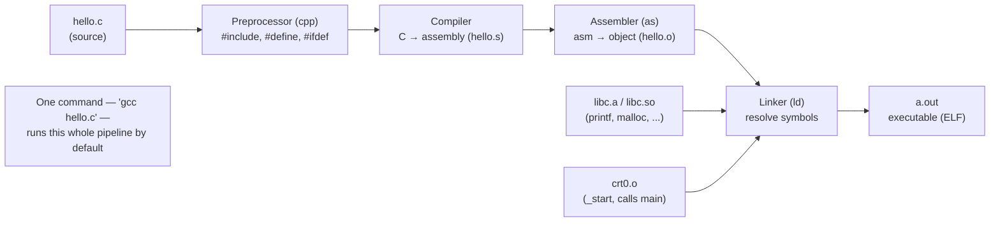

## In simple terms

**C** is the language that operating systems, compilers, embedded firmware, and most performance-critical infrastructure are written in. It's small, fast, portable, and unforgiving: there's no garbage collector, no memory safety, no string class — you manage memory by hand and the compiler trusts you completely. That trade-off (great power, great responsibility) made it the default systems language for fifty years.

## The Visual Map



## More detail

Dennis Ritchie created C at Bell Labs (1972) to rewrite Unix. The design goals were portability (the same C code should compile on different machines) and giving the programmer direct access to the machine without forcing assembly.

Defining characteristics:

- **Manual memory management** — `malloc` / `free`, no GC, no bounds checking. You own every allocation's lifetime.
- **Pointers** — first-class; arithmetic on them is allowed, and foot-guns abound.
- **Static typing** — but relatively weak: types coerce eagerly and silently between numeric kinds.
- **Tiny standard library** — much smaller than modern languages; "do everything yourself" by design.
- **Preprocessor** — `#include`, `#define`, `#ifdef`. Crude textual substitution, but ubiquitous.
- **No exceptions, no closures, no generics** — you build all of those by hand (return codes, function pointers, macros/`void *`) if you need them.

Standards: K&R (1978), ANSI C89, C99, C11, C17, C23. Most embedded code is still C99; most kernels target a slightly newer subset.

The compiler family: **gcc** (the GNU C compiler, default on Linux/Unix), **clang** (LLVM-based, better diagnostics, used by Apple and FreeBSD), **MSVC** (Windows), and small or pedagogical compilers like **tcc** and **chibicc**.

Common safety footguns: buffer overflows, use-after-free, double-free, integer overflow, uninitialised reads, dangling pointers, and signed-overflow undefined behaviour. Modern projects mitigate with `-fsanitize=address,undefined`, fuzzing, static analysis, and increasingly *Rust* for new code.

## Under the Hood

A short C program showing what makes C *C*: explicit allocation, pointer arithmetic, and the responsibility to free. The commented lines are real footguns the compiler will happily accept:

```c
#include <stdio.h>
#include <stdlib.h>

int main(void) {
    int n = 5;
    /* Manual allocation: ask the heap for n ints. No GC will reclaim this. */
    int *arr = malloc(n * sizeof(int));
    if (arr == NULL) return 1;            /* malloc can fail; you must check */

    /* Pointer arithmetic: arr + i is the address of the i-th int.
       arr[i] is exactly *(arr + i) — array indexing IS pointer math. */
    for (int i = 0; i < n; i++)
        *(arr + i) = i * i;               /* write squares via the pointer */

    int sum = 0;
    for (int i = 0; i < n; i++)
        sum += arr[i];
    printf("sum of squares 0..4 = %d\n", sum);   /* 0+1+4+9+16 = 30 */

    /* arr[5] = 99;   <-- buffer overflow: no bounds check, undefined behaviour */
    free(arr);                            /* you must free exactly once... */
    /* free(arr);     <-- double free: corrupts the allocator */
    /* sum = arr[0];  <-- use-after-free: arr now dangles */
    return 0;
}
```

Compile and run with `gcc demo.c -o demo && ./demo` (add `-fsanitize=address,undefined` to make the commented-out bugs crash loudly instead of silently corrupting memory).

## Engineering Trade-offs

**Control vs. safety**
C gives you the machine: raw pointers, manual allocation, predictable layout, zero hidden costs. That's precisely why it powers kernels and embedded systems where every byte and cycle matters. The price is that the compiler enforces almost nothing — buffer overflows, use-after-free, and undefined behaviour are *your* responsibility, and they are the root of a large fraction of the industry's security vulnerabilities.

**Portability vs. assumptions**
C compiles on essentially every platform ever made, which is why it's the universal lingua franca. But "portable" hides traps: integer sizes (`int` is not guaranteed 32 bits), endianness, and alignment vary, and code that assumes one platform's behaviour breaks subtly on another. Truly portable C is a discipline, not a default.

**Tiny language vs. build-it-yourself**
C's smallness means you can hold the whole language in your head and the runtime is nearly nonexistent — great for bootstrapping and for environments with no OS. The flip side: no generics, no built-in collections, no string type, no error handling beyond return codes. Every non-trivial C project re-implements (or imports) data structures other languages give you for free.

**Undefined behaviour vs. optimisation**
The C standard leaves many situations "undefined" specifically so compilers can optimise aggressively (assuming signed overflow never happens, that pointers don't alias, etc.). This yields very fast code — but the same UB lets an optimiser delete your safety checks or miscompile buggy code in surprising ways. Fast and forgiving are in direct tension here.

## Real-world examples

- **SQLite** is ~150 KB of C source that runs in every smartphone, browser, and countless embedded devices — the most-deployed database engine in the world.
- **The Linux kernel** is tens of millions of lines of C, as are the BSDs and large parts of macOS and Windows.
- **Redis** started as a few thousand lines of C and grew into one of the most-deployed in-memory databases.
- **The CPython interpreter** is written in C; the language runtimes for Ruby, PHP, Lua, and the JVM's hotspot core are too — so even "I don't write C" programmers depend on C constantly.
- **OpenSSL**, **zlib**, **FFmpeg**, and **curl** — the C libraries quietly underpinning encryption, compression, media, and HTTP across the entire software stack.

## Common misconceptions

- **"C is obsolete."** It is the most-deployed systems language by an enormous margin and will be for decades. Even where Rust is adopted for new code, it almost always coexists with (and links against) existing C.
- **"C is hard."** The *language* is small — you can learn its syntax in a weekend. What's genuinely hard is writing *correct* C without modern tooling; AddressSanitizer, UBSan, fuzzers, and a strict compiler are essentials, not luxuries.
- **"`arr[i]` and `*(arr+i)` are different things."** They are defined to be identical in C — array subscripting *is* pointer arithmetic, which is why `arr[i]` and `i[arr]` both compile.

## Try it yourself

C integers are fixed-width and wrap around silently on overflow — a classic footgun that Python's arbitrary-precision integers normally hide. You can reproduce exact C `int8_t`/`int32_t` overflow using the stdlib `ctypes` module (no compiler needed):

```bash
python3 - << 'EOF'
import ctypes

# C 'signed char' (int8_t): range -128..127, wraps on overflow
print("int8_t overflow:")
for x in (126, 127, 128, 129, 255, 256):
    print(f"  (int8_t){x:>4} = {ctypes.c_int8(x).value}")

# C 'int' (int32_t): INT_MAX + 1 wraps to INT_MIN
INT_MAX = 2**31 - 1
print(f"\nint32_t:  INT_MAX     = {ctypes.c_int32(INT_MAX).value}")
print(f"          INT_MAX + 1 = {ctypes.c_int32(INT_MAX + 1).value}   (wrapped to INT_MIN!)")

# Unsigned wraps the other way: 0u - 1 = UINT_MAX
print(f"          (unsigned)0 - 1 = {ctypes.c_uint32(0 - 1).value}")
EOF
```

`ctypes.c_int32(2**31)` gives `-2147483648` — exactly what a C program prints, because both use the same two's-complement machine integers. This is *the* reason C code must guard against integer overflow that higher-level languages can ignore.

## Learn next

- [Compiler](/t/compiler) — what turns your `.c` files into runnable binaries; C's whole workflow revolves around the compile-link cycle.
- [Memory](/t/memory) — the machine resource C makes you manage directly, by hand, with `malloc`/`free` and pointers.
- [Pointer and reference](/t/pointer-and-reference) — C's defining feature and its sharpest edge; understanding pointers is understanding C.
- [Rust](/t/rust) — the modern systems language designed to keep C's control while eliminating its memory-safety footguns at compile time.
