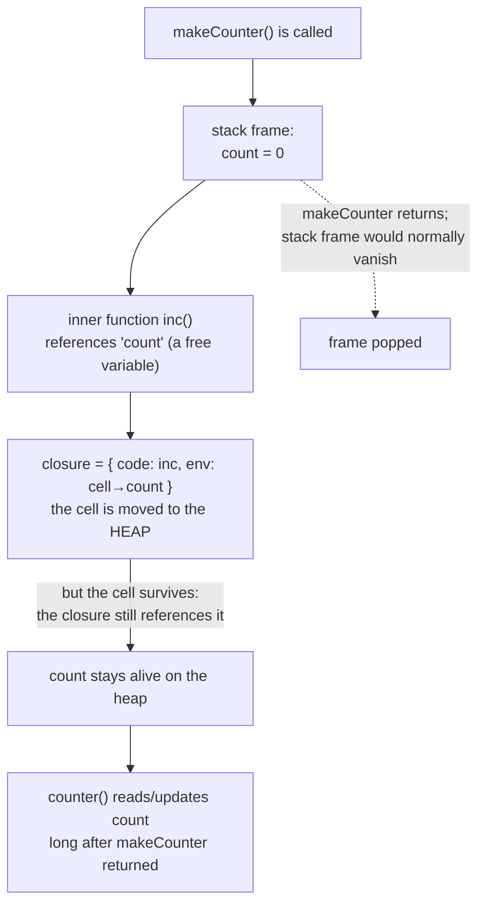

## In simple terms

Normally, when a function returns, its local variables are gone. A closure "closes over" variables from its surrounding scope, capturing them and keeping them alive even after the outer function has finished. The inner function and the captured variables form a package — a closure — that can be passed around, stored, and called later with full access to the environment it was created in.

## The Visual Map



## More detail

```javascript
function makeCounter() {
  let count = 0;           // local variable
  return function() {      // inner function
    count++;               // captures 'count' from the outer scope
    return count;
  };
}

const counter = makeCounter();
counter(); // 1
counter(); // 2
counter(); // 3 — count is still alive, bound to this closure
```

`count` would normally be reclaimed when `makeCounter` returns — but the inner function holds a reference to it, so the runtime keeps it alive as long as the closure exists.

**How closures are implemented:**
- At compile time, the language identifies **free variables** — variables referenced by a function but defined outside it.
- At run time, creating the inner function allocates a closure object on the heap: a pointer to the function code plus the captured variables (or references to them, often called **cells** or, in Lua, **upvalues**).
- In languages with mutable closures (JavaScript, Python), modifications to a captured variable are visible to all closures sharing it — the source of the classic loop-closure bug:
  ```javascript
  // Bug: all closures capture the same 'i'
  for (var i = 0; i < 3; i++) {
    setTimeout(() => console.log(i), 0); // prints 3, 3, 3
  }
  // Fix: use let (block-scoped) so each iteration gets a fresh binding
  ```

**Closures across languages:** JavaScript, Python, Ruby, Kotlin, and Swift offer full closures with mutable capture; Java and Kotlin lambdas capture only *effectively final* variables; C has no closures (function pointers can't capture, though GCC/Clang offer non-portable nested functions); Rust closures capture by value, shared reference, or mutable reference, with lifetimes tracked for safety.

## Under the Hood

In CPython, a closure's captured variables live in heap-allocated **cells**, exposed through `__closure__` and `__code__.co_freevars`. This makes the mechanism visible — and shows that two closures from the same factory hold *independent* cells:

```python
#!/usr/bin/env python3
"""Closures in CPython: free variables live in heap cells."""

def make_counter():
    count = 0                 # a free variable for the inner function
    def inc():
        nonlocal count        # rebind the captured cell, not a new local
        count += 1
        return count
    return inc

a, b = make_counter(), make_counter()
print("calls:", a(), a(), a(), b())          # 1 2 3 1  -> independent state

# Reveal the implementation: the captured variable is a heap 'cell'
print("free vars:", a.__code__.co_freevars)        # ('count',)
print("a's cell :", a.__closure__[0].cell_contents) # 3
print("b's cell :", b.__closure__[0].cell_contents) # 1  (a different cell)
```

Each call to `make_counter` allocates a fresh cell, which is why `a` and `b` count independently. The `__closure__` tuple is literally the captured environment the function carries with it.

## Engineering Trade-offs

**Expressive power vs. hidden lifetime extension**
Closures let you carry context implicitly — no explicit `this` parameter, no manually-passed state — which is what makes callbacks, decorators, and reactive UIs concise. The hidden cost is that a captured variable's lifetime is silently extended: a long-lived closure (a registered event listener, a cached callback) can keep a large object graph alive, a memory leak that's invisible at the call site.

**Capture by reference vs. by value**
Capturing by reference (JavaScript, Python) means closures see *live* updates to shared variables — powerful, but the cause of the loop-variable bug and of surprising action-at-a-distance. Capturing by value (or "effectively final", as Java requires) is predictable and safe to reason about but can't express shared mutable state without an explicit container. Rust makes the choice explicit per closure.

**Heap allocation vs. zero-cost**
A closure that captures variables generally requires a heap allocation for its environment, plus an indirection on every access — cheap, but not free, and a real cost in tight loops or memory-constrained systems. Languages like Rust and C++ try to keep non-escaping closures on the stack or inline them entirely, recovering "zero-cost" where the lifetime allows.

**Encapsulation vs. introspectability**
Closures are a clean way to hide private state (the pre-`class` JavaScript module pattern). But that state is *only* reachable through the closure — you can't inspect or serialise it the way you can an object's fields, which complicates debugging, testing, and persistence.

## Real-world examples

- **React hooks** (`useState`, `useEffect`) rely heavily on closures — an effect callback closes over the state and props from the render in which it was created.
- **Python decorators** are closures: `functools.lru_cache` wraps a function in a closure holding a cache dictionary.
- **Node.js callbacks**: `fs.readFile(path, (err, data) => { /* closes over path and surrounding vars */ })`.
- **Partial application / currying**: `const add5 = x => x + 5` is a closure over the captured `5`; configuration-bound handlers are built this way everywhere.
- **Iterator and generator factories**: each `makeRange(start, end)` returns a closure with its own position, the basis of many lazy-sequence libraries.

## Common misconceptions

- **"Closures only exist in functional languages."** JavaScript, Python, Ruby, Kotlin, Swift, Rust, and C# all have closures — they are ubiquitous in mainstream imperative code.
- **"A closure is the same as an anonymous function."** A closure *captures* variables from its scope; an anonymous function (lambda) is just an unnamed function. A lambda that captures nothing is not a closure.
- **"Closures copy the variables they capture."** In reference-capturing languages they capture the *variable* (a shared cell), not a snapshot — which is exactly why the loop-closure bug prints the final value, not the per-iteration one.

## Try it yourself

See the loop-closure bug and its fix in Python, where late binding makes every lambda share one variable:

```bash
python3 - << 'EOF'
# BUG: all three lambdas capture the SAME variable i (late binding).
# They read i only when CALLED — by then the loop has finished and i == 2.
funcs = [lambda: i for i in range(3)]
print("buggy:", [f() for f in funcs])     # [2, 2, 2]

# FIX: bind the current value of i per-iteration via a default argument,
# which is evaluated at definition time (one fresh binding each loop).
funcs = [lambda i=i: i for i in range(3)]
print("fixed:", [f() for f in funcs])     # [0, 1, 2]
EOF
```

The buggy version prints `[2, 2, 2]` because all three closures reference the one `i`, which ends at 2. The fix captures each iteration's value eagerly. This is the single most common closure mistake, and it appears in nearly every language with reference capture (JavaScript's `var`, Go pre-1.22, and more).

## Learn next

- [Lambda calculus](/t/lambda-calculus) — the theoretical root: a lambda abstraction over its free variables *is* a closure; this grounds the whole idea formally.
- [Continuation](/t/continuation) — closures are the building block of continuation-passing style and the way callbacks "remember" where to resume.
- [Garbage collection](/t/garbage-collection) — what keeps captured variables alive (and why careless closures can leak): the GC traces references a closure holds.
