## In simple terms

A **compiler** is a program that reads code in one language (say, C or Rust) and produces an equivalent program in another (usually machine code the CPU can run). The translation happens once, ahead of time; the resulting binary then runs many times without the compiler present. Contrast an [interpreter](/t/interpreter), which reads and executes the source directly, every time.

## The Visual Map

```mermaid
graph LR
    Src["Source code\nint x = 2 + 3;"]
    Src --> Lex["Lexer\ntokens: int, x, =, 2, +, 3, ;"]
    Lex --> Parse["Parser\nAST: Assign(x, Add(2,3))"]
    Parse --> Sem["Semantic analysis\nname resolution + type check"]
    Sem --> IR["Intermediate representation\n(LLVM IR / SSA)"]
    IR --> Opt["Optimiser\nconstant fold: 2+3 → 5\ninline, vectorise, DCE"]
    Opt --> Gen["Code generation\ntarget ISA (x86-64, ARM)"]
    Gen --> Obj["Object file (.o)"]
    Obj --> Link["Linker\nresolve symbols, libs"]
    Link --> Bin["Executable binary"]

    subgraph Front["Front end (language-specific)"]
        Lex
        Parse
        Sem
    end
    subgraph Mid["Middle end (language-neutral)"]
        IR
        Opt
    end
    subgraph Back["Back end (target-specific)"]
        Gen
    end
```



## More detail

A typical compiler is a pipeline, conventionally split into a **front end** (understands the source language), a **middle end** (optimises a neutral intermediate representation), and a **back end** (emits code for a target machine):

1. **Lexer** — splits the source into tokens (`int`, `+`, `42`).
2. **Parser** — builds an abstract syntax tree (AST) from the tokens.
3. **Semantic analysis** — name resolution, type checking, scope rules.
4. **Intermediate representation (IR)** — a simpler, language-neutral form. LLVM IR is the best-known example; SSA (static single assignment) form makes many optimisations easy.
5. **Optimisation** — constant folding, inlining, dead-code elimination, loop transformations, vectorisation.
6. **Code generation** — produce machine code for the target ISA, including register allocation and instruction selection.
7. **Linking** — combine compiled units and resolve external references into a final binary.

The front-end/middle-end/back-end split is what lets LLVM support *M* languages and *N* targets with *M + N* components instead of *M × N*: any front end that emits LLVM IR gets every back end for free.

**Variations:**

- **Ahead-of-time (AOT)** — produces a binary you ship (`gcc`, `rustc`, `clang`).
- **Just-in-time (JIT)** — compiles at run-time inside the runtime, often guided by profiling (V8, HotSpot JVM, .NET CLR).
- **Source-to-source / transpiler** — produces another high-level language (TypeScript → JavaScript, Babel for newer JS → older JS).
- **Cross-compiler** — runs on host A, produces code for host B (common in embedded and OS work).

Compilers also produce **debug info** (e.g. DWARF) so debuggers can map a crash address back to your source line.

## Under the Hood

A complete miniature compiler in Python: it lexes and parses an arithmetic expression, then *generates code* for a stack machine (the same model the JVM, CPython, and WebAssembly use). The output is bytecode, not an AST walk — that is what makes it a compiler:

```python
#!/usr/bin/env python3
"""Mini compiler: arithmetic expression -> stack-machine bytecode."""
import re

# --- 1. Lexer ---
def lex(src):
    return re.findall(r"\d+|[+\-*/()]", src)

# --- 2/3. Parser + code generator (recursive descent, precedence climbing) ---
class Compiler:
    def __init__(self, tokens):
        self.toks = tokens
        self.pos = 0
        self.code = []                 # emitted bytecode

    def peek(self):  return self.toks[self.pos] if self.pos < len(self.toks) else None
    def next(self):  t = self.peek(); self.pos += 1; return t

    def expr(self):                    # + and -
        self.term()
        while self.peek() in ("+", "-"):
            op = self.next(); self.term()
            self.code.append("ADD" if op == "+" else "SUB")

    def term(self):                    # * and /
        self.factor()
        while self.peek() in ("*", "/"):
            op = self.next(); self.factor()
            self.code.append("MUL" if op == "*" else "DIV")

    def factor(self):                  # number or ( expr )
        t = self.next()
        if t == "(":
            self.expr(); self.next()   # consume ")"
        else:
            self.code.append(f"PUSH {t}")

def compile_expr(src):
    c = Compiler(lex(src)); c.expr(); return c.code

# --- 4. A stack VM that executes the compiled bytecode ---
def run(bytecode):
    stack = []
    for instr in bytecode:
        op, *arg = instr.split()
        if op == "PUSH": stack.append(int(arg[0]))
        else:
            b, a = stack.pop(), stack.pop()
            stack.append({"ADD": a+b, "SUB": a-b, "MUL": a*b, "DIV": a//b}[op])
    return stack[0]

source = "2 + 3 * (4 - 1)"
program = compile_expr(source)
print(f"Source:   {source}")
print(f"Bytecode: {program}")
print(f"Result:   {run(program)}   (expected 11)")
```

Note how operator precedence (`*` binds tighter than `+`) and parentheses are resolved *at compile time* into a flat instruction order — the VM just pushes and pops.

## Engineering Trade-offs

**Compile time vs. run time**
The defining advantage of AOT compilation is that expensive analysis and optimisation happen once, before shipping, so every execution is fast. The cost is a build step: large C++ or Rust projects can take minutes to hours to compile, and aggressive optimisation (`-O3`, LTO) multiplies that. Interpreters skip the wait but pay it back on every run.

**Optimisation level vs. debuggability and build speed**
`-O0` compiles fast and keeps a faithful mapping from source to machine code, so debuggers and stack traces are accurate. `-O2`/`-O3` reorder, inline, and delete code — producing faster binaries but stack traces and breakpoints that no longer match the source. Production builds want speed; development builds want debuggability. You cannot fully have both.

**AOT vs. JIT**
AOT has no runtime warm-up and predictable performance, but cannot exploit runtime information (actual types, hot paths, the specific CPU). JIT compilers profile the running program and re-optimise hot code with real data — often beating AOT on long-running workloads — but pay a warm-up cost and carry the compiler in memory at runtime. Short-lived programs favour AOT; long-running servers often favour JIT.

**IR portability vs. peak performance**
A shared IR (LLVM IR, JVM bytecode) decouples languages from targets and enables reuse, but the IR is a lowest-common-denominator abstraction. Squeezing out the last few percent of performance sometimes needs target-specific intrinsics or hand-written assembly that bypass the portable layer.

## Real-world examples

- **GCC**, **Clang/LLVM**, and **MSVC** compile C and C++; Clang's reusable LLVM back end is also the foundation for Rust, Swift, and Julia.
- **rustc** compiles Rust (lowering through its own MIR then LLVM IR); **swiftc** compiles Swift; the **go** toolchain compiles Go with its own fast, non-LLVM back end.
- The **TypeScript compiler** (`tsc`) is a transpiler: it type-checks then emits plain JavaScript.
- **WebAssembly** is a portable compilation *target* that many languages (C, C++, Rust, Go) now share for running near-native code in browsers and sandboxes.
- The **Zig** compiler doubles as a drop-in C cross-compiler: it bundles libc and headers for many platforms, replacing the traditional gcc/clang cross-toolchain setup.

## Common misconceptions

- **"Compilers always produce machine code."** Many compilers target bytecode (JVM, .NET CIL, CPython) or another high-level language (TypeScript → JS, Babel). The defining trait is *translation ahead of execution*, not the output format.
- **"Compiled means fast, interpreted means slow."** Modern JITs match or beat AOT compilers on hot code; modern interpreters with optimised runtimes outrun naïve compiled code. The line between "compiler" and "interpreter" is blurry — most fast runtimes are both.
- **"The compiler optimises away all my inefficiencies."** Compilers excel at local, provably-safe transformations (constant folding, inlining, register allocation) but cannot fix a poor algorithm or data structure — Big-O is on you.

## Try it yourself

CPython *is* a compiler: it compiles your source to bytecode before running it. Use the built-in `dis` module to see the bytecode — including the optimiser constant-folding `2 + 3 * 4` at compile time:

```bash
python3 - << 'EOF'
import dis

def calc():
    return 2 + 3 * 4          # written as an expression...

print("Bytecode for calc():")
dis.dis(calc)                  # ...but the compiler folds it to a constant
print("Result:", calc())
EOF
```

You'll see the bytecode load a single precomputed `14` — spelled `LOAD_CONST 14`, `RETURN_CONST 14`, or `LOAD_SMALL_INT 14` depending on your Python version — with no `BINARY_OP`/`ADD`/`MULTIPLY` in sight. The compiler evaluated `2 + 3 * 4` once, at compile time, so the program never adds or multiplies at run time.

## Learn next

- [Interpreter](/t/interpreter) — the dual to compilation: execute source directly instead of translating it ahead of time. Most real runtimes blend both.
- [Parsing](/t/parsing) — the front-end step that turns a token stream into the AST a compiler walks; the gateway to everything downstream.
- [Type system](/t/type-system) — what semantic analysis actually *checks*; the rules a compiler enforces to reject ill-typed programs before they run.
