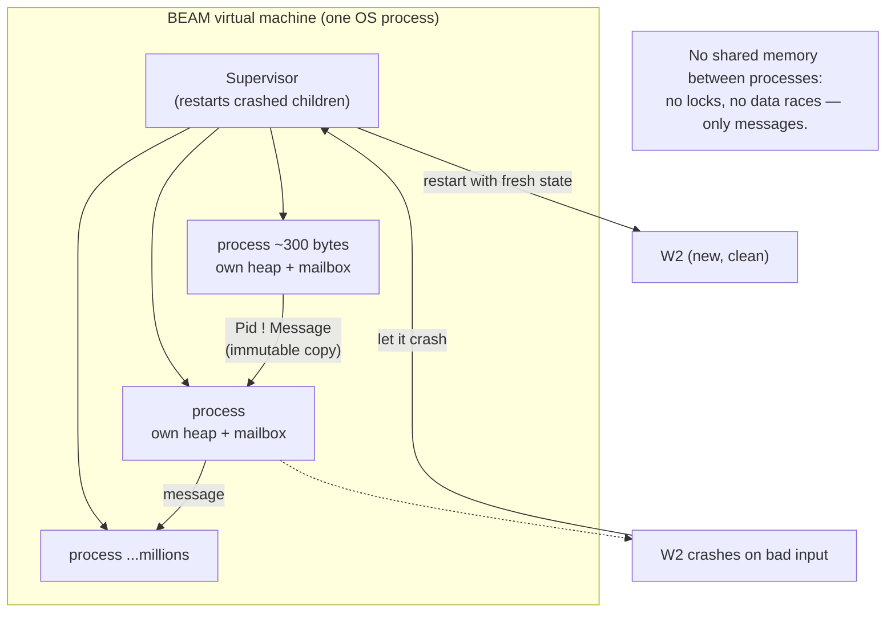

## In simple terms

Erlang was built by Ericsson in the 1980s to run telephone switches that must never go down — "nine nines" of uptime (99.9999999%). Its solution: millions of tiny, isolated processes that communicate only by message passing, each watched by a supervisor that restarts it on failure. A bug in one call's process crashes just that process; the supervisor restarts it; the caller gets an error response; the switch keeps running. This "let it crash" philosophy and its actor-based concurrency model became enormously influential in distributed-systems design.

## The Visual Map



## More detail

**The BEAM virtual machine:** Erlang runs on BEAM, a VM designed for massive concurrency.
- **Lightweight processes** — not OS threads. BEAM processes start at ~300 bytes, each with its own heap and stack, and the VM schedules millions of them across OS threads with a work-stealing scheduler.
- **Preemptive, fair scheduling** — processes are scheduled by *reduction count* (roughly one per function call); after its quota, any process is interrupted, so none can starve the others.
- **Soft real-time** — that reduction-based preemption gives predictable latency regardless of what a process is doing.

**Message passing:** processes share *no* memory; they communicate only by sending immutable messages to each other's mailbox (`Pid ! Message`) and receiving via pattern match:
```erlang
receive
  {hello, Name} -> io:format("Hello, ~s~n", [Name]);
  stop           -> exit(normal)
end.
```

**OTP (Open Telecom Platform):** a framework of battle-tested behaviours — `gen_server` (request/response process with built-in tracing), `supervisor` (monitors children and restarts them with strategies like one-for-one or one-for-all), `gen_statem` (state machine), and `application` (start/stop lifecycle). Supervisors compose into **supervision trees**.

**"Let it crash":** instead of defensively handling every possible error inline, Erlang code handles the happy path and lets a process crash on the unexpected; its supervisor restarts it from a known-good state. This yields simpler code and *more* reliable systems than trying to recover from every conceivable error in place. **Hot code loading** lets a running system swap modules without stopping — essential for switches that can't reboot. **Elixir**, a modern Ruby-flavoured language on BEAM (with the Phoenix web framework and LiveView), has largely superseded Erlang for new projects while reusing all of OTP.

## Under the Hood

A stateful process in idiomatic Erlang. State isn't a mutable variable — it's an argument threaded through a tail-recursive `receive` loop, and the only way to touch it is to send a message:

```erlang
%% A counter process: state lives in the loop's argument, updated by messages.
-module(counter).
-export([start/0, loop/1]).

start() -> spawn(?MODULE, loop, [0]).      %% spawn a process, initial count = 0

loop(Count) ->
    receive
        {add, N} ->
            loop(Count + N);               %% "update" state by recursing with a new value
        {get, From} ->
            From ! {count, Count},          %% reply into the caller's mailbox
            loop(Count);
        stop ->
            ok                              %% return (process terminates) — no loop() call
    end.

%% In the Erlang shell:
%%   C = counter:start().
%%   C ! {add, 10}.
%%   C ! {add, 5}.
%%   C ! {get, self()}.
%%   receive {count, N} -> N end.   %%=> 15
```

There are no locks because there is no shared state: the count exists only inside this one process's loop, and concurrency is achieved by running thousands of such loops, each isolated. If `loop` ever crashes (say, on an unhandled message that violates an assertion), its supervisor simply restarts it at `loop(0)`.

## Engineering Trade-offs

**Isolation and fault tolerance vs. raw single-thread speed**
Per-process heaps and copy-on-send messaging eliminate locks, data races, and shared-state bugs, and let one process crash without corrupting others — extraordinary reliability. The cost is that BEAM is not a numeric speed demon: copying messages and per-process GC mean Erlang trails C/Java/Go on single-threaded CPU-bound work. It trades peak throughput for concurrency and resilience.

**"Let it crash" vs. defensive programming**
Letting processes die and restart keeps the happy-path code clean and avoids the impossible task of anticipating every error — provided failures are independent and state can be safely reconstructed. It's a poor fit when an operation has side effects that a restart can't undo (a half-sent payment), where you need transactional rollback rather than a fresh start.

**Massive lightweight concurrency vs. per-process overhead**
Millions of ~300-byte processes make connection-per-process designs (one process per chat user, per TCP connection) natural and scalable. But each process has its own heap and GC, so very fine-grained processes add memory and scheduling overhead; the model shines for many *concurrent, mostly-waiting* entities, less so for a few CPU-saturating workers.

**Hot code loading vs. operational complexity**
Upgrading a running system with no downtime is a genuine superpower for always-on infrastructure. It's also intricate: BEAM juggles two versions of a module at once, and getting state migration right across a code change is subtle — power that most non-telecom systems don't need and shouldn't pay the complexity for.

## Real-world examples

- **WhatsApp** ran hundreds of millions of users on a small engineering team, with around a million connections per BEAM server — the canonical Erlang scaling story.
- **Ericsson's AXD 301** ATM switch achieved famous "nine nines" availability using Erlang/OTP supervision.
- **Discord** uses Elixir (BEAM) for messaging infrastructure handling millions of concurrent users, leaning on lightweight processes per connection.
- **RabbitMQ**, a widely deployed message broker, is written in Erlang — message passing all the way down.

## Common misconceptions

- **"Erlang is only for telecom."** WhatsApp, Discord, Pinterest, and Bet365 use Erlang/Elixir for anything needing massive concurrency and high availability.
- **"BEAM processes are like OS threads."** They're ~1000× lighter; you can run millions on one machine where OS threads would exhaust memory.
- **"Let it crash means ignoring errors."** It means *isolating* errors and recovering through supervision rather than handling every case inline — the supervisor's restart *is* the error handling.

## Try it yourself

Model "let it crash" supervision in Python: a worker accumulates a running total, a "poison" message crashes it, and a supervisor restarts it with fresh state so the system keeps processing:

```bash
python3 - << 'EOF'
class WorkerCrash(Exception): pass

def worker_handle(state, msg):
    if msg == "boom":                       # an unexpected message
        raise WorkerCrash("unexpected message")
    return state + msg                       # normal: accumulate

def run_supervised(messages):
    state, restarts = 0, 0
    for msg in messages:
        try:
            state = worker_handle(state, msg)
            print(f"  handled {msg!r:>5} -> running total {state}")
        except WorkerCrash as e:
            restarts += 1
            print(f"  CRASH on {msg!r}: {e} -> supervisor restarts (state reset to 0)")
            state = 0                        # restart the worker clean
    return state, restarts

msgs = [10, 5, "boom", 3, 7, "boom", 1]
print("supervised run over messages:", msgs)
final, restarts = run_supervised(msgs)
print(f"system survived {restarts} crash(es); final state {final}")
EOF
```

The crashes don't take the system down — each is contained, the worker restarts, and processing continues. That is the whole idea: failures are isolated to one process and recovered by supervision, rather than every function defensively guarding against every possible error.

## Learn next

- [Actor model](/t/actor-model) — the concurrency model Erlang made practical: isolated actors communicating only by asynchronous messages.
- [Distributed system](/t/distributed-system) — OTP's supervision, fault tolerance, and message passing are foundational distributed-systems techniques.
- [Thread](/t/thread) — contrast OS threads (heavy, shared memory, locks) with BEAM's millions of isolated lightweight processes to see why the actor model scales differently.
