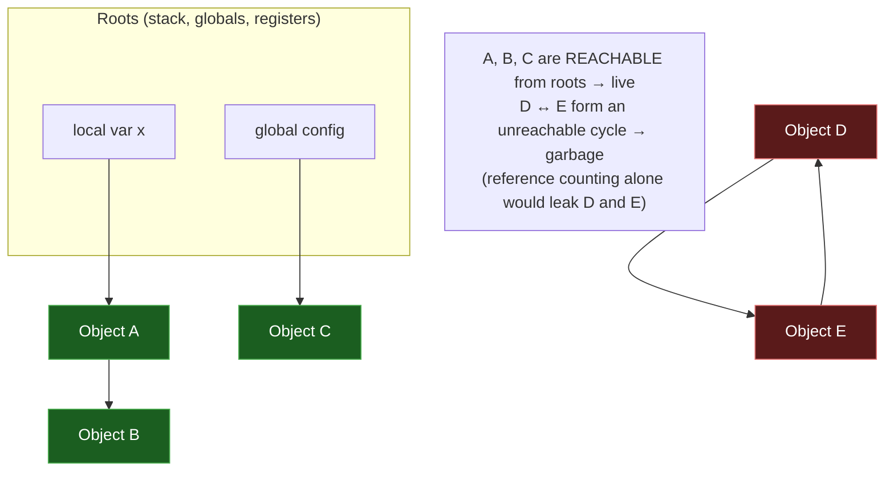

## In simple terms

**Garbage collection** is when the language runtime, not you, is responsible for freeing memory. The runtime periodically figures out which allocated objects no one is using anymore and reclaims them. This eliminates whole categories of bugs — leaks, use-after-free, double-free — at the cost of some runtime overhead.

## The Visual Map



## More detail

The core idea is **reachability**: an object is "live" if it can be reached, by following references, from a known set of **roots** (the stack, registers, global variables). Anything unreachable can never be used again, so it is safe to free.

Common collector designs:

- **Reference counting** — every object keeps a count of references; when it hits zero, free immediately. Simple and predictable, with frees spread out in time. Can't reclaim *cycles* (objects that reference each other) without an extra tracing pass. Used by CPython, Swift, and Rust's `Rc`.
- **Mark-and-sweep** — periodically walk all reachable objects from the roots and **mark** them, then **sweep** the heap freeing everything unmarked. Reclaims cycles, but classically "stops the world" during collection.
- **Generational** — most objects die young, so split the heap into generations and collect the young generation often, the old one rarely. Used by the JVM, V8, and .NET.
- **Concurrent / incremental** — do collection work alongside the running application to shrink pause times. Modern JVM collectors (ZGC, Shenandoah) and Go's GC are concurrent.
- **Copying / compacting** — move live objects into a fresh region; this defragments memory and makes allocation as cheap as bumping a pointer.

Non-GC alternatives trade convenience for control:

- **Manual** (C, C++) — you call `free`/`delete`. Fast, but the source of leaks and use-after-free bugs.
- **Ownership / RAII** (Rust, C++) — the compiler tracks who owns each allocation and inserts the free at scope exit. Compile-time, zero runtime overhead.
- **Region / arena** — bulk-free a whole region at once when a phase ends. Common in compilers and games.

## Under the Hood

A working **mark-and-sweep** collector in Python, over a hand-built object graph. Note that it reclaims an unreachable *cycle* (D ↔ E) that pure reference counting would leak:

```python
#!/usr/bin/env python3
"""Mark-and-sweep garbage collector over a toy heap."""

class Obj:
    def __init__(self, name):
        self.name = name
        self.refs = []        # references to other Objs
        self.marked = False

# --- Build a heap ---
heap = {n: Obj(n) for n in "ABCDE"}
heap["A"].refs = [heap["B"]]          # A -> B
heap["C"].refs = []                    # C: lone, but rooted
heap["D"].refs = [heap["E"]]          # D -> E
heap["E"].refs = [heap["D"]]          # E -> D   (a cycle, unreachable)

roots = [heap["A"], heap["C"]]        # only A and C are reachable from roots

def mark(obj):
    """DFS from a root, marking everything reachable."""
    if obj.marked:
        return
    obj.marked = True
    for child in obj.refs:
        mark(child)

def collect(heap, roots):
    # MARK phase
    for r in roots:
        mark(r)
    # SWEEP phase
    freed = [name for name, o in heap.items() if not o.marked]
    for name in freed:
        del heap[name]
    # reset marks for next cycle
    for o in heap.values():
        o.marked = False
    return freed

print("Before GC:", sorted(heap))
freed = collect(heap, roots)
print("Freed (unreachable):", sorted(freed))   # D and E — including the cycle
print("After GC: ", sorted(heap))               # A, B, C survive
```

## Engineering Trade-offs

**Throughput vs. pause time**
A simple stop-the-world mark-and-sweep maximises total throughput — it never coordinates with the application — but introduces pauses that scale with live-heap size, unacceptable for interactive or real-time systems. Concurrent collectors (ZGC, Go's GC) shrink pauses to sub-millisecond by doing most work alongside the program, but the bookkeeping (read/write barriers) lowers peak throughput. There is no collector that is simultaneously lowest-pause and highest-throughput.

**Reference counting vs. tracing**
Reference counting frees memory promptly and predictably (good for caches and resource handles) and needs no separate pass, but it cannot reclaim cycles and pays a cost on *every* pointer write to update counts. Tracing collectors handle cycles and have cheap pointer writes, but reclaim memory only when they run, so dead objects linger. Many runtimes combine both (CPython: refcounting + a cyclic tracer).

**Memory headroom vs. collection frequency**
A GC trades space for time: give it more heap headroom and it collects less often, raising throughput; constrain the heap and it collects constantly, raising CPU cost and pauses. This is why GC'd services are tuned with explicit heap sizes — too small thrashes the collector, too large wastes RAM and lengthens full collections.

**Productivity vs. determinism**
GC frees application code from memory bookkeeping, eliminating entire bug classes — the reason Python, JavaScript, Java, Go, and C# are so productive. The cost is loss of *deterministic* deallocation: you can't predict exactly when an object is freed, which is unacceptable for kernels, hard-real-time control, and tight game loops. Those domains use manual management or compile-time ownership (Rust) instead.

## Real-world examples

- The JVM offers a menu of collectors: G1 (balanced, default), and the low-pause ZGC and Shenandoah, which target pause times under 1 ms even on heaps in the hundreds of gigabytes — once thought impossible.
- Go advertises sub-millisecond GC pauses by collecting concurrently with the application, a deliberate design choice favouring latency over raw throughput.
- CPython uses reference counting as its primary mechanism plus a generational cyclic collector to catch reference cycles that counting alone would leak.
- A long-running Node.js server whose "RSS keeps climbing" usually has a *logical* leak — a closure, cache, or event listener holding references the GC therefore can't reclaim.

## Common misconceptions

- **"GC means I never leak."** You can still leak by keeping references alive (caches, globals, event listeners). GC reclaims *unreachable* memory, not *unused* memory — if you can still reach it, the collector must keep it.
- **"GC is always slower than manual management."** Not necessarily — a moving/compacting GC allocates by bumping a pointer and batches frees, which can beat `malloc`/`free` on allocation-heavy workloads.
- **"The GC runs at predictable times."** Most tracing collectors run when heap pressure crosses a threshold, not on a schedule, so collection timing depends on allocation rate — which is exactly why it's unsuitable where timing must be deterministic.

## Try it yourself

Watch Python's cyclic collector reclaim a reference cycle that reference counting alone cannot. We create two objects that point at each other, drop our references, and show they survive until `gc.collect()` traces and frees them:

```bash
python3 - << 'EOF'
import gc

class Node:
    instances = 0
    def __init__(self): Node.instances += 1
    def __del__(self):  Node.instances -= 1

gc.disable()                       # turn OFF cyclic GC; leave refcounting on

a = Node(); b = Node()
a.partner = b; b.partner = a       # a <-> b : a reference cycle
print("Live Node objects after creating cycle:", Node.instances)  # 2

del a, b                           # drop our names; counts are 1 each (cycle keeps them alive)
print("After 'del' (refcounting alone):       ", Node.instances)  # still 2 — leaked!

freed = gc.collect()               # run the tracing cyclic collector
print("After gc.collect():                    ", Node.instances)  # 0 — reclaimed
print("Objects the cyclic GC freed:           ", freed)
EOF
```

Reference counting can't drop the count to zero because each object holds the other; only the tracing collector, which reasons about *reachability from roots*, can see the whole cycle is dead.

## Learn next

- [Memory management](/t/memory-management) — the broader picture of how programs allocate and reclaim memory, of which GC is one strategy among manual and ownership-based ones.
- [Memory](/t/memory) — the hierarchy and address space GC operates over; understanding the heap explains what the collector is actually managing.
- [Pointer and reference](/t/pointer-and-reference) — references *are* the edges GC traces for reachability; understanding them clarifies why cycles and dangling pointers behave as they do.
- [Type system](/t/type-system) — Rust's ownership and borrow checker (a type-system feature) is the leading compile-time alternative to runtime GC.
