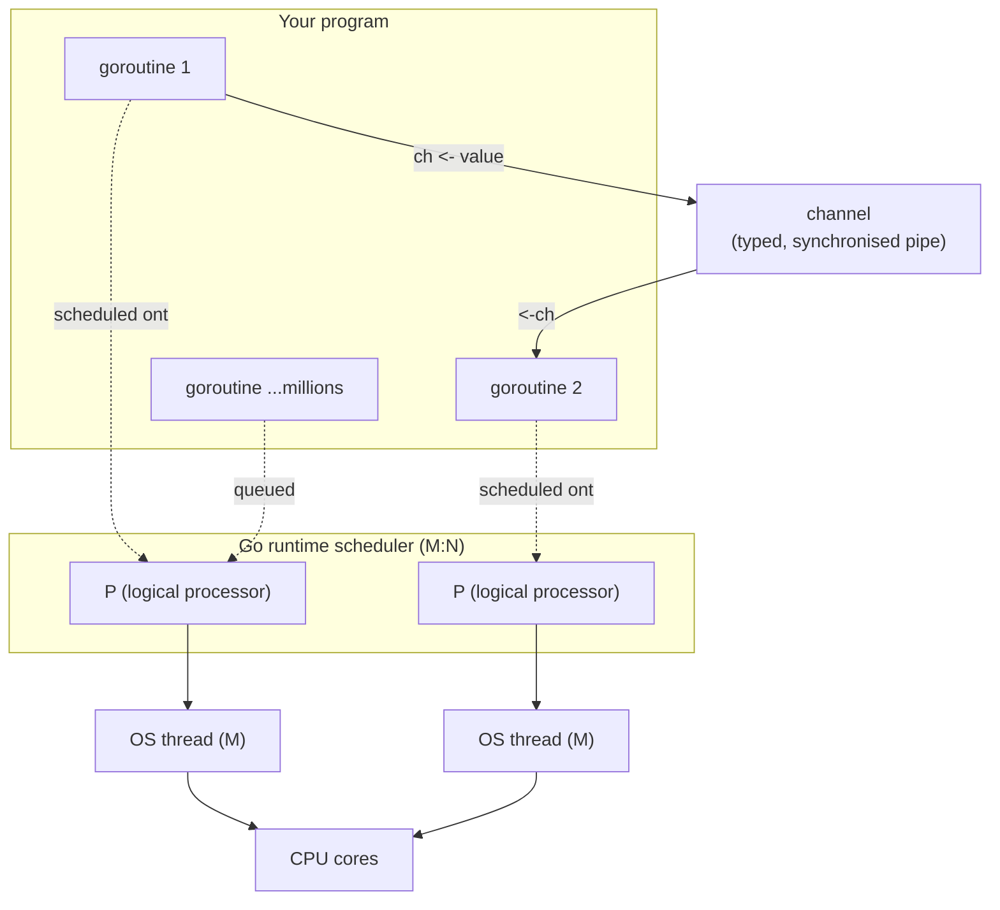

## In simple terms

**Go** (sometimes written "Golang" because that's the search term that finds anything) is a deliberately small programming language designed to make writing reliable, concurrent server software fast and approachable. It compiles to a single statically-linked binary, has a fast garbage collector, includes "goroutines" (lightweight threads), and is opinionated about formatting and project structure so teams don't argue.

## The Visual Map



## More detail

Go was designed at Google by Rob Pike, Ken Thompson, and Robert Griesemer (announced 2009, 1.0 in 2012) explicitly to address the pain of large C++ and Java codebases for backend services.

Defining choices:

- **Small language** — fits in your head; very few features compared to Java, C++, or Scala, and new versions add things slowly.
- **Static typing** with type inference for locals (`x := 5`).
- **Garbage collected**, with a concurrent low-pause collector (sub-millisecond pause targets).
- **Goroutines** — `go someFunc()` launches a lightweight task on Go's scheduler; a process can host millions concurrently because each starts with a tiny (~2 KB) growable stack.
- **Channels** — typed pipes between goroutines, with `select` for waiting on multiple channels. Go's motto: *"don't communicate by sharing memory; share memory by communicating."*
- **Structural interfaces** — anything that implements the methods *is* the interface; no `implements` keyword.
- **Errors are values** — no exceptions; functions return errors explicitly (`if err != nil { return err }`).
- **`gofmt`** — one canonical formatting, so style debates simply don't happen.
- **Single statically-linked binary** — trivial deployment to containers or bare metal.

What's deliberately absent: generics didn't arrive until Go 1.18 (2022, 13 years in); there are no exceptions, no inheritance, no operator overloading, no implicit numeric conversion, no macros, and no metaprogramming. The result is code that's plain to read, easy to refactor and deploy, and slightly more verbose than Python or Rust equivalents.

## Under the Hood

A Go worker pool: a fixed set of goroutines pull jobs off one channel and push results to another. This is the canonical Go concurrency pattern — note the errors-as-values idiom and the `range` over a closed channel:

```go
package main

import (
	"fmt"
	"sync"
)

// process returns a result and an error value — Go has no exceptions.
func process(job int) (int, error) {
	if job == 0 {
		return 0, fmt.Errorf("cannot process zero")
	}
	return job * job, nil
}

func main() {
	jobs := make(chan int, 10)    // typed channel: a pipe of ints
	results := make(chan int, 10)
	var wg sync.WaitGroup

	// Launch 3 worker goroutines reading from the same channel.
	for w := 0; w < 3; w++ {
		wg.Add(1)
		go func() {                // 'go' = run concurrently
			defer wg.Done()
			for job := range jobs { // loops until 'jobs' is closed
				if sq, err := process(job); err == nil {
					results <- sq
				}
			}
		}()
	}

	for j := 1; j <= 5; j++ {
		jobs <- j
	}
	close(jobs)        // signal workers no more jobs are coming
	wg.Wait()          // wait for all goroutines to finish
	close(results)

	sum := 0
	for r := range results {
		sum += r
	}
	fmt.Println("sum of squares 1..5 =", sum) // 1+4+9+16+25 = 55
}
```

Run with `go run main.go`. The scheduler multiplexes the three goroutines onto however many OS threads the runtime decides to use — you never touch threads directly.

## Engineering Trade-offs

**Simplicity vs. expressiveness**
Go's smallness is a feature: a new team member is productive in days, codebases stay uniform, and there's usually one obvious way to do a thing. The cost is verbosity and missing abstractions — for over a decade there were no generics, so collections relied on `interface{}` and code generation. Go bets that readability at scale beats expressive power.

**Goroutines vs. OS threads**
Goroutines are cheap (kilobytes, not megabytes) and scheduled in user space, so you can spawn millions and write blocking-style code that scales. The trade-off is that the runtime scheduler and GC are always present; for the rare workload that can't tolerate any GC pause (high-frequency trading, some hot paths), teams drop to a language without a collector — which is exactly why Discord and Cloudflare rewrote specific hot paths in Rust.

**Errors as values vs. exceptions**
Returning errors explicitly makes every failure path visible and forces you to handle (or deliberately ignore) it at the call site — no invisible stack-unwinding. The cost is boilerplate: `if err != nil { return err }` repeated everywhere, which critics find noisy and tedious.

**GC and fast builds vs. peak performance**
Go's compiler is famously fast and produces a self-contained binary, and its concurrent GC keeps pauses tiny — ideal for services. But it won't match hand-tuned C or Rust on raw CPU-bound throughput, and the GC adds memory overhead. Go optimises for *operational* simplicity (deploy one binary, scale horizontally) over squeezing a single machine.

## Real-world examples

- **Kubernetes** — millions of lines of Go; the reference example of building large distributed systems in the language.
- **Docker / Moby** — its original Go implementation drove much of Go's early popularity.
- **Discord** uses Go for many backend services and publicly documented rewriting some latency-sensitive hot paths to Rust to escape GC pauses.
- **Cloudflare** built much of its internal proxy and DNS infrastructure in Go before migrating select pieces to Rust for the same reason.
- The cloud-native toolbelt — **Terraform, Prometheus, Grafana, etcd, CockroachDB, InfluxDB**, and HashiCorp's stack — is overwhelmingly Go; on a Kubernetes cluster almost every binary is Go.

## Common misconceptions

- **"Goroutines are threads."** They're lightweight tasks multiplexed onto a small pool of OS threads by Go's scheduler — which is why millions per process is normal where millions of OS threads would be impossible.
- **"Go has no generics."** True only until Go 1.18 (2022); it has parametric polymorphism now, though the standard library still uses it sparingly.
- **"Go is only for microservices."** It excels there, but it's also the language of major CLIs (`gh`, `kubectl`, `terraform`), batch tools, and full databases.

## Try it yourself

No Go toolchain handy? Reproduce Go's goroutines-and-channels model with Python's stdlib `threading` and `queue` — a worker pool where tasks flow through a thread-safe pipe, exactly like a Go channel:

```bash
python3 - << 'EOF'
import threading, queue

jobs = queue.Queue()        # stand-in for a Go channel
results = queue.Queue()

def worker():               # stand-in for a goroutine
    while True:
        job = jobs.get()
        if job is None:     # sentinel = Go's close(channel)
            jobs.task_done(); break
        results.put(job * job)
        jobs.task_done()

workers = [threading.Thread(target=worker) for _ in range(3)]
for t in workers: t.start()

for j in range(1, 6):       # send jobs 1..5
    jobs.put(j)
for _ in workers:           # one sentinel per worker
    jobs.put(None)
jobs.join()
for t in workers: t.join()

total = 0
while not results.empty():
    total += results.get()
print("sum of squares 1..5 =", total)   # 1+4+9+16+25 = 55
EOF
```

This mirrors the Go program above: a shared queue (channel), several workers (goroutines), and a sentinel to signal "no more work" (`close`). Real Go does the same with built-in language syntax and a far more efficient user-space scheduler.

## Learn next

- [Garbage collection](/t/garbage-collection) — the concurrent, low-pause collector that frees Go programmers from manual memory management (and the thing latency-critical code sometimes flees).
- [Thread](/t/thread) — the OS-level unit Go's goroutines are multiplexed onto; understanding threads clarifies what makes goroutines cheaper.
- [Microservices](/t/microservices) — the distributed architecture Go was designed to make pleasant, and where most Go in production lives.
