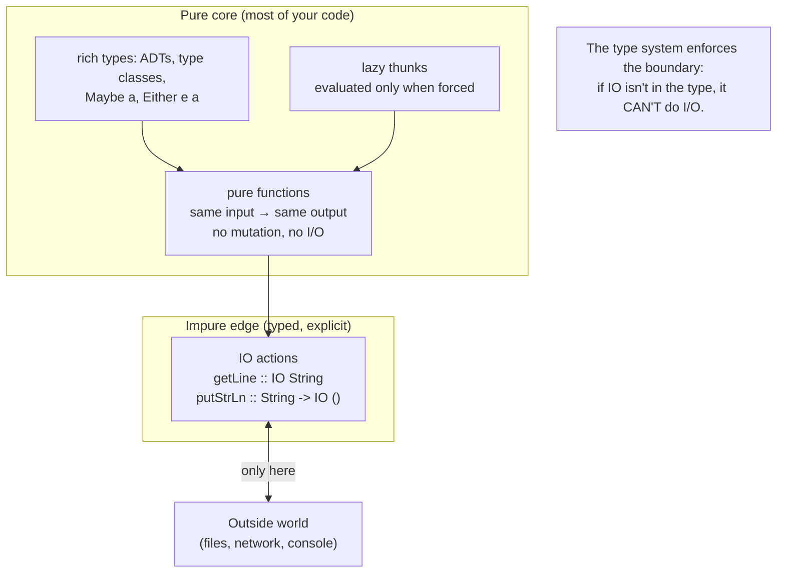

## In simple terms

Haskell takes functional programming to its logical extreme: every function is pure (no side effects — no mutable state, no I/O), evaluation is lazy (values are computed only when needed), and the type system is so powerful it can express invariants like "this function touches the outside world" or "these two lists have the same element type." Side effects are permitted but must be *declared in types* using the `IO` type — so a signature tells you whether a function can do I/O. Haskell is often described as a language that forces you to think so carefully about programs that it makes you a better programmer in any language.

## The Visual Map



## More detail

**Pure functions:** every Haskell function maps inputs to outputs with no observable side effects — the same input always yields the same output. This makes reasoning, testing, memoisation, and parallelisation straightforward.

**Lazy evaluation:** expressions aren't evaluated until their result is needed. `ones = 1 : ones` defines an *infinite* list of 1s, but only the elements you consume are ever computed. Laziness enables elegant infinite data structures and modular composition (a producer and a consumer can be written independently).

**The type system (Hindley–Milner + type classes + GHC extensions):**
- **Parametric polymorphism** — `id :: a -> a` works for any type `a`, with types inferred.
- **Type classes** — principled ad-hoc polymorphism: `sort :: Ord a => [a] -> [a]` works for any orderable type. `Eq`, `Ord`, `Show`, `Functor`, `Monad` form a hierarchy borrowed from algebra and category theory.
- **Algebraic data types** — `data Maybe a = Nothing | Just a`, with exhaustive pattern matching the compiler checks.
- **Kinds and extensions** — types themselves have "types" (kinds); GADTs, type families, and rank-N types push type-level programming further.

**Monads and IO:** side effects are sequenced via monads. `IO a` means "an action that, when performed, yields an `a`"; `do`-notation is sugar over monadic bind:
```haskell
main :: IO ()
main = do
  name <- getLine
  putStrLn ("Hello, " ++ name)
```
A function *without* `IO` in its type is guaranteed pure — the compiler will not let it secretly read a file. **GHC** (the Glasgow Haskell Compiler, itself written in Haskell) compiles this to fast native code via its STG intermediate machine.

## Under the Hood

A small but complete Haskell program touching the language's signature features: an algebraic data type with exhaustive matching, a pure function constrained by a type class, an *infinite lazy* list, and `IO` confined to `main`:

```haskell
-- An algebraic data type; the compiler checks matches are exhaustive.
data Shape = Circle Double | Rect Double Double

area :: Shape -> Double
area (Circle r)   = pi * r * r
area (Rect w h)   = w * h

-- Pure, polymorphic, constrained by a type class: works for any Ord a.
largest :: Ord a => [a] -> a
largest = foldr1 (\x acc -> if x > acc then x else acc)

-- An INFINITE list, fine because evaluation is lazy:
fibs :: [Integer]
fibs = 0 : 1 : zipWith (+) fibs (tail fibs)

-- IO is explicit in the type; purity ends only here, at the edge.
main :: IO ()
main = do
  print (area (Circle 2))          -- 12.566...
  print (largest [3, 9, 2, 7])     -- 9
  print (take 10 fibs)             -- [0,1,1,2,3,5,8,13,21,34]
```

`fibs` refers to *itself* and is infinite, yet `take 10 fibs` terminates — because nothing is computed until forced. And `area`/`largest` provably can't do I/O: it isn't in their types.

## Engineering Trade-offs

**Purity vs. pragmatic side effects**
Banning hidden side effects makes Haskell code referentially transparent — trivially testable, memoisable, and safe to parallelise, with the type system documenting exactly what each function can do. The cost is a real learning curve: even printing a line or reading input requires understanding `IO` and monads, and threading effects through pure code can feel ceremonious to newcomers.

**Laziness: elegance vs. space leaks**
Lazy evaluation enables infinite structures, avoids needless computation, and decouples producers from consumers. But it makes time and *space* behaviour hard to predict: unevaluated thunks can pile up into "space leaks" that balloon memory unexpectedly. Haskell's answer (`seq`, `BangPatterns`, strict data) means performance tuning often involves deliberately *removing* laziness — a tax other languages don't pay.

**Type-system power vs. complexity**
Haskell's types can encode invariants most languages can't express, catching deep bugs at compile time. Pushed far (GADTs, type families, rank-N types), this becomes type-level programming with a steep cliff: error messages grow intimidating and the gap between "compiles" and "I understand why" widens.

**Influence vs. adoption**
Haskell's ideas — type classes, ADTs, monads, type inference, immutability — quietly seeded Rust (traits), Scala, Swift (optionals/protocols), Kotlin (null safety), and TypeScript (discriminated unions). Yet its own market share stays small: it's a phenomenal *idea incubator* and a niche production language, a trade between purity-of-vision and mainstream ergonomics.

## Real-world examples

- **Facebook's Sigma** anti-abuse system is written in Haskell, making millions of spam/abuse decisions per second.
- **Standard Chartered** uses Haskell extensively for financial modelling and risk.
- **GitHub's Semantic** code-analysis library (powering some code navigation) was written in Haskell.
- **Cardano**, a major blockchain, implements its core in Haskell, leaning on the type system and formal methods for correctness in financial code.

## Common misconceptions

- **"Haskell is impractical."** Facebook, Standard Chartered, and GitHub have run it in production at scale — less common than Python, but genuinely production-capable.
- **"Laziness means slow."** GHC is a heavily optimising compiler that often rivals C on numeric code; laziness's real risk is *space* leaks, addressed with strictness annotations, not raw slowness.
- **"Monads are a Haskell-only mystery."** They're just a pattern for sequencing computations with context; the same structure appears as `Promise`/`Optional`/`Iterator` in mainstream languages — Haskell only names it explicitly.

## Try it yourself

Haskell's lazy infinite lists map directly onto Python *generators*, which also compute values only on demand. Define "infinite" sequences and take a finite prefix — nothing beyond what you ask for is ever evaluated:

```bash
python3 - << 'EOF'
import itertools

def nats():                     # Haskell: nats = [0..]   (infinite)
    n = 0
    while True:
        yield n; n += 1

def fibs():                     # Haskell: fibs = 0 : 1 : zipWith (+) fibs (tail fibs)
    a, b = 0, 1
    while True:
        yield a; a, b = b, a + b

# 'take 10' — only these elements are ever computed
print("first 10 naturals:", list(itertools.islice(nats(), 10)))
print("first 10 fibs    :", list(itertools.islice(fibs(), 10)))

# A lazy pipeline: even squares. Nothing runs until islice pulls 5 values.
even_squares = (n*n for n in nats() if n % 2 == 0)
print("first 5 even squares:", list(itertools.islice(even_squares, 5)))
EOF
```

Each generator describes an *infinite* sequence, yet the program terminates because `islice` pulls only the elements requested — exactly how Haskell evaluates `take 10 fibs`. Laziness lets you separate "what the sequence *is*" from "how much of it you need."

## Learn next

- [Lambda calculus](/t/lambda-calculus) — Haskell is essentially a practical, typed lambda calculus; this is its theoretical core.
- [Type theory](/t/type-theory) — the foundation of Haskell's type system, type classes, and the propositions-as-types view its features embody.
- [Category theory](/t/category-theory) — where `Functor`, `Applicative`, and `Monad` come from; Haskell is the language that brought these abstractions into everyday programming.
