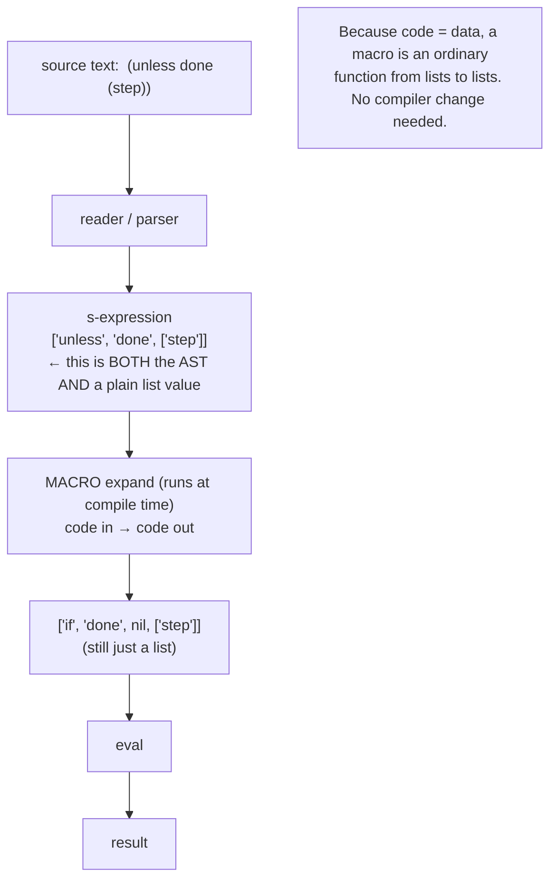

## In simple terms

In most languages, code is text and data is structured values — completely different things. In a homoiconic language (primarily Lisps), code *is* data: a function call `(+ 1 2)` is literally a list `[+, 1, 2]` in memory. Because code is a data structure, programs can manipulate, construct, and generate code using the same operations they use for any data. This enables **macros** that run at compile time and transform code — implementing entirely new language constructs without touching the compiler.

## The Visual Map



## More detail

**The Lisp representation:** in Lisp, everything is an **s-expression** — either an atom (number, symbol, string) or a list of s-expressions. The program `(+ 1 (* 2 3))` parses into the list `[+, 1, [*, 2, 3]]`: a tree of atoms and lists. `eval` evaluates any such structure as code, and because code and data are *both lists*, code can be constructed, inspected, and modified just like any other list.

**Macros** are functions that run at *compile time*, receiving unevaluated source code as data and returning transformed code that the compiler then evaluates:

```lisp
;; A macro that swaps two variables
(defmacro swap! (a b)
  `(let ((tmp ,a))      ; backtick = quasi-quote (a code template)
     (setf ,a ,b)       ; comma = unquote (splice a value in)
     (setf ,b tmp)))

(swap! x y)  ; expands at compile time to: (let ((tmp x)) (setf x y) (setf y tmp))
```

`swap!` is not a function in the language — it's a new syntactic form the programmer added. With macros you can define new control flow (`while` from `cond`+`loop`), build DSLs (Clojure's `core.async`, `hiccup` HTML), and ship test frameworks (`deftest`, `is`) as ordinary libraries.

**Macros vs. functions:** a function receives *evaluated* arguments; a macro receives *unevaluated* code. So a function can't implement short-circuiting `and`/`or` (both args evaluate first), but a macro can choose which parts to evaluate. **Hygiene** is the catch: naive macros can accidentally capture variable names; Scheme's `syntax-rules` renames automatically (hygienic), while Common Lisp/Clojure's `defmacro` is unhygienic but more powerful.

**Other homoiconic / AST-macro languages:** Clojure (Lisp on the JVM — `->`, `core.async`), Julia (`@macro`, expressions as first-class AST), and Elixir (`defmacro` over the AST). Contrast non-homoiconic metaprogramming: the C preprocessor (`#define`, textual, no hygiene), Rust `macro_rules!` (token-tree patterns, structured but not full code-as-data), and C++ templates (Turing-complete but at the type level, accidentally).

## Under the Hood

A mini-Lisp in Python where code is literally a Python list. The `expand` step is a real macro — it rewrites the `unless` form into an `if` form *before* evaluation, demonstrating code-transforming-code:

```python
#!/usr/bin/env python3
"""Code IS data: a tiny Lisp evaluator plus a compile-time macro."""

def seval(expr, env):
    if isinstance(expr, (int, float)): return expr      # literal
    if isinstance(expr, str):          return env[expr] # symbol lookup
    op, *args = expr
    if op == "if":
        _, c, t, e = expr
        return seval(t, env) if seval(c, env) else seval(e, env)
    return env[op](*[seval(a, env) for a in args])      # apply a primitive

def expand(expr):
    """A MACRO: (unless c body) -> (if c 0 body). Operates on code-as-lists."""
    if isinstance(expr, list) and expr and expr[0] == "unless":
        _, cond, body = expr
        return ["if", expand(cond), 0, expand(body)]
    if isinstance(expr, list):
        return [expand(e) for e in expr]
    return expr

env = {"+": lambda a, b: a + b, "*": lambda a, b: a * b,
       ">": lambda a, b: a > b, "x": 10}

prog = ["unless", [">", "x", 100], ["*", "x", 2]]    # "unless x > 100, give x*2"
print("source (a list)     :", prog)
expanded = expand(prog)                               # macro runs: code -> code
print("after macro expansion:", expanded)
print("result              :", seval(expanded, env))  # x=10, not >100 -> 20
```

`unless` never exists as a primitive — the macro rewrites it into `if` while it's still just a list, then the evaluator runs the result. That is the whole of homoiconic metaprogramming.

## Engineering Trade-offs

**Expressive power vs. tooling and readability**
Macros let you grow the language toward the problem — DSLs, new control flow, boilerplate elimination — so library authors can add what would otherwise need compiler changes. The cost is that code no longer means what it literally says: a heavily macro'd codebase can be hard to read, step through in a debugger, or analyse with standard tooling, because syntax is being rewritten beneath you.

**Compile-time computation vs. phase complexity**
Running code at compile time (on unevaluated code) enables optimisations and zero-runtime-cost abstractions — Clojure's `go` blocks compile to a state machine with no runtime support. But it introduces *phase separation*: macro code and runtime code live in different worlds, and mixing them up (calling a runtime function during expansion, or vice versa) produces confusing errors.

**Unhygienic power vs. hygienic safety**
Unhygienic macros (`defmacro`) can do anything, including intentionally capturing names — maximally powerful, but a footgun: an introduced `tmp` can clash with the caller's `tmp`. Hygienic systems (`syntax-rules`) prevent capture automatically but constrain what transformations you can express. Languages pick a point on this safety/power axis.

**Uniform syntax vs. familiarity**
Homoiconicity essentially requires a uniform, minimal syntax (Lisp's parentheses) so that code maps cleanly onto a single data structure. That uniformity is what makes the whole approach work — and is exactly what newcomers find alien, which is much of why homoiconicity stayed concentrated in the Lisp family rather than going mainstream.

## Real-world examples

- **Clojure's `core.async`** `go` macro rewrites sequential-looking channel code into a compile-time state machine — concurrency added as a *library*, not a language feature.
- **Racket** is used as a "language laboratory": entire new languages (Typed Racket, teaching languages) are implemented as Racket macros.
- **LFE** (Lisp Flavoured Erlang) compiles Lisp macros down to BEAM bytecode.
- **Hy** embeds a Lisp in Python, compiling homoiconic Lisp code into Python AST objects.

## Common misconceptions

- **"Macros are just functions."** Macros run at compile time on *unevaluated* code and return new code; functions run at runtime on *evaluated* values. Different phase, different power (macros can control evaluation order; functions can't).
- **"Lisp macros and C `#define` are similar."** The C preprocessor does blind textual substitution — no syntax awareness, no hygiene, no AST. Lisp macros operate on structured code and can run arbitrary computation to produce it.
- **"Homoiconicity is just having an `eval`."** Many languages have `eval`-over-strings; homoiconicity is stronger: code is *already* the language's native data structure, so you manipulate it with ordinary list operations, not string surgery.

## Try it yourself

The essence of homoiconicity: a program is a data structure you can read, build, and *edit*. Here a Lisp expression is a Python list — evaluate it, then programmatically rewrite an operator and watch the meaning change:

```bash
python3 - << 'EOF'
def seval(expr, env):
    if isinstance(expr, int): return expr
    if isinstance(expr, str): return env[expr]
    op, *args = expr
    return env[op](*[seval(a, env) for a in args])

env = {"+": lambda a, b: a + b, "*": lambda a, b: a * b}

code = ["+", 1, ["*", 2, 3]]              # this list IS the program (+ 1 (* 2 3))
print("code as data:", code, "=>", seval(code, env))   # 1 + (2*3) = 7

code[2][0] = "+"                          # edit the code like any nested list
print("edited code :", code, "=>", seval(code, env))   # 1 + (2+3) = 6
EOF
```

You just modified a *program* with a list assignment, then ran the result — no string parsing, no recompilation step you can see. In a homoiconic language this is how macros work: ordinary data manipulation that happens to be operating on code.

## Learn next

- [Lisp](/t/lisp) — the language family built on homoiconicity, where s-expressions and macros originated and are most fully realised.
- [Lambda calculus](/t/lambda-calculus) — the s-expression is essentially lambda-calculus notation made into a concrete, manipulable data structure.
- [Continuation](/t/continuation) — together with homoiconicity, first-class continuations are why Scheme is the most-studied language in programming-language theory.
