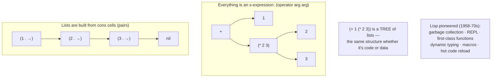

## In simple terms

Lisp (LISt Processing) was invented by John McCarthy at MIT in 1958 and is the second oldest high-level programming language after Fortran. It introduced ideas so revolutionary that most are now standard: garbage collection, interactive development (the REPL), first-class functions, dynamic typing, and treating code as data (homoiconicity). Modern Lisps — Scheme, Common Lisp, Clojure, Racket — carry these ideas forward. Many "new" features in Python, JavaScript, and Ruby were present in Lisp 40 years earlier.

## The Visual Map



## More detail

**The core idea — s-expressions:** Lisp code is written as nested lists: `(operator arg1 arg2)`. `(+ 1 2)` is both the written form *and* the data structure — a list containing `+`, `1`, and `2`. This uniformity (code = data) is [homoiconicity](/t/homoiconicity), and it's what makes Lisp macros so powerful.

```lisp
(defun factorial (n)
  (if (<= n 1)
      1
      (* n (factorial (- n 1)))))

(factorial 5) ; => 120
```

**What Lisp pioneered** (and the rest of the industry slowly adopted): **garbage collection** (McCarthy, 1958 — exotic until the 1990s mainstream); the **REPL** (every interactive language shell descends from it); **first-class functions** (JS callbacks, Python decorators, Haskell higher-order functions); **dynamic typing** (Python, Ruby, JS are in this tradition); **dynamic/hot code loading** (Erlang hot upgrades, React fast refresh, Jupyter); and keyword/optional arguments and multiple return values.

**The Lisp family:** Common Lisp (ANSI-standardised, multiparadigm with CLOS, used at ITA Software/Google Flights and Grammarly), Scheme (minimalist, mandates proper tail calls, the SICP teaching language, embedded as GNU Guile), Clojure (immutable-by-default Lisp on the JVM, ~millions of lines at the fintech Nubank), Racket (a "language laboratory" for building new languages as macros), and Emacs Lisp (which configures and extends Emacs). As Alan Kay put it, "Lisp isn't a language, it's a building material" — its macros let you grow the language to fit the problem.

## Under the Hood

Lisp is named for **LISt Processing**, and its lists are built from **cons cells** — pairs of (head, rest). Here are cons cells and the recursive list functions (`map`, `reverse`) that define the Lisp style, in Python:

```python
#!/usr/bin/env python3
"""Cons cells and recursive list processing — the heart of LISt Processing."""

def cons(a, d): return (a, d)      # a pair: (head, rest)
def car(p):     return p[0]        # head
def cdr(p):     return p[1]        # rest
NIL = None                          # the empty list

def from_list(xs):                  # Python list -> cons-cell list
    return NIL if not xs else cons(xs[0], from_list(xs[1:]))

def to_list(p):                     # cons-cell list -> Python list
    out = []
    while p is not NIL:
        out.append(car(p)); p = cdr(p)
    return out

def lmap(f, p):                     # recursive map over cons cells
    return NIL if p is NIL else cons(f(car(p)), lmap(f, cdr(p)))

def lreverse(p, acc=NIL):           # tail-recursive reverse
    return acc if p is NIL else lreverse(cdr(p), cons(car(p), acc))

nums = from_list([1, 2, 3, 4])
print("list      :", to_list(nums))
print("squared   :", to_list(lmap(lambda x: x * x, nums)))   # [1, 4, 9, 16]
print("reversed  :", to_list(lreverse(nums)))                # [4, 3, 2, 1]
print("cons cells:", nums)          # (1, (2, (3, (4, None)))) — nested pairs
```

Notice the data structure printed at the end: `(1, (2, (3, (4, None))))` — a list is literally pairs nested inside pairs, terminated by nil. Every Lisp list, and every piece of Lisp *code*, is this same structure.

## Engineering Trade-offs

**Uniform syntax (homoiconicity) vs. familiarity**
Reducing all syntax to parenthesised lists is what makes code-as-data and macros possible, and it makes the grammar trivially small and consistent. The cost is the wall of parentheses and prefix notation that newcomers bounce off — a real adoption barrier that kept Lisp influential but niche for decades.

**Macros and malleability vs. fragmentation**
Because you can grow the language with macros, a Lisp shop can craft a perfect DSL for its domain — extraordinary leverage. The flip side is that every codebase risks becoming its own dialect, raising the cost for newcomers to read code that no longer resembles "standard" Lisp.

**Dynamic, interactive development vs. static guarantees**
Lisp pioneered live, REPL-driven development: redefine a function in a running image and keep going. That interactivity is fantastic for exploration and long-lived systems, but classic Lisp's dynamic typing defers many errors to run time — the same trade dynamic languages make today, with the same large-codebase maintenance cost.

**Pioneering ideas vs. capturing the market**
Lisp invented an astonishing share of modern language features, yet mainstream adoption went to languages that borrowed those ideas with friendlier syntax (Python, JS, Ruby). Being the idea incubator and being the popular product turned out to be different things — a recurring pattern in language history.

## Real-world examples

- **Nubank** (one of the world's largest digital banks) runs a huge Clojure backend — the headline modern production Lisp story.
- **Grammarly's** early NLP pipeline was implemented in Common Lisp.
- **ITA Software's** airfare search engine (behind Google Flights) was written in Common Lisp, prized for its optimisation power.
- **GNU Emacs** is configured and extended entirely in Emacs Lisp, used daily by a very large developer community.

## Common misconceptions

- **"Lisp is dead."** Clojure is actively developed and in production at Nubank and many others; Emacs Lisp has a vast user base; Racket is research-active. The family is alive.
- **"All those parentheses make it unreadable."** Lispers report the parens "disappear" with practice, and that the uniform "everything is a list" syntax makes the language *more* consistent, not less.
- **"Lisp is just an academic toy."** It pioneered GC, the REPL, first-class functions, and macros — the practical foundations of nearly every language you use today.

## Try it yourself

A famous Lisp claim is that you can write a Lisp evaluator in a few lines. Here is a tiny one — it evaluates s-expressions *and* supports first-class `lambda`, the feature Lisp gave the world:

```bash
python3 - << 'EOF'
def seval(x, env):
    if isinstance(x, str):       return env[x]      # symbol lookup
    if not isinstance(x, list):  return x           # literal
    if x[0] == "lambda":                            # (lambda (params) body) -> a closure
        params, body = x[1], x[2]
        return lambda *args: seval(body, {**env, **dict(zip(params, args))})
    f = seval(x[0], env)                            # evaluate the operator...
    return f(*[seval(a, env) for a in x[1:]])       # ...apply to evaluated args

env = {"+": lambda a, b: a + b, "*": lambda a, b: a * b}

print("(+ 1 (* 2 3))     =", seval(["+", 1, ["*", 2, 3]], env))          # 7
square = seval(["lambda", ["n"], ["*", "n", "n"]], env)                   # a function value
print("square via lambda =", square(6))                                  # 36
print("inline application =", seval([["lambda", ["n"], ["*", "n", "n"]], 5], env))  # 25
EOF
```

In about a dozen lines you have evaluation, variables, and first-class functions that capture their environment (closures). Building a working interpreter this easily — because code is already a simple data structure — is exactly why Lisp is the canonical first language in every compilers course.

## Learn next

- [Homoiconicity](/t/homoiconicity) — Lisp's superpower: code and data share one representation, which is what makes its macros possible.
- [Closure](/t/closure) — Lisp popularised functions that capture their environment; the mini-evaluator above builds them directly.
- [Lambda calculus](/t/lambda-calculus) — the mathematical foundation McCarthy drew on; s-expressions are essentially its notation made concrete.
