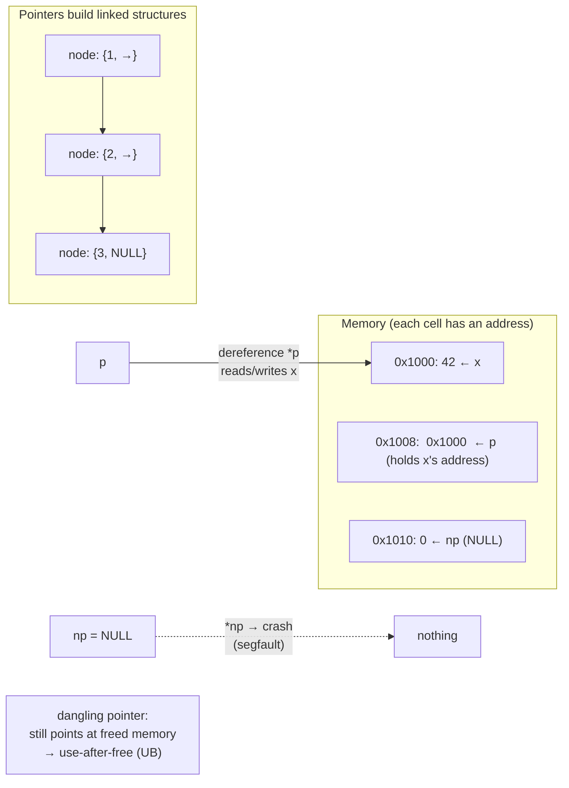

## In simple terms

Most values are stored somewhere in memory, and each location has an address — a number identifying it. A pointer is a variable that holds an address rather than a direct value. Following the pointer to read the value at that address is called **dereferencing**. Pointers enable dynamic memory allocation (you don't need to know sizes at compile time), linked data structures (nodes pointing to each other), and efficient passing of large objects (pass the address, not a copy). They are the foundation of C and C++ — and the source of most memory-safety bugs.

## The Visual Map



## More detail

**Pointer in C:**
```c
int x = 42;
int *p = &x;        // p holds the address of x  (& = address-of)
printf("%d\n", *p); // dereference p -> prints 42 (* = follow the pointer)
*p = 99;            // modify x THROUGH p
printf("%d\n", x);  // 99
```

**Pointer arithmetic:** `p + 1` advances the pointer by `sizeof(*p)` bytes — to the next array element. `p[i]` is exactly `*(p + i)`. This enables fast array traversal but also buffer overflows (writing past the end). The dangerous family of bugs all stem from raw pointers having no bounds checking and no lifetime tracking:

- **NULL pointer** — value 0, "points to nothing"; dereferencing it is undefined behaviour, usually a segfault.
- **Dangling pointer** — points to memory that's been freed; reading/writing it is *use-after-free*, a top security-vulnerability class.
- **Double free** — freeing the same block twice corrupts the allocator, often exploitably.

**Safer abstractions built on pointers:**
- **C++ references** — an alias for an existing variable; can't be null and can't be reseated, so safer than raw pointers for most uses (`int& ref = x;`).
- **C++ smart pointers** — `unique_ptr` (sole owner, freed at scope exit, zero overhead), `shared_ptr` (reference-counted shared ownership), `weak_ptr` (non-owning).
- **Rust references** — checked at compile time by the borrow checker: a reference can't outlive its data, and you can't hold a mutable and any other reference at once — eliminating use-after-free, data races, and null deref *with no runtime cost*.
- **Managed-language references** — Java, Python, and Go references are pointers under the hood, but GC-tracked with no arithmetic; null still bites (Java's `NullPointerException`), which Kotlin/Swift/Rust avoid with explicit `Option`/nullable types.

## Under the Hood

Pointers are how you build *linked* data structures — each node stores a value and a pointer to the next. This singly linked list in C shows allocation, the `->` dereference-and-access operator, and the disciplined `free` walk you must do by hand:

```c
#include <stdio.h>
#include <stdlib.h>

struct Node { int value; struct Node *next; };   // a node points to the next node

struct Node *push(struct Node *head, int v) {
    struct Node *n = malloc(sizeof(struct Node));
    n->value = v;          // (*n).value — dereference and set
    n->next  = head;       // link to the old head
    return n;              // new head
}

int main(void) {
    struct Node *head = NULL;          // empty list = NULL pointer
    for (int i = 1; i <= 3; i++)
        head = push(head, i);          // build 3 -> 2 -> 1 -> NULL

    int sum = 0;
    for (struct Node *p = head; p != NULL; p = p->next)  // walk via pointers
        sum += p->value;
    printf("sum = %d\n", sum);         // 6

    while (head) {                     // free every node — your responsibility
        struct Node *next = head->next;
        free(head);
        head = next;
    }
    // head now dangles if reused: 'head->value' here would be use-after-free.
    return 0;
}
```

Each `next` field is a pointer; `NULL` marks the end. Nothing here is bounds-checked or lifetime-tracked — forget the `free` loop and you leak; free twice and you corrupt the heap.

## Engineering Trade-offs

**Indirection power vs. safety**
Pointers buy you dynamic structures, shared data, and cheap passing of big objects (an address instead of a copy) — the entire toolkit of systems programming. The price is that raw pointers are unchecked: the language guarantees nothing about validity, so null derefs, buffer overflows, and use-after-free are entirely on the programmer. Microsoft and Chrome each attribute ~70% of severe vulnerabilities to exactly these mistakes.

**Manual pointers vs. smart pointers vs. GC**
Raw pointers are fastest and most flexible but most dangerous. Smart pointers (`unique_ptr`/`shared_ptr`) automate freeing at a small or moderate cost (`shared_ptr`'s atomic refcount isn't free in hot concurrent paths). Garbage collection removes the bug class entirely but adds pauses and memory overhead. You're choosing where on the control-vs-safety spectrum to sit.

**Pass by reference vs. pass by value**
Passing a pointer/reference avoids copying large objects and lets a callee mutate the caller's data — efficient and powerful. But it introduces *aliasing*: two names for the same memory, which makes reasoning harder, invites accidental mutation, and blocks some compiler optimisations. Pass-by-value is safe and local but copies.

**Compile-time checking (Rust) vs. runtime freedom (C)**
Rust's borrow checker proves pointer safety before the program runs, eliminating whole vulnerability classes at zero runtime cost — but rejects some valid programs and imposes a learning curve. C trusts you completely: maximal freedom, maximal responsibility. The industry's slow migration toward Rust and checked pointers is a bet that the safety is worth the friction.

## Real-world examples

- The **Linux kernel** is C: every data structure uses raw pointers, and kernel developers track ownership entirely by hand (with limited Rust now being introduced).
- **Chrome's MiraclePtr** and broader Rust adoption are Google's response to use-after-free being Chrome's #1 vulnerability class — replacing raw C++ pointers with checked ones.
- **Android** reported that writing new code in Rust instead of C/C++ cut memory-safety bugs from ~76% of vulnerabilities to a minority within a couple of years.
- Every **linked list, tree, and graph** in systems code is pointers connecting heap-allocated nodes — the structure in the Under-the-Hood example, scaled up.

## Common misconceptions

- **"Pointers are only in C."** C, C++, Rust, Go (`unsafe`), Pascal, Ada, and assembly have explicit pointers; Java and Python have references — pointers under the hood — hidden behind managed interfaces.
- **"Smart pointers have no overhead."** `unique_ptr` is genuinely zero-cost; `shared_ptr` is not — its reference count lives on the heap and updates atomically, which is expensive under heavy contention.
- **"A reference and a pointer are the same thing."** A C++ reference can't be null or reseated and needs no dereference syntax; a pointer can be null, reassigned, and arithmetic'd. The constraints are the safety.

## Try it yourself

You can manipulate real memory addresses from Python using the stdlib `ctypes` module — create a value, take a pointer to it, and modify the original *through* the pointer, exactly like C's `*p = 99`:

```bash
python3 - << 'EOF'
import ctypes

x = ctypes.c_int(42)
p = ctypes.pointer(x)                  # p holds the ADDRESS of x  (like int *p = &x)

print("value of x       :", x.value)                                   # 42
print("address of x     :", hex(ctypes.addressof(x)))
print("p points to addr :", hex(ctypes.cast(p, ctypes.c_void_p).value))# == address of x
print("dereference *p   :", p.contents.value)                          # 42

p.contents.value = 99                  # *p = 99  -> writes through the pointer
print("x after *p = 99  :", x.value)                                   # 99 — x changed!
EOF
```

The address printed for `p` equals the address of `x`, and assigning through `p.contents` changes `x` itself — there is only one integer in memory, and the pointer is a second handle to it. That aliasing (two names, one location) is the whole idea of pointers, and the root of both their power and their danger.

## Learn next

- [Memory](/t/memory) — what an address actually indexes into; pointers are addresses into this space.
- [Garbage collection](/t/garbage-collection) — the automatic alternative to manual pointer freeing, tracing which pointers still reach live data.
- [Virtual memory](/t/virtual-memory) — explains what the number in a pointer really refers to (a virtual, per-process address, not a physical one).
- [Rust](/t/rust) — the modern systems language that keeps pointer-level control while making the dangerous cases compile errors.
