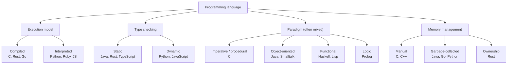

## In simple terms

A programming language is a precise way of telling a computer what to do. It has its own grammar (**syntax**), its own meaning (**semantics**), and a tool — a [compiler](/t/compiler) or [interpreter](/t/interpreter) — that turns your text into something the machine can run. It is the negotiated middle ground between how humans like to express ideas and what hardware can actually execute.

## The Visual Map



## More detail

Programming languages vary along several largely-independent axes — a given language picks a point on each:

- **Compiled vs. interpreted** — translated ahead of time (C, Rust, Go) or executed by a runtime (Python, Ruby, JavaScript). The line is blurry: most "interpreted" languages compile to bytecode first.
- **Static vs. dynamic types** — types checked at compile time (Java, Rust, TypeScript) or at run time (Python, JavaScript). See [type system](/t/type-system).
- **Paradigm** — imperative, object-oriented, functional, logic. Most modern languages are *multi-paradigm*: Python has classes, first-class functions, and comprehensions all at once.
- **Memory management** — manual (C), garbage-collected (Java, Go, Python), or ownership-based (Rust).
- **Level of abstraction** — from assembly (close to the machine) up through C, Go, and Python (close to the problem domain).

The 2026 mainstream includes Python, JavaScript/TypeScript, Java, C#, Go, Rust, C, C++, Swift, and Kotlin. Every one of them ultimately reduces to the same machine instructions; the language is the *notation*, not the capability.

## Under the Hood

Paradigm is a *style of expression*, not a hard property of a language. Here is one task — sum of squares of the even numbers in a list — written three ways in a single multi-paradigm language (Python), then the same idea sketched in other languages:

```python
#!/usr/bin/env python3
"""Sum of squares of even numbers — three paradigms, one language."""
from functools import reduce

data = [1, 2, 3, 4, 5, 6]

# 1. Imperative: explicit state and a loop (the C/Go way of thinking)
total = 0
for n in data:
    if n % 2 == 0:
        total += n * n
print("imperative:", total)

# 2. Functional: transform a stream, no mutable state (the Haskell/Lisp way)
print("functional:", reduce(lambda acc, n: acc + n*n,
                            filter(lambda n: n % 2 == 0, data), 0))

# 3. Declarative comprehension: say *what*, not *how* (Python's sweet spot)
print("comprehension:", sum(n*n for n in data if n % 2 == 0))

# The same computation in other languages' notation (not run here):
#   C:        for (int i=0;i<n;i++) if(a[i]%2==0) t += a[i]*a[i];
#   Haskell:  sum [n*n | n <- data, even n]
#   SQL:      SELECT SUM(n*n) FROM data WHERE n % 2 = 0;
```

All three Python versions compute the same answer through different *notation*; the machine code underneath ends up doing equivalent arithmetic.

## Engineering Trade-offs

**Productivity vs. control**
High-level languages (Python, JavaScript) hide pointers, memory, and machine details so you write less code faster — at the cost of runtime overhead and less control over performance. Low-level languages (C, Rust) expose the machine for maximum control and speed, demanding more care and more code. The right choice depends on whether the bottleneck is developer time or machine time.

**Static vs. dynamic typing**
Static types catch whole classes of errors before the program runs and power autocomplete, refactoring, and documentation — but add ceremony and can slow prototyping. Dynamic types are faster to write and more flexible, but defer errors to run time and make large codebases harder to navigate safely. Gradual typing (TypeScript, Python type hints) tries to offer both on a sliding scale.

**Ecosystem and momentum vs. technical merit**
Languages rarely win on language design alone. The package registry (npm, PyPI, Maven, crates.io), tooling (debuggers, profilers, IDE support), hiring pool, and platform reach usually matter more than syntax elegance. A "better" language with a thin ecosystem often loses to a "worse" one with batteries included.

**Specialisation vs. generality**
Domain-specific languages (SQL, regex, shells) are concise and safe within their niche but can't express general computation; general-purpose languages do everything adequately but force you to spell out domain logic by hand. Most real systems mix a general-purpose language with several DSLs.

## Real-world examples

- **Python** dominates data science, scripting, and AI/ML glue code — chosen for readability and its enormous library ecosystem, not raw speed.
- **JavaScript** runs in every web browser (a near-monopoly on the client) and, via Node.js, much of the server side too.
- **Rust** is increasingly used where memory safety matters and a garbage-collector runtime is unwelcome — OS components, browsers, and infrastructure.
- **C** remains the lingua franca of operating systems, embedded firmware, and the runtimes of higher-level languages (CPython itself is written in C).
- **SQL** is a declarative DSL so successful that essentially every database speaks a dialect of it decades after its creation.

## Common misconceptions

- **"The best language wins."** Languages thrive because of ecosystems, ergonomics, tooling, and momentum — not raw technical merit. Plenty of elegant languages remain niche; plenty of flawed ones are everywhere.
- **"Static types slow you down."** For non-trivial systems, modern static types usually pay back the up-front cost in fewer runtime bugs, safer refactoring, and better editor tooling.
- **"You should learn the 'fastest' language first."** The first language is for learning concepts (variables, control flow, functions, data structures) that transfer everywhere; those concepts matter far more than the specific language's performance.

## Try it yourself

Confirm that paradigm is notation, not capability — run the three styles and watch them agree, then tweak the predicate:

```bash
python3 - << 'EOF'
from functools import reduce
data = list(range(1, 11))   # 1..10

imperative = 0
for n in data:
    if n % 3 == 0:
        imperative += n * n

functional = reduce(lambda a, n: a + n*n, filter(lambda n: n % 3 == 0, data), 0)
declarative = sum(n*n for n in data if n % 3 == 0)

print("imperative :", imperative)
print("functional :", functional)
print("declarative:", declarative)
print("all agree  :", imperative == functional == declarative)
EOF
```

Change `n % 3 == 0` to any rule you like — all three notations stay in lockstep, because they describe the same computation in different styles.

## Learn next

- [Compiler](/t/compiler) — how the text you write becomes machine code ahead of time.
- [Interpreter](/t/interpreter) — the alternative: executing your source directly through a runtime.
- [Type system](/t/type-system) — the rules that decide which programs a language will accept, and the biggest single axis of variation between languages.
- [Algorithms](/t/algorithms) — the language-independent problem-solving that any programming language is ultimately a notation for expressing.
