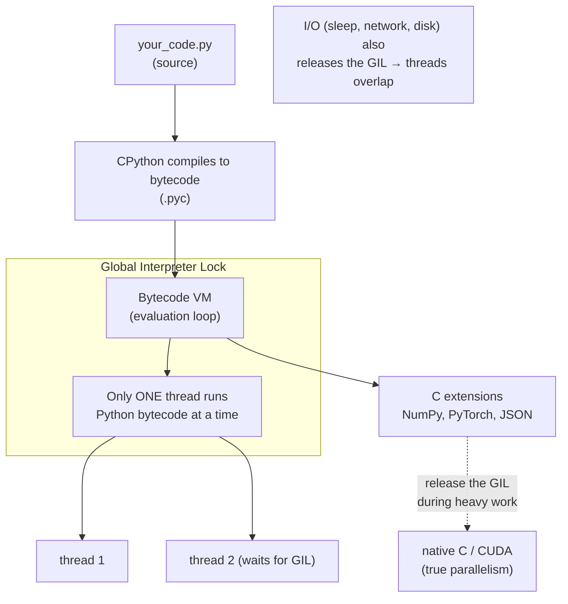

## In simple terms

**Python** is a programming language designed to be readable. It looks almost like pseudo-code: indentation defines blocks, there are no semicolons, no curly braces, no type declarations to start. You can usually read a Python program out loud and roughly explain it to a non-programmer. That accessibility, plus a huge collection of high-quality libraries, made it the dominant language for data work, scientific computing, scripting, and a large slice of backend web development.

## The Visual Map



## More detail

Python was created by Guido van Rossum in 1991 with one strong opinion: code is read more often than it's written, so optimise for the reader. The result is a small core syntax plus a deep standard library — "batteries included".

Key properties:

- **Dynamically typed**, with optional type hints (PEP 484) that tools like `mypy` and `pyright` check statically without changing run-time behaviour.
- **Interpreted** by CPython (the reference implementation) via a bytecode VM. Alternative runtimes include **PyPy** (a JIT, much faster on long-running pure-Python code) and **MicroPython** for embedded systems.
- **Garbage collected** with reference counting plus a cycle collector.
- **Multi-paradigm**: imperative by default, fluent OO, and light functional facilities (comprehensions, `map`/`filter`, first-class functions).
- **Famously rich ecosystem**: `numpy`, `pandas`, `scikit-learn`, `pytorch`, `tensorflow`, `requests`, `django`, `fastapi`, `polars`, and tens of thousands more.

The language has evolved steadily — 3.0 (2008) broke compatibility to fix decades of legacy; 3.11+ delivered major interpreter speed-ups; and 3.13 introduced an experimental **free-threading** build that removes the **global interpreter lock (GIL)**, the long-standing rule that only one Python thread executes bytecode at a time.

## Under the Hood

The most important thing to understand about CPython is the **GIL**. Because only one thread runs bytecode at a time, spreading *CPU-bound* work across threads gives **no speedup** — the threads simply take turns:

```python
#!/usr/bin/env python3
"""The GIL: threads do NOT speed up CPU-bound Python."""
import time, threading

def cpu_work(n):
    x = 0
    for i in range(n):       # pure-Python loop: holds the GIL the whole time
        x += i * i
    return x

N = 5_000_000

# Two calls one after another (serial baseline)
t0 = time.perf_counter()
cpu_work(N); cpu_work(N)
serial = time.perf_counter() - t0

# The same two calls on two threads
t0 = time.perf_counter()
threads = [threading.Thread(target=cpu_work, args=(N,)) for _ in range(2)]
for t in threads: t.start()
for t in threads: t.join()
threaded = time.perf_counter() - t0

print(f"serial (2 calls): {serial:.3f}s")
print(f"2 threads       : {threaded:.3f}s")
print(f"speedup         : {serial / threaded:.2f}x   <- ~1.0: the GIL serialised them")
```

On a multi-core machine you'd *expect* two threads to halve the time; instead the speedup is roughly 1.0×, because both threads contend for the single GIL. For real CPU parallelism in Python you use `multiprocessing` (separate processes, separate GILs) or a C extension that releases the GIL (NumPy, PyTorch).

## Engineering Trade-offs

**Readability and speed of development vs. raw execution speed**
Python's design optimises for the programmer: dynamic typing, no compile step, minimal ceremony. The cost is that pure-Python CPU-bound code runs perhaps 10–100× slower than C. The community's answer is *delegation* — keep the slow numeric work in C extensions (NumPy, PyTorch) and use Python as the orchestration layer, getting near-native speed where it matters and readability everywhere else.

**The GIL: simplicity vs. multi-core CPU scaling**
The GIL makes CPython's memory management and C-extension API far simpler and keeps single-threaded code fast, but it prevents threads from using multiple cores for CPU-bound Python. You work around it with `multiprocessing`, `asyncio` (for I/O), or GIL-releasing extensions — and Python 3.13+'s free-threaded build aims to remove the constraint entirely, at some single-thread overhead.

**Dynamic typing vs. large-codebase maintainability**
Dynamic typing makes small scripts and prototypes wonderfully terse, but large dynamically-typed codebases get hard to refactor safely. Optional type hints plus `mypy`/`pyright` reclaim much of static typing's safety and tooling — at the cost of annotation effort that the language doesn't force on you.

**"Batteries included" + huge ecosystem vs. dependency and environment management**
Python's vast library ecosystem is its superpower, but it created a notorious weakness: dependency and virtual-environment management (`pip`, `venv`, `conda`, and newer tools like `uv`). The same openness that gives you a package for everything also gives you version conflicts and "works on my machine" environment drift.

## Real-world examples

- **Instagram's backend** is one of the largest Python (Django) deployments in the world.
- **Dropbox** was historically Python top to bottom, including the desktop client, and employed Guido van Rossum for years.
- **Pandas + Jupyter notebooks** power a huge fraction of data analysis everywhere, from quant funds to academic labs.
- **PyTorch and TensorFlow** expose Python as their primary interface even though the heavy lifting is C++ and CUDA — the canonical "Python orchestrates, C accelerates" pattern.
- **Ansible**, **Salt**, and much infrastructure automation tooling is written in Python.

## Common misconceptions

- **"Python is slow."** Pure-Python CPU-bound loops are slow, but the common workloads delegate heavy lifting to C extensions (NumPy, PyTorch, fast JSON parsers) that are anything but. For genuinely CPU-bound pure-Python code, PyPy or Cython is the answer.
- **"The GIL means Python can't do concurrency."** The GIL constrains *CPU-bound threading*. Python is excellent at *I/O-bound* concurrency (via `asyncio` and threads, since I/O releases the GIL) and at parallelism via `multiprocessing` or GIL-releasing libraries.
- **"Python is only for scripts."** Multi-million-line Python services run in production at Google, Netflix, Spotify, and Stripe.

## Try it yourself

The flip side of the GIL: for *I/O-bound* work — network calls, disk reads, `time.sleep` — Python releases the GIL while waiting, so threads overlap and give a real, large speedup:

```bash
python3 - << 'EOF'
import time, threading

def io_work():
    time.sleep(0.3)          # simulate a network/disk call; GIL is released here

# Serial: four "requests" back to back
t0 = time.perf_counter()
for _ in range(4): io_work()
serial = time.perf_counter() - t0

# Concurrent: four threads waiting at the same time
t0 = time.perf_counter()
threads = [threading.Thread(target=io_work) for _ in range(4)]
for t in threads: t.start()
for t in threads: t.join()
threaded = time.perf_counter() - t0

print(f"serial (4 sleeps): {serial:.2f}s")
print(f"4 threads        : {threaded:.2f}s")
print(f"speedup          : {serial / threaded:.1f}x   <- ~4x: I/O waits overlapped")
EOF
```

Compare this ~4× speedup to the Under-the-Hood CPU-bound result of ~1×: *the exact same threading code* helps enormously for I/O and not at all for computation. Knowing which kind of work you have is the key to concurrency in Python.

## Learn next

- [Programming language](/t/programming-language) — the broader category and the axes (typing, paradigm, execution model) on which Python sits.
- [Interpreter](/t/interpreter) — what runs Python: CPython compiles to bytecode and interprets it, so Python is "interpreted" in the everyday sense.
- [Garbage collection](/t/garbage-collection) — Python's memory model: reference counting plus a cycle collector, freeing you from manual `free`.
