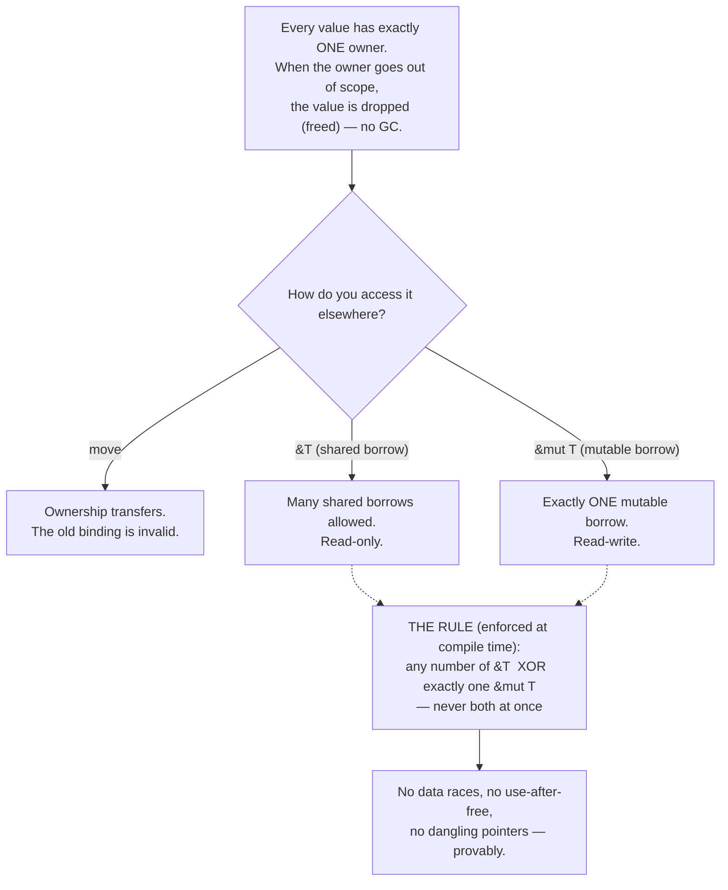

## In simple terms

**Rust** is a systems programming language that promises C-like speed, no garbage collector, and *memory safety guaranteed by the compiler*. The trick is a unique type system (most famously the "borrow checker") that proves at compile time that your program never has dangling pointers, data races, or use-after-free bugs. The trade-off: the compiler is strict, and learning to satisfy it takes time.

## The Visual Map



## More detail

Rust started at Mozilla (Graydon Hoare, 2006), reached 1.0 in 2015, and has topped Stack Overflow's "most admired language" survey for nearly a decade. It's now used in the Linux kernel, Windows, Firefox, AWS Firecracker, Dropbox storage, the Discord backend, and countless newer tools.

Core ideas:

- **Ownership** — every value has exactly one owner; when the owner goes out of scope, the value is dropped (deterministic, no GC).
- **Borrowing** — you can pass references, but the compiler tracks them: *many* immutable references **or** *one* mutable reference at any time, never both.
- **Lifetimes** — annotations that prove references don't outlive the data they point to.
- **No null** — use `Option<T>` instead. **No exceptions** — use `Result<T, E>`.
- **Pattern matching** — exhaustive `match` over enums (sum types); the compiler checks you handled every case.
- **Traits** — generic interfaces with monomorphisation for zero-cost abstraction.
- **`unsafe`** — a scoped escape hatch for low-level code where you take responsibility for the guarantees.

The toolchain is famously good: **cargo** (package manager, build tool, test runner, doc generator in one), **rust-analyzer** (IDE support), **clippy** (linter), and **rustfmt** (official formatter, no config debates). The async story is `async`/`await` with pluggable runtimes (tokio, smol, embassy) — the language deliberately stayed runtime-agnostic.

## Under the Hood

A small Rust program showing the three ideas that make Rust *Rust*: ownership moves, borrowing, and `Result`/`match` instead of exceptions and null. The commented line is a real compile error:

```rust
fn main() {
    // OWNERSHIP: 's' owns the String. Assigning it MOVES ownership to 'taken';
    // 's' is now invalid — Rust forbids using a moved value.
    let s = String::from("atlas");
    let taken = s;
    // println!("{}", s);   // <- compile error: borrow of moved value: `s`

    // BORROWING: pass a reference (&) so the function can read without taking ownership.
    let n = length(&taken);
    println!("'{}' has length {}", taken, n);   // 'taken' still valid: it was only borrowed

    // NO NULL, NO EXCEPTIONS: failure is a value of type Result<T, E>, matched exhaustively.
    for b in [2, 0] {
        match divide(10, b) {
            Ok(q)  => println!("10 / {} = {}", b, q),
            Err(e) => println!("10 / {} -> error: {}", b, e),
        }
    }
}

fn length(s: &String) -> usize { s.len() }      // borrows; does not consume

fn divide(a: i32, b: i32) -> Result<i32, String> {
    if b == 0 { Err("divide by zero".into()) } else { Ok(a / b) }
}
```

Run with `cargo run` (or `rustc main.rs && ./main`). The key insight: `taken` is still usable after `length(&taken)` because a borrow doesn't transfer ownership — but using `s` after the move simply will not compile.

## Engineering Trade-offs

**Compile-time safety vs. compile-time friction**
Rust's headline win is eliminating memory-safety bugs *before the program runs*, with no runtime cost. The price is paid up front: the borrow checker rejects programs it cannot prove safe, including some that *are* safe, forcing you to restructure code or reach for `Rc`/`RefCell`/`unsafe`. This is the "fighting the borrow checker" phase every newcomer goes through.

**No GC vs. expressive freedom**
Skipping garbage collection gives deterministic destruction, predictable latency (no pauses), and tiny runtimes suitable for kernels and embedded — exactly where GC is unwelcome. The cost is that ownership and lifetimes must be made explicit in the type system, so patterns that a GC makes trivial (shared mutable graphs, cyclic data structures) require deliberate tools (`Rc<RefCell<T>>`, arenas) in Rust.

**Zero-cost abstractions vs. compile times and binary size**
Generics monomorphise (a separate specialised copy per concrete type), giving abstractions that cost nothing at run time — as fast as hand-written code. The trade-off shows up at *build* time: heavy generic code and monomorphisation make Rust compiles notoriously slow and binaries larger.

**Safety leverage vs. ecosystem maturity and learning cost**
Adopting Rust is a real organisational lever — Microsoft and Google each attribute roughly 70% of their high-severity vulnerabilities to memory-safety bugs that Rust prevents by construction. But it costs a steeper learning curve (teams report 2–3 months to fluency) and a younger ecosystem than C/C++ in some domains.

## Real-world examples

- **Linux kernel** added Rust support in 2022; new drivers are increasingly written in Rust alongside the C core.
- **Cloudflare's Pingora** — the Rust HTTP proxy that serves a large share of their traffic, built to replace nginx.
- **Discord** rewrote its read-states service from Go to Rust specifically to eliminate garbage-collection latency spikes.
- **AWS Firecracker** — the microVM technology under Lambda and Fargate — is written in Rust for safety and small footprint.
- **ripgrep, fd, bat, eza, zoxide** — much of the modern fast-CLI renaissance is Rust binaries.

## Common misconceptions

- **"Rust is impossible to learn."** It's harder than Go or Python, but most teams report 2–3 months to productivity — the borrow checker becomes intuition with practice.
- **"Rust is always faster than C."** Comparable; sometimes faster (safe parallelism is easier to reach for), sometimes slower (the borrow checker can force a less optimal-looking design that's still safe).
- **"You can't write unsafe code in Rust."** You can, inside `unsafe { ... }` — you simply opt out of the borrow checker's guarantees for that block and take responsibility yourself. Safe Rust is built on small, audited `unsafe` foundations.

## Try it yourself

You can't run the borrow checker without `rustc`, but you can model the rule it enforces. This tiny Python "borrow checker" tracks borrows of a value and rejects the illegal combination — *shared and mutable at the same time* — exactly as Rust does at compile time:

```bash
python3 - << 'EOF'
class BorrowError(Exception): pass

class Tracked:
    def __init__(self, name): self.name, self.shared, self.mutable = name, 0, False
    def borrow(self):                       # &T  (shared / read-only)
        if self.mutable:
            raise BorrowError(f"cannot borrow `{self.name}` as shared "
                              f"while a &mut exists")
        self.shared += 1
        return f"&{self.name}"
    def borrow_mut(self):                   # &mut T  (exclusive / read-write)
        if self.mutable:
            raise BorrowError(f"cannot borrow `{self.name}` as mutable twice")
        if self.shared > 0:
            raise BorrowError(f"cannot borrow `{self.name}` as mutable "
                              f"while {self.shared} shared borrow(s) exist")
        self.mutable = True
        return f"&mut {self.name}"
    def drop_shared(self): self.shared -= 1
    def drop_mut(self):    self.mutable = False

v = Tracked("data")
print("ok:", v.borrow(), "+", v.borrow())         # many shared borrows: fine
try:
    v.borrow_mut()                                 # mutable while shared -> REJECTED
except BorrowError as e:
    print("rejected:", e)

v.drop_shared(); v.drop_shared()                   # shared borrows end
print("ok:", v.borrow_mut())                       # now a unique &mut is allowed
try:
    v.borrow()                                     # shared while mutable -> REJECTED
except BorrowError as e:
    print("rejected:", e)
EOF
```

The rule — *any number of `&T` XOR exactly one `&mut T`* — is precisely what makes data races impossible: you can never have a writer and a reader (or two writers) touching the same data at once. Rust proves this statically; here we just enforce it dynamically to see the logic.

## Learn next

- [C](/t/c) — the dominant systems language Rust is designed to replace, keeping the control while removing the memory-safety footguns.
- [Type system](/t/type-system) — Rust pushes a static type system to its logical extreme, encoding ownership, lifetimes, and exclusivity as types.
- [Garbage collection](/t/garbage-collection) — what Rust pointedly does *not* use; ownership gives deterministic freeing without a collector.
