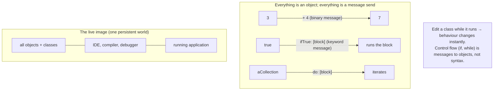

## In simple terms

Smalltalk was created at Xerox PARC in the 1970s by Alan Kay, Dan Ingalls, and Adele Goldberg. Kay envisioned a computer as a "dynamic medium" where everything is an object and objects communicate *only* by sending messages — no global state, just objects talking to each other. Smalltalk pioneered the graphical user interface, the first modern windowing system, the MVC (Model-View-Controller) pattern, and live programming (changing code while the program runs). Java, Python, Ruby, Objective-C, and Swift all acknowledge it as a direct ancestor.

## The Visual Map



## More detail

**Everything is an object:** *literally* everything — integers, booleans, classes, and blocks of code. `3 + 4` is not a built-in operation; it sends the `+` message to the integer object `3` with argument `4`. `true ifTrue: [...]` sends `ifTrue:` to the boolean object `true`. There are no VM-level primitive types exposed to the programmer.

**Three message forms:**
```smalltalk
| x |
x := OrderedCollection new.
x add: 42.
x do: [:each | Transcript showCr: each printString].
```
- **Unary** — `x size` (no argument, highest precedence).
- **Binary** — `3 + 4` (one argument, medium precedence).
- **Keyword** — `x at: 1 put: 'a'` (named arguments, lowest precedence).

**Blocks (closures):** `[:x | x + 1]` is a first-class closure over its lexical scope. Crucially, `ifTrue:`, `whileTrue:`, and `do:` are *not* language keywords — they're messages sent to booleans, blocks, and collections, with blocks as arguments. Control flow is library code.

**The live image:** Smalltalk isn't compiled to a binary and run. The whole system lives in a persistent **image** — a snapshot of the heap with all objects, classes, and running state. The IDE, compiler, debugger, and application all share that one image, so editing a running class changes its behaviour immediately — the original "hot reload." Smalltalk-80 also introduced **MVC** (the structure behind Rails, Django, Cocoa) and deep **reflection** (every object knows its class; classes can be inspected and modified at runtime), which seeded Java reflection, Python's `inspect`, and Ruby's `method_missing`. Modern Smalltalks include **Pharo** and **Squeak**.

## Under the Hood

A class definition and its use in Smalltalk (GNU Smalltalk syntax). Note that defining a class, looping, and branching are *all* message sends — there is barely any "syntax", just objects receiving messages:

```smalltalk
"Define a class with one instance variable and three methods."
Object subclass: Counter [
  | count |
  init       [ count := 0 ]
  increment  [ count := count + 1 ]   "+ is a message to the integer 'count'"
  count      [ ^count ]               "^ returns a value"
]

| c |
c := Counter new.
c init.
c increment; increment; increment.    "cascade: send 3 messages to the same object"
Transcript showCr: c count printString. "=> 3"

"Control flow is a message to a Boolean, taking blocks as arguments:"
(c count > 2)
  ifTrue:  [ Transcript showCr: 'big'   ]
  ifFalse: [ Transcript showCr: 'small' ].

"Iteration is a message too: send 'to:do:' with a block."
1 to: 3 do: [:i | Transcript showCr: i printString ].
```

There is no `if` statement and no `for` loop in the grammar: `ifTrue:ifFalse:` is a method on `Boolean`, and `to:do:` is a method on `Integer`. Everything reduces to objects sending each other messages.

## Engineering Trade-offs

**Pure message passing vs. performance and predictability**
Treating *everything* as a message send (even `3 + 4`, even `ifTrue:`) gives a tiny, uniform, deeply malleable language where you can redefine control flow itself. The cost is that naive implementations are slow (every operation is a dynamic dispatch) and behaviour is hard to predict statically — modern Smalltalk VMs claw back speed with aggressive JIT inlining, but the dynamism resists the static analysis that catches bugs early.

**The live image vs. reproducible builds**
A persistent live image is a magical development experience — inspect and modify a running system, fix a bug in the debugger and resume. But the image *is* mutable global state: it can drift into a one-of-a-kind configuration that's hard to reproduce, version-control, or deploy, which clashes with modern "build from source, immutable artifact" practice.

**Reflection and dynamism vs. tooling and safety**
Total reflection (any object inspectable, any class changeable at runtime) enables extraordinary tools and metaprogramming. The same openness defeats static guarantees and makes large systems harder to reason about — the recurring dynamic-language trade that Smalltalk pioneered and Python/Ruby inherited.

**Vision vs. adoption**
Smalltalk defined OOP as objects + message passing + polymorphism, plus the GUI and live programming — decades ahead of its time. Yet the mainstream adopted a *watered-down* OOP (C++/Java: method dispatch, primitive types, static compilation) that Alan Kay argues missed the message-passing essence. Purity of vision and market success diverged, as they often do.

## Real-world examples

- The **Xerox Alto** (1973), the first GUI computer, was programmed in Smalltalk and Interlisp — the environment that birthed windows, icons, and the mouse-driven desktop.
- **Objective-C** was created as "Smalltalk messaging on top of C" and became the language of Mac and iOS until Swift.
- **Ruby** was explicitly designed by Matz to feel like Smalltalk with friendlier, more Perl-like syntax.
- **JPMorgan** and other financial firms ran large VisualWorks Smalltalk systems for decades, some still in production.

## Common misconceptions

- **"Smalltalk is slow."** Modern VMs (Pharo's Cog VM) JIT-compile and are competitive with Python and Ruby on typical workloads.
- **"OOP in Java/Python is the same as in Smalltalk."** Java uses method dispatch (not pure message passing), has primitive types (not objects), and compiles to fixed bytecode (not a live image) — different philosophy, not just different syntax.
- **"`ifTrue:` is a keyword."** It's a method on `Boolean` taking blocks as arguments — which is *why* you can define your own control structures in Smalltalk.

## Try it yourself

Smalltalk's defining idea — control flow as messages to objects — is reproducible in Python, where (as in Smalltalk) everything is already an object. Here `if` becomes a method on a boolean-like object, taking blocks (lambdas) as arguments:

```bash
python3 - << 'EOF'
# In Smalltalk, 'if' is a message to a Boolean with blocks as arguments.
class STrue:
    def ifTrue_ifFalse(self, then_blk, else_blk): return then_blk()
class SFalse:
    def ifTrue_ifFalse(self, then_blk, else_blk): return else_blk()
def boolean(b): return STrue() if b else SFalse()

# 'x > 5 ifTrue: [...] ifFalse: [...]'  becomes a method call with two blocks:
for x in (3, 9):
    print(boolean(x > 5).ifTrue_ifFalse(lambda: f"{x} is big",
                                         lambda: f"{x} is small"))

# And like Smalltalk, even integers are objects responding to messages:
print("(3).__add__(4)     =", (3).__add__(4))      # '3 + 4' is a message to 3
print("(255).bit_length() =", (255).bit_length())
print("all objects        :", type(3).__name__, type(int).__name__)
EOF
```

`boolean(x > 5).ifTrue_ifFalse(...)` chooses a branch with *no `if` statement at all* — the boolean object decides which block to run. That's exactly how Smalltalk works, and `(3).__add__(4)` shows Python shares the "everything is an object you send messages to" lineage Smalltalk created.

## Learn next

- [Erlang](/t/erlang) — took Smalltalk's message-passing idea to concurrency: isolated processes (actors) communicating only by messages.
- [Closure](/t/closure) — Smalltalk's blocks are first-class closures, the mechanism that lets control flow be ordinary library methods.
- [Xerox PARC](/t/xerox-parc) — the research lab where Smalltalk, the GUI, and much of modern personal computing were invented.
