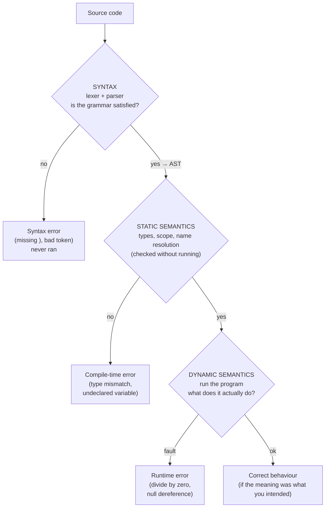

## In simple terms

**Syntax** is the grammar of a language — which arrangements of symbols are even allowed. **Semantics** is the meaning — what a grammatically valid program actually *does*. The English sentence "colorless green ideas sleep furiously" is syntactically fine but semantically nonsense. In code, `x = 1 / 0` is perfectly valid syntax, but its meaning — divide by zero — is an error. A language processor checks syntax first, then worries about meaning.

## The Visual Map



## More detail

**Syntax** is what a parser enforces: balanced braces, keywords in the right place, well-formed expressions. A *syntax error* means the source couldn't even be turned into a structured form — the compiler gave up before understanding any meaning.

**Semantics** divides into two layers:

- **Static semantics** — meaning that can be checked *without running* the program: type compatibility, scope and name resolution, "variable used before it's declared." Caught by the compiler *after* parsing.
- **Dynamic semantics** — what actually happens *at run time*: the order expressions evaluate in, what `+` does to two particular values, what a null dereference does.

The two are independent. Two programs can share an identical syntactic shape but mean different things — `a + b` is numeric addition in one language and string concatenation in another. And the same meaning can be written with wildly different syntax: every language spells "loop over a list" differently. Formally, **grammars** (e.g. BNF) describe syntax, while **operational** or **denotational semantics** describe meaning.

## Under the Hood

Here a single classifier runs Python source through three gates — parse (syntax), name-resolve (static semantics), then execute (dynamic semantics) — and reports *which layer* each snippet fails at. It uses Python's own `ast` module as the parser, so the stages are real:

```python
#!/usr/bin/env python3
"""Classify an error by the layer that catches it: syntax / static / dynamic."""
import ast

ENV = {"x": 10, "y": 2}                      # the "declared" variables

def classify(src):
    # GATE 1 — SYNTAX: can it even be parsed into a tree?
    try:
        tree = ast.parse(src, mode="eval")
    except SyntaxError as e:
        return "SYNTAX error", e.msg

    # GATE 2 — STATIC SEMANTICS: are all referenced names in scope?
    used = {n.id for n in ast.walk(tree) if isinstance(n, ast.Name)}
    undefined = used - ENV.keys()
    if undefined:
        return "STATIC SEMANTIC error", f"name(s) not defined: {sorted(undefined)}"

    # GATE 3 — DYNAMIC SEMANTICS: actually run it
    try:
        value = eval(compile(tree, "<demo>", "eval"), {}, dict(ENV))
        return "OK", f"value = {value}"
    except Exception as e:
        return "DYNAMIC SEMANTIC error", f"{type(e).__name__}: {e}"

for src in ["x +* y", "x + z", "x / 0", "x + y"]:
    layer, detail = classify(src)
    print(f"{src:8} -> {layer:24} {detail}")
```

Each snippet is rejected (or accepted) at a *different* gate: `x +* y` never parses, `x + z` parses but references an undeclared name, `x / 0` is flawless until it runs, and `x + y` is correct at every layer. Knowing which gate caught an error is half of debugging.

## Engineering Trade-offs

**Pushing checks earlier (cheaper) vs. later (more flexible)**
The earlier a language catches an error, the cheaper it is to fix: syntax errors are flagged instantly, static-semantic errors at compile time, dynamic-semantic errors only when the unlucky code path runs (perhaps in production). Statically-typed languages move more checks into the static-semantic gate, catching bugs sooner at the cost of up-front strictness; dynamic languages defer to run time for flexibility, trading later failures for faster iteration.

**Syntactic sugar vs. parser and tooling complexity**
Rich, expressive syntax (comprehensions, pattern matching, operator overloading) makes code shorter and clearer to read, but every construct enlarges the grammar — more for the parser, formatter, highlighter, and the human to learn. Minimal-syntax languages (Lisp, Go) keep grammar tiny and tooling simple at the cost of verbosity. This is a deliberate language-design dial.

**Unambiguous grammar vs. natural notation**
A grammar with no ambiguity is easy to parse correctly, but the most *readable* notation (the classic "dangling else", or `a ? b : c ? d : e`) is often ambiguous and needs extra rules (precedence, associativity) to pin down its meaning. Designers trade parser simplicity against notation that matches human intuition.

## Real-world examples

- A missing semicolon or unbalanced bracket is a **syntax** error — flagged before the program runs at all.
- `"5" + 3` yields `"53"` in JavaScript but is a `TypeError` in Python: *identical syntax, different semantics*.
- A **linter** mostly checks syntax and style; a **type checker** (and your **tests**) check semantics — which is why "it lints" and "it's correct" are unrelated claims.
- "It compiles" guarantees syntax and static semantics passed; it says nothing about dynamic semantics — the program can still do entirely the wrong thing.

## Common misconceptions

- **"If it parses, it's correct."** Parsing only proves the grammar is satisfied. The meaning can still be completely wrong — most real bugs are semantic, not syntactic.
- **"Syntax is the hard part of a language."** The grammar is usually the easy part; the depth — and most of the bugs — lives in the semantics (type rules, evaluation order, edge cases like overflow and null).
- **"Compile errors and runtime errors are the same kind of problem."** They live at different gates: a compile error is static (caught without running); a runtime error is dynamic (caught only on the executed path). The fix strategies differ accordingly.

## Try it yourself

The cleanest proof that syntax and semantics are independent: feed the *exact same expression* to two languages and watch them disagree on its meaning. `"5" + 3` is valid syntax in both Python and JavaScript — but means different things:

```bash
# Same syntax, different semantics — needs python3 (always present) and node.
echo "Python:"
python3 -c 'print(repr("5" + 3))' 2>&1 | sed 's/^/  /'

echo "JavaScript:"
node -e 'console.log(JSON.stringify("5" + 3))' 2>&1 | sed 's/^/  /'
```

Python raises `TypeError: can only concatenate str (not "int") to str` — its semantics forbid mixing string and number with `+`. JavaScript prints `"53"` — its semantics coerce the number to a string and concatenate. The characters typed are identical; only the *meaning* the language assigns differs. (No `node`? The Python half alone still shows the point: valid syntax, rejected by semantics.)

## Learn next

- [Parsing](/t/parsing) — the step that enforces *syntax*, turning a legal token stream into the AST later stages reason about.
- [Compiler](/t/compiler) — enforces both the grammar and the *static* semantics (types, scope) before generating code.
- [Type system](/t/type-system) — the largest and most consequential body of static-semantic rules a language defines.
