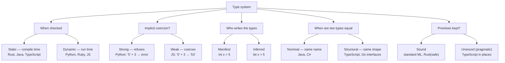

## In simple terms

A **type system** is the part of a programming language that knows what kinds of things your values are — numbers, strings, lists, functions — and refuses to let you do nonsense like add a number to a function. The stricter the type system, the more bugs it catches without ever running your code.

## The Visual Map



## More detail

The two axes are often confused, so pin them down first: **static vs. dynamic** is about *when* types are checked (compile time vs. run time); **strong vs. weak** is about *how willing* the language is to implicitly coerce between types. They are independent — Python is dynamic but strong; C is static but relatively weak.

Type systems vary along several more axes:

- **Manifest vs. inferred** — you write the types (`int x = 5`) or the compiler figures them out (`let x = 5`). Most modern languages infer local types.
- **Nominal vs. structural** — "two types match iff they have the same name" vs. "iff they have the same shape." TypeScript and Go interfaces are structural; Java and C# are nominal.
- **Sound vs. unsound** — a *sound* type system guarantees the runtime never violates a type promise; an *unsound* one sometimes lies. TypeScript is intentionally unsound in places (e.g. array bounds, `any`) for ergonomics.

Modern features many languages have adopted:

- **Generics / parametric polymorphism** — `List<T>` works for any `T` without losing type safety.
- **Algebraic data types** — sum types (`Result<T, E>`, `Option<T>`) plus exhaustive pattern matching.
- **Type inference** — most local types need not be written (Hindley–Milner in ML/Haskell, flow inference in TypeScript).
- **Option / nullable types** — make "might be missing" explicit instead of letting `null` lurk in every reference.
- **Lifetimes / ownership** (Rust) — types that also encode aliasing and memory safety, eliminating use-after-free at compile time.
- **Effect systems** — types that track side effects (IO, async, can-throw), so the signature tells you what a function *does*, not just its inputs and outputs.

## Under the Hood

A tiny **static type checker** in Python. It walks an expression AST and computes each node's type *without evaluating it*, rejecting `1 + true` before any "execution" happens — exactly what a real compiler's semantic-analysis phase does:

```python
#!/usr/bin/env python3
"""A miniature static type checker for int/bool expressions."""

class TypeError_(Exception): pass

# AST nodes are tuples: ("int", 5) ("bool", True)
#   ("+", a, b) ("<", a, b) ("if", cond, then, else_)
def check(node):
    """Return the type ('int' or 'bool') of an expression, or raise."""
    tag = node[0]
    if tag == "int":  return "int"
    if tag == "bool": return "bool"

    if tag in ("+", "-", "*"):
        lt, rt = check(node[1]), check(node[2])
        if lt != "int" or rt != "int":
            raise TypeError_(f"'{tag}' needs int operands, got {lt} and {rt}")
        return "int"

    if tag == "<":
        if check(node[1]) != "int" or check(node[2]) != "int":
            raise TypeError_("'<' needs int operands")
        return "bool"

    if tag == "if":
        if check(node[1]) != "bool":
            raise TypeError_("'if' condition must be bool")
        t1, t2 = check(node[2]), check(node[3])
        if t1 != t2:
            raise TypeError_(f"if branches disagree: {t1} vs {t2}")
        return t1
    raise TypeError_(f"unknown node {tag}")

# Well-typed: if (3 < 5) then (1 + 2) else 0   -> int
good = ("if", ("<", ("int",3), ("int",5)), ("+", ("int",1), ("int",2)), ("int",0))
print("good program type:", check(good))

# Ill-typed: 1 + true   -> rejected BEFORE running
bad = ("+", ("int",1), ("bool",True))
try:
    check(bad)
except TypeError_ as e:
    print("rejected at compile time:", e)
```

## Engineering Trade-offs

**Safety vs. flexibility**
A stricter type system rejects more incorrect programs — but it also rejects some *correct* programs it can't prove safe, forcing rewrites or escape hatches (`any`, `unsafe`, casts). The more guarantees you demand, the more you must convince the checker, which is friction. Dynamic languages accept everything and find out at run time.

**Compile-time cost vs. run-time cost**
Type checking and inference take time and, for expressive systems (Rust's borrow checker, heavy generics, C++ templates), can dominate build times. The payoff is that checks happen *once* at build rather than on every execution, and many run-time checks (and their overhead) disappear entirely.

**Up-front annotation vs. long-term maintainability**
Writing types costs keystrokes and slows the very first draft. At scale, those types pay back as machine-checked documentation, safe refactoring, and IDE intelligence (autocomplete, jump-to-definition). This is why large dynamically-typed codebases (Python, JavaScript) routinely bolt on `mypy` or TypeScript as they grow.

**Soundness vs. pragmatism**
A fully sound type system never lies, but enforcing soundness can make common patterns awkward (covariant arrays, gradual migration from untyped code). TypeScript deliberately trades soundness for adoption — it would rather be useful on messy real-world JavaScript than provably correct and unusable. The "right" point on this axis depends on whether a wrong type is catastrophic or merely annoying.

## Real-world examples

- A typo in a field name in TypeScript fails the build, instead of silently returning `undefined` at run time and crashing three function calls later.
- **Rust's borrow checker** is "just" an unusually expressive type system: by encoding ownership and lifetimes in types, it eliminates use-after-free and data races at compile time.
- **Python's optional type hints** (PEP 484) let `mypy` catch errors the interpreter wouldn't, without changing run-time behaviour — gradual typing in action.
- **Haskell's** Hindley–Milner inference lets you write almost no annotations yet get a fully static, sound check — the type system reconstructs the types for you.
- Modern **TypeScript's** type system is Turing-complete; people have encoded games and even small interpreters entirely within types as a (somewhat absurd) demonstration of its expressive power.

## Common misconceptions

- **"Static and strong mean the same thing."** They're orthogonal. Static/dynamic is *when* checking happens; strong/weak is *whether* implicit coercions are allowed. Python is dynamic *and* strong; C is static *and* fairly weak.
- **"Static types slow you down."** They cost a few keystrokes up front and save hours of debugging at any non-trivial scale, while enabling tooling dynamic languages struggle to match.
- **"Dynamic types are simpler."** They're simpler to *start* with and harder to *maintain* at scale — which is exactly why large dynamic codebases adopt type checkers over time.

## Try it yourself

See the difference between strong and weak typing first-hand. Python is *strongly* typed: it refuses to silently turn a string into a number, raising at run time rather than guessing:

```bash
python3 - << 'EOF'
# Python: STRONG typing — no silent coercion between str and int
cases = [("5" + "3", "string + string"),
         ("5" * 3,   "string * int")]
for value, label in cases:
    print(f"{label:18} -> {value!r}")

print()
for expr in ['"5" + 3', '"5" - 3']:
    try:
        result = eval(expr)
        print(f'{expr:10} -> {result!r}')
    except TypeError as e:
        print(f'{expr:10} -> TypeError: {e}')

# Contrast (JavaScript, WEAK typing — not run here):
#   "5" + 3  ->  "53"   (number coerced to string)
#   "5" - 3  ->  2      (string coerced to number!)
EOF
```

Python raises `TypeError` on `"5" + 3`, forcing you to convert explicitly. JavaScript would coerce and produce `"53"` (and, bafflingly, `"5" - 3` gives `2`) — the canonical example of weak typing's surprises.

## Learn next

- [Compiler](/t/compiler) — where static type checking actually runs, as part of semantic analysis, before any code is generated.
- [Interpreter](/t/interpreter) — how dynamically-typed languages check types instead: at run time, as values flow through the program.
- [Syntax vs. semantics](/t/syntax-vs-semantics) — types are a *semantic* property; this clarifies why a syntactically valid program can still be a type error.
- [Rust](/t/rust) — the flagship example of pushing a type system to encode memory safety and concurrency correctness via ownership and lifetimes.
