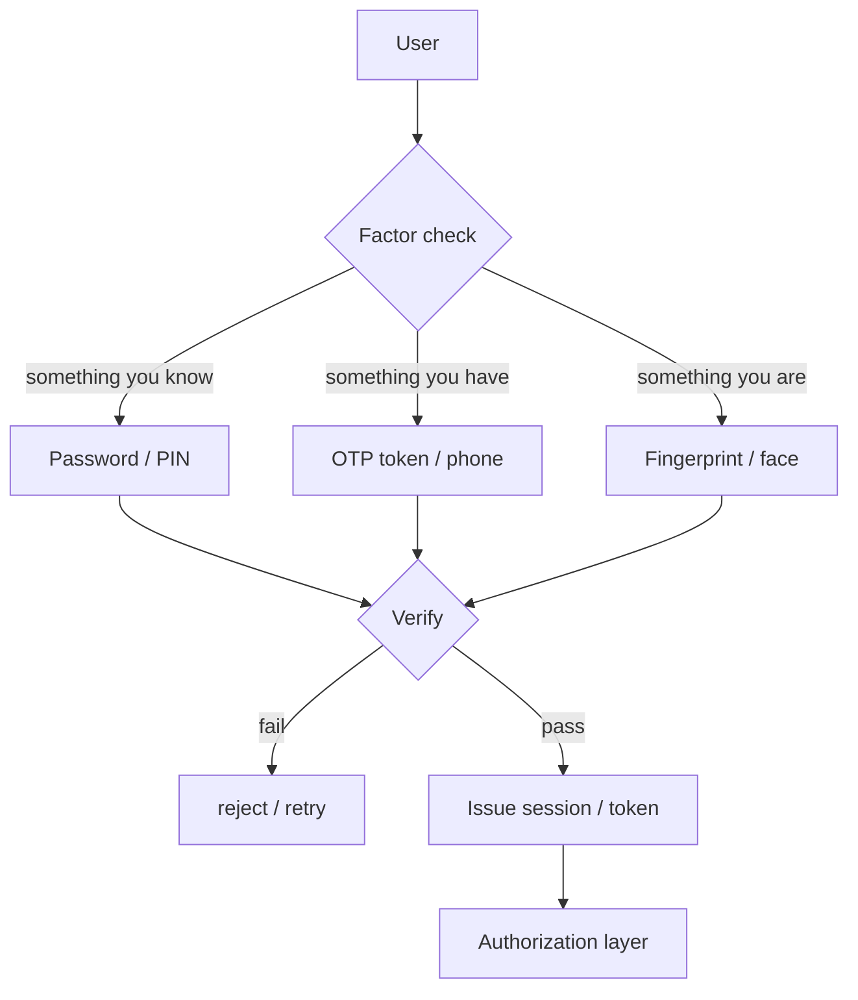

## In simple terms

**Authentication** is the part of an app that figures out who you are — the login page, the magic link, the fingerprint. Once authenticated, you can be **authorised** to do things, but those are two different jobs.

## The Visual Map



## More detail

Factors of authentication:

- **Something you know** — password, PIN, passphrase.
- **Something you have** — phone, hardware token, smart card.
- **Something you are** — fingerprint, face, voice.

**Multi-factor authentication (MFA)** combines two or more from different categories. Two passwords aren't MFA.

Modern application authentication is built on:

- **Passwords** — hashed with a slow KDF (Argon2, bcrypt, scrypt), checked on login.
- **OAuth 2.0 / OpenID Connect** — federated sign-in via Google, GitHub, Apple.
- **WebAuthn / Passkeys** — public-key cryptography from the device, replacing passwords.
- **Magic links** — short-lived signed URL emailed to the user.
- **TOTP** (RFC 6238) — 6-digit codes from an authenticator app, derived via HMAC over a time counter.
- **Hardware keys** (YubiKey, Titan) — strongest in practice.

Once authenticated, the server issues a **session**: a cookie or token the client sends with each request.

Pitfalls: storing passwords in plaintext, MFA account-recovery that bypasses MFA, not rate-limiting login endpoints (credential stuffing).

## Under the Hood

TOTP (the code from your authenticator app) is HMAC-SHA1 over a counter derived from the current time:

```python
import hmac, hashlib, struct, time, base64

def totp(secret_b32: str, digits: int = 6, interval: int = 30) -> str:
    key = base64.b32decode(secret_b32)
    counter = int(time.time()) // interval
    msg = struct.pack(">Q", counter)
    mac = hmac.new(key, msg, hashlib.sha1).digest()
    offset = mac[-1] & 0x0f
    code = struct.unpack(">I", mac[offset:offset+4])[0] & 0x7fffffff
    return f"{code % 10**digits:0{digits}d}"

# Standard demo key (RFC 6238 test vectors)
print("TOTP (changes every 30s):", totp("JBSWY3DPEHPK3PXP"))
```

The server recomputes the same value and compares — no secret is sent over the wire, only shared knowledge of the key.

## Engineering Trade-offs

- **Passwords vs passkeys.** Passwords are universal but vulnerable to phishing, stuffing, and weak hashing. Passkeys are phishing-proof with no server-side secret — but require device support and a recovery path.
- **Stateful sessions vs stateless JWTs.** Server-side sessions enable instant revocation; JWTs are self-contained and scale easily but can't be reliably revoked until they expire.
- **MFA benefit vs UX cost.** Each factor added dramatically reduces account-takeover risk at the cost of friction. Hardware keys are the highest security/friction ratio; SMS OTP adds some security but is vulnerable to SIM-swap.
- **Federated identity vs local accounts.** SSO via OIDC shifts responsibility to a specialist provider and reduces per-app password databases, but creates a single point of failure — a compromised IdP can compromise everything.

## Real-world examples

- "Sign in with GitHub" is OAuth 2.0 / OIDC.
- A passkey replaces a password with a private key locked in your phone's secure enclave.
- A leaked password database is only useful to an attacker if passwords were hashed weakly.
- Passkeys are now supported by Google, Apple, Microsoft, and Amazon — by 2026 it is realistic never to type a password into major services again.

## Common misconceptions

- **"Authentication = authorization."** Authn proves who; authz decides what. They are separate stages, often handled by different code.
- **"Passwords are dead because of passkeys."** Passkeys are gaining ground fast, but passwords + MFA will coexist for many years.

## Try it yourself

Generate a live TOTP code the same way an authenticator app does — pure stdlib:

```bash
python3 -c "
import hmac, hashlib, struct, time, base64
key = base64.b32decode('JBSWY3DPEHPK3PXP')
counter = int(time.time()) // 30
mac = hmac.new(key, struct.pack('>Q', counter), hashlib.sha1).digest()
offset = mac[-1] & 0xf
code = struct.unpack('>I', mac[offset:offset+4])[0] & 0x7fffffff
print(f'TOTP code: {code % 1000000:06d}  (valid for {30 - int(time.time()) % 30}s)')
"
```

Run it twice within 30 seconds — same code. Run it after the window — different code. That is the entire RFC 6238 algorithm.

## Learn next

- [Authorization](/t/authorization) — what the system does once it knows who you are.
- [Password hashing](/t/password-hashing) — how to store credentials safely.
- [OAuth](/t/oauth) — delegated identity using access tokens.
- [Multi-factor authentication](/t/multi-factor-authentication) — layering factors to reduce account takeover risk.
