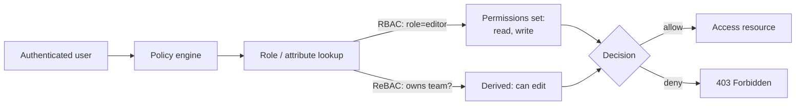

## In simple terms

Once a system knows *who* you are (authentication), it has to decide *what* you can do. Can this user read that document? Edit it? Delete the project? **Authorization** is the layer of permission checks that runs on every meaningful action.

## The Visual Map



## More detail

Common authorization models:

- **Access Control List (ACL)** — for each resource, a list of who can do what. Unix file permissions work this way.
- **Role-Based Access Control (RBAC)** — assign users to roles (`admin`, `editor`, `viewer`), assign permissions to roles. Easy to reason about.
- **Attribute-Based Access Control (ABAC)** — rules over attributes of subject, resource, action, and environment. Flexible, harder to audit.
- **Relationship-Based Access Control (ReBAC)** — permissions derived from graphs of relationships ("you can edit because you're a member of the team that owns the project"). Used by Google Zanzibar, OpenFGA, SpiceDB.
- **Capability-based** — possessing an unforgeable token *is* the permission. Very simple; hard to revoke.

Implementation-level rules:
- **Authorize on the server**, always. Hiding a button in the UI is not security.
- **Default deny.** If no rule grants access, refuse.
- **Check at every boundary** — each API endpoint, not just page navigation.
- **Audit log** every authorization decision.

## Under the Hood

A minimal RBAC checker — the same shape as what Express middleware, Django permissions, and Spring Security provide:

```python
ROLES = {
    "admin":  {"read", "write", "delete"},
    "editor": {"read", "write"},
    "viewer": {"read"},
}
USERS = {"alice": "admin", "bob": "editor", "carol": "viewer"}

def check(user: str, action: str) -> bool:
    role = USERS.get(user)
    return action in ROLES.get(role, set())

for user in USERS:
    perms = [a for a in ("read", "write", "delete") if check(user, a)]
    print(f"{user:6} ({USERS[user]:7}): {', '.join(perms)}")
```

Permissions are attached to **roles**, not directly to users — so revoking "write" from all editors is one change, not N user changes.

## Engineering Trade-offs

- **RBAC simplicity vs ABAC flexibility.** RBAC is easy to audit ("who has admin?") but coarse — you can't say "editors can edit during business hours". ABAC handles context but policies become hard to reason about and audit.
- **ReBAC scales, but is slow to reason about.** Google Zanzibar handles billions of checks per second on relationship graphs, but debugging "why doesn't Alice have access?" requires tracing a graph, not reading a role list.
- **Centralized policy engine vs distributed checks.** A central OPA/Cedar/Zanzibar instance gives one place to change policy but adds a network hop and a new critical service. Embedded checks are simpler until you need consistency across many services.
- **Audit logging cost.** Every authorization decision logged is expensive at scale, but without it you can't answer "who accessed patient record X?" Required in healthcare (HIPAA), finance (SOX), and government.

## Real-world examples

- A Google Doc has "owner", "editor", "commenter", "viewer" plus per-link rules — a mix of RBAC and ACL.
- Kubernetes RBAC controls which service accounts can `list` pods in which namespaces.
- A `PUT /api/orders/42` that returns the right answer for the wrong user is an IDOR (Insecure Direct Object Reference) — an authorization bug, not an authentication one.
- Google Zanzibar (now open as OpenFGA/SpiceDB) handles billions of authorization checks per second across Drive, YouTube, and Calendar.

## Common misconceptions

- **"Authorization is part of authentication."** They are separate concerns; conflating them is a source of real bugs.
- **"Roles are always enough."** For small apps yes, for large multi-tenant systems no — you eventually need attributes, relationships, or both.

## Try it yourself

See RBAC in action and what an IDOR looks like when the ownership check is missing:

```bash
python3 -c "
ROLES = {'admin': {'read','write','delete'}, 'editor': {'read','write'}, 'viewer': {'read'}}
USERS = {'alice': 'admin', 'bob': 'editor', 'carol': 'viewer'}

def check(user, action):
    return action in ROLES.get(USERS.get(user, ''), set())

print('--- RBAC decisions ---')
for u in USERS:
    row = [a for a in ('read','write','delete') if check(u, a)]
    print(f'{u:6}: {row}')

orders = {1: 'alice', 2: 'bob'}

def get_UNSAFE(user, oid):
    return orders.get(oid)           # no ownership check!

def get_SAFE(user, oid):
    owner = orders.get(oid)
    if owner != user and not check(user, 'delete'):
        return None
    return owner

print()
print('--- IDOR demo ---')
print('unsafe: bob reads order 1 (owned by alice):', get_UNSAFE('bob', 1))
print('safe:   bob reads order 1:', get_SAFE('bob', 1))
print('safe:   alice (admin) reads order 2:', get_SAFE('alice', 2))
"
```

## Learn next

- [Authentication](/t/authentication) — proving identity before authorization runs.
- [Zero trust](/t/zero-trust) — authorization applied at every layer, never once at the perimeter.
- [OAuth](/t/oauth) — delegated authorization across services.
- [Password hashing](/t/password-hashing) — storing credentials that feed the auth pipeline.
