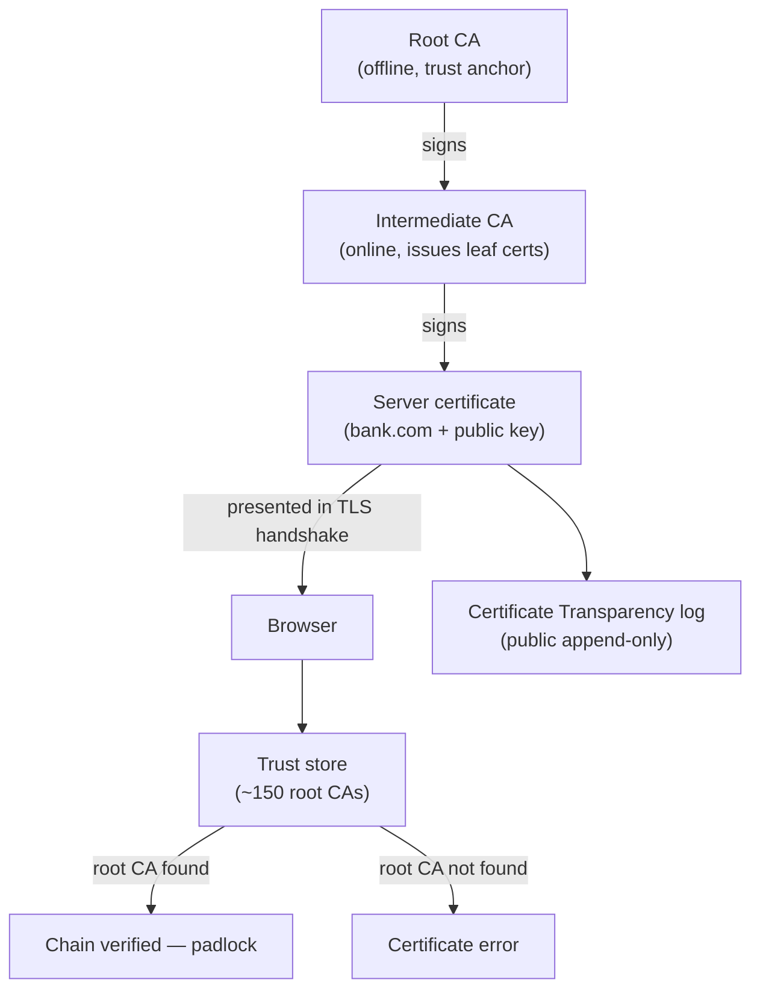

## In simple terms

Public-key cryptography solves eavesdropping — but how do you know the public key you received actually belongs to `bank.com` and not an attacker? A **Certificate Authority (CA)** answers this: it verifies the identity of a website and then signs a **certificate** binding their public key to their name. Your browser trusts a list of CAs; if a certificate is signed by one of them, you can trust the key.

## The Visual Map



## More detail

A **digital certificate** (X.509 format) contains: the subject's identity, the subject's **public key**, validity period, the **issuer** (the CA that signed it), and the **CA's digital signature** over all the above.

**Verification:** the browser verifies that the server's certificate is signed by a CA in its **trust store** (a list of ~150 root CAs pre-installed by the OS and browser vendors). Root CAs are kept offline for security — they sign **intermediate CAs**, which sign the leaf (server) certificates. A typical chain: Root CA → Intermediate CA → Server certificate.

**Certificate types by validation level:**
- **DV (Domain Validation)** — CA verifies domain control only (DNS record or challenge file). Automated, free (Let's Encrypt). Gives the padlock but says nothing about the organisation.
- **OV (Organisation Validation)** — CA verifies the legal entity. Takes days.
- **EV (Extended Validation)** — strict identity verification; used to show the company name in the browser bar (largely deprecated).

**Let's Encrypt** is an automated CA (ACME protocol) that issues free DV certificates with 90-day expiry, renewed automatically by Certbot and Caddy. It drove HTTPS adoption from ~40% to ~90% of web traffic.

**Certificate Transparency (CT):** all issued certificates must appear in at least two public CT logs. Browsers reject certificates not in CT logs. This makes it impossible for a rogue CA to issue a certificate for `google.com` without detection within hours.

**Revocation:** OCSP Stapling is the modern approach — the server pre-fetches its own revocation status and includes it in the TLS handshake. CRL checking is largely abandoned by browsers due to latency and privacy issues.

## Under the Hood

Simulating a three-tier certificate chain — root signs intermediate, intermediate signs leaf, browser verifies:

```python
import hmac, hashlib, json

def sign(body: dict, ca_secret: bytes) -> dict:
    body_bytes = json.dumps(body, sort_keys=True).encode()
    sig = hmac.new(ca_secret, body_bytes, hashlib.sha256).hexdigest()[:32]
    return {**body, "signature": sig, "sig_by_secret": id(ca_secret)}

def verify_sig(cert: dict, ca_secret: bytes) -> bool:
    body = {k: v for k, v in cert.items() if k not in ("signature", "sig_by_secret")}
    body_bytes = json.dumps(body, sort_keys=True).encode()
    expected = hmac.new(ca_secret, body_bytes, hashlib.sha256).hexdigest()[:32]
    return hmac.compare_digest(cert["signature"], expected)

root_key   = b"root-ca-offline-private-key"
inter_key  = b"intermediate-ca-private-key"

inter_cert = sign({"subject": "Intermediate CA", "public_key": "inter-pub-key"}, root_key)
leaf_cert  = sign({"subject": "bank.com", "public_key": "bank-pub-key-789",
                   "issuer": "Intermediate CA"}, inter_key)

print("Intermediate cert signed by root:", verify_sig(inter_cert, root_key))
print("Leaf cert signed by intermediate:", verify_sig(leaf_cert, inter_key))
print("Tampered leaf cert valid?        ", verify_sig({**leaf_cert, "subject": "evil.com"}, inter_key))
print()
print("Chain: bank.com <- Intermediate CA <- Root CA (in browser trust store)")
```

## Engineering Trade-offs

- **Certificate lifetime vs revocation cost.** Short-lived certificates (90 days, like Let's Encrypt) reduce the revocation problem — an expired cert is automatically invalid. Long-lived certificates require working revocation infrastructure (OCSP stapling), but reduce renewal automation burden.
- **Root CA vs CA-as-a-service.** Running an internal CA gives full control but requires securing the root key (HSM, offline storage) and operating OCSP/CRL infrastructure. Delegating to Let's Encrypt / DigiCert removes that burden at the cost of depending on a third party.
- **CT log monitoring vs performance.** All certificates must be submitted to CT logs, which costs a round-trip. In exchange, any organisation can monitor CT logs for certificates issued for their domains — a rogue CA issuance becomes visible within minutes.
- **Trust store churn.** Browser vendors (and Apple, Microsoft, Google) can distrust a CA at any time — all certificates signed by that CA immediately fail. Symantec's 2017 distrust cascade caused widespread outages for customers who hadn't migrated.

## Real-world examples

- Let's Encrypt issues ~400 million active certificates for free; almost every small website uses it.
- DigiCert, Sectigo, and GlobalSign are commercial CAs for code signing and EV certificates.
- Internal corporate CAs (Windows Server CA) issue certificates for internal services, VPNs, and mutual TLS.
- CT logs (Google Argon, Cloudflare Nimbus) are monitored by companies like Facebook to detect rogue certificates for their domains within minutes.

## Common misconceptions

- **"HTTPS means the site is safe."** HTTPS means the connection is encrypted and the domain matches the certificate. It says nothing about whether the site is legitimate or the content is trustworthy.
- **"Free certificates are less secure."** DV certificates from Let's Encrypt provide the same cryptographic security as expensive certificates — the difference is identity verification, not key strength.

## Try it yourself

Inspect a real server's certificate chain — Python stdlib:

```bash
python3 -c "
import ssl, socket
ctx = ssl.create_default_context()
conn = ctx.wrap_socket(socket.socket(), server_hostname='google.com')
conn.connect(('google.com', 443))
cert = conn.getpeercert()
conn.close()
print('Subject:    ', dict(x[0] for x in cert['subject']))
print('Issuer:     ', dict(x[0] for x in cert['issuer']))
print('Expires:    ', cert['notAfter'])
sans = [v for t,v in cert.get('subjectAltName',[]) if t=='DNS']
print('SANs (first 3):', sans[:3])
"
```

## Learn next

- [Public-key cryptography](/t/public-key-cryptography) — the mechanism CAs use; CAs answer "whose key is this?"
- [TLS](/t/tls) — the protocol that presents and verifies certificates during the handshake.
- [Elliptic-curve cryptography](/t/elliptic-curve-cryptography) — the key type (ECDSA, Ed25519) in modern certificates.
- [JWT](/t/jwt) — RS256 JWTs use keys that can be signed by a CA-issued certificate.
