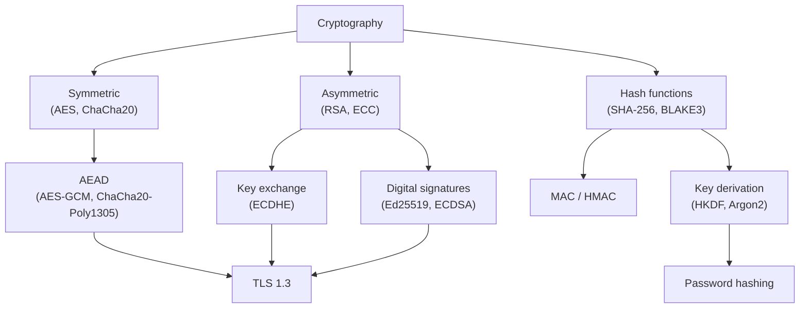

## In simple terms

Cryptography is the toolbox that keeps secrets and proves identity online. It scrambles data so only the intended reader can unscramble it, and lets one party prove "this message really came from me, untouched."

## The Visual Map



## More detail

The three primitives most engineers use:

- **Symmetric encryption** (e.g. AES) — same key encrypts and decrypts. Fast; suitable for bulk data.
- **Asymmetric encryption** (e.g. RSA, ECC) — public/private keypair. Solves key distribution; too slow for bulk data.
- **Hash functions** (e.g. SHA-256, BLAKE3) — one-way fingerprints; deterministic, fixed-size output.

Higher-level constructions combine these:

- **Authenticated encryption** (AEAD) like AES-GCM or ChaCha20-Poly1305 — encrypts *and* detects tampering in one step.
- **Digital signatures** (Ed25519, ECDSA) — private key signs, public key verifies.
- **Message authentication codes** (HMAC) — symmetric equivalent of a signature; proves message origin + integrity.
- **Key derivation** (HKDF, Argon2id for passwords) — stretches or adapts key material.

The one rule above all others: **don't roll your own**. Use well-tested libraries (libsodium, language platform standards) and accept the recommended defaults. More serious vulnerabilities come from misusing correct primitives than from algorithm weaknesses.

## Under the Hood

HMAC-SHA256 shows both the "authentication" and "integrity" properties simultaneously:

```python
import hmac, hashlib, secrets

key = secrets.token_bytes(32)          # 256-bit symmetric key
msg = b"Transfer $100 to Alice"

# sender computes tag
tag = hmac.new(key, msg, hashlib.sha256).digest()
print("tag:", tag.hex()[:32], "...")

# receiver verifies
def verify(key, msg, received_tag):
    expected = hmac.new(key, msg, hashlib.sha256).digest()
    return hmac.compare_digest(expected, received_tag)  # constant-time

print("correct msg:", verify(key, msg, tag))
print("tampered   :", verify(key, b"Transfer $999 to Alice", tag))
```

`hmac.compare_digest` is the constant-time comparison that prevents timing-based tag forgery — without it, a fast-reject on the first mismatched byte leaks information.

## Engineering Trade-offs

- **Symmetric vs asymmetric.** Symmetric is ~1000× faster; used for bulk data. Asymmetric solves the key distribution problem — two strangers can agree on a key over a public channel (ECDHE). In practice both are used together: asymmetric to exchange a symmetric key, symmetric for everything after.
- **Standard algorithms vs custom.** Custom ciphers are almost never correct. Even careful experts get it wrong (ROCA, Dual_EC_DRBG). The correct posture is to use audited, standardised algorithms and focus engineering effort on *how* they're used.
- **Key management is harder than encryption.** A correct cipher is useless if the key is stored in a config file next to the ciphertext. HSMs, KMS services, and key rotation policies are the real security work.
- **Metadata leaks even when content is encrypted.** TLS encrypts payload but the server's IP, connection timing, and packet sizes are observable. Traffic analysis attacks are real.

## Real-world examples

- HTTPS uses TLS, which uses AEAD ciphers plus public-key cryptography.
- `git commit -S` signs commits with GPG or SSH keys (digital signature).
- Apple's iMessage uses end-to-end encryption with per-device keys.
- The 2017 ROCA vulnerability broke millions of Estonian national ID smartcards because a hardware RSA key generator chose primes from a too-small subset — implementation matters as much as algorithm choice.

## Common misconceptions

- **"Bigger keys = more secure."** Past a point, more bits buy nothing useful. Algorithm choice matters more than key size.
- **"Encrypted means anonymous."** Encryption hides content; the existence and timing of communication is often still visible.

## Try it yourself

See integrity protection and tampering detection in action with stdlib HMAC:

```bash
python3 -c "
import hmac, hashlib, secrets
key = secrets.token_bytes(32)
msg = b'pay Alice 100'
tag = hmac.new(key, msg, hashlib.sha256).hexdigest()
print('tag:', tag[:16], '...')
tampered = b'pay Alice 999'
tag2 = hmac.new(key, tampered, hashlib.sha256).hexdigest()
print('tags match (should be False):', tag == tag2)
diff = sum(a != b for a, b in zip(bytes.fromhex(tag), bytes.fromhex(tag2)))
print(f'{diff}/32 bytes differ — avalanche effect')
"
```

One character change in the message produces a completely different tag — the avalanche effect that makes MACs and hash functions useful as integrity primitives.

## Learn next

- [Public-key cryptography](/t/public-key-cryptography) — the asymmetric half: key exchange and signatures.
- [Password hashing](/t/password-hashing) — the KDF branch of cryptography applied to credentials.
- [TLS](/t/tls) — cryptography assembled into the protocol that secures the web.
- [Homomorphic encryption](/t/homomorphic-encryption) — the frontier: computing on encrypted data without decrypting it.
