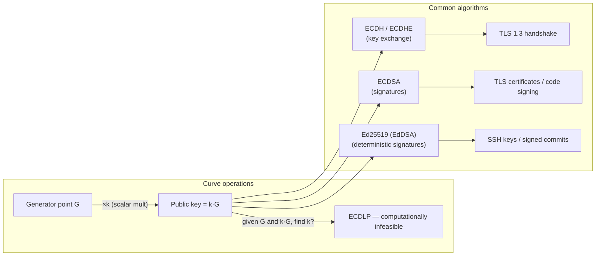

## In simple terms

RSA security relies on the difficulty of factoring large numbers. ECC relies on the **elliptic curve discrete logarithm problem**: given two points P and Q on a curve, find the integer `k` such that `Q = k·P`. This problem is harder per bit than factoring: a 256-bit ECC key provides roughly the same security as a 3072-bit RSA key, with much faster operations and shorter keys. That is why modern TLS, SSH, and code signing use ECC.

## The Visual Map



## More detail

An **elliptic curve** over a prime field is defined by `y² = x³ + ax + b (mod p)`. Points on the curve form a group: you can "add" two points by drawing a line through them and reflecting the third intersection. **Scalar multiplication** (`Q = k·P` — add P to itself k times) is efficient; finding `k` given P and Q is computationally infeasible for large curves.

**Key operations:**

- **ECDH (Elliptic Curve Diffie-Hellman)** — key agreement. Alice has private key `a`, public key `A = a·G`. Bob has `b`, `B = b·G`. Shared secret: `a·B = b·A = ab·G`. Used in TLS 1.3 key exchange (as ephemeral ECDHE).
- **ECDSA** — digital signatures. Used in TLS certificates, Bitcoin transactions, and code signing.
- **EdDSA (Ed25519)** — deterministic signatures on twisted Edwards curves. No random nonce needed, faster, and simpler to implement correctly. The contemporary default for SSH, signed Git commits, and new TLS certificate issuance.

**Standard curves:**
- **P-256 (secp256r1)** — NIST-standardised, used in TLS, Android, and FIDO2. Some concerns about NIST parameter provenance.
- **Curve25519** — designed by Bernstein for performance and safety margins. Used in Signal, WireGuard, SSH (Ed25519), and modern TLS. Widely trusted.
- **secp256k1** — Bitcoin's curve; not widely used outside cryptocurrency.

**Security advantage:** 128-bit security requires 256-bit ECC vs. 3072-bit RSA — smaller keys mean faster handshakes, shorter certificates, and less bandwidth, critical for mobile and IoT.

## Under the Hood

Elliptic curve point addition and scalar multiplication on a toy curve over a small prime:

```python
p, a = 97, 2   # y² = x³ + 2x + 3 (mod 97)

def add_points(P, Q):
    if P is None: return Q
    if Q is None: return P
    x1, y1 = P;  x2, y2 = Q
    if x1 == x2:
        if y1 != y2: return None                           # P + (-P) = point at infinity
        m = (3*x1*x1 + a) * pow(2*y1, p-2, p) % p        # tangent line
    else:
        m = (y2 - y1) * pow(x2 - x1, p-2, p) % p         # secant line
    x3 = (m*m - x1 - x2) % p
    y3 = (m*(x1 - x3) - y1) % p
    return (x3, y3)

def scalar_mult(k, P):
    R = None
    while k > 0:
        if k & 1: R = add_points(R, P)
        P = add_points(P, P)
        k >>= 1
    return R

G = (3, 6)   # generator — verify: 6² mod 97 = 36; 3³+2·3+3 = 36 ✓
alice_priv, bob_priv = 7, 13
A = scalar_mult(alice_priv, G)   # Alice's public key
B = scalar_mult(bob_priv, G)     # Bob's public key
alice_shared = scalar_mult(alice_priv, B)
bob_shared   = scalar_mult(bob_priv, A)
print(f"Generator G: {G}")
print(f"Alice public: {A}  (= 7·G)")
print(f"Bob   public: {B}  (= 13·G)")
print(f"Alice shared: {alice_shared}  (= 7·B = 7·13·G)")
print(f"Bob   shared: {bob_shared}  (= 13·A = 13·7·G)")
print(f"Match: {alice_shared == bob_shared}")
```

The math is identical to standard ECDH — both sides compute `ab·G` via different paths. On real curves (Curve25519), `p` is ~2²⁵⁵ and reversing the scalar multiplication is computationally infeasible.

## Engineering Trade-offs

- **ECC vs RSA.** For new systems, ECC is strictly better — equivalent security at a fraction of the key size, faster signing and verification. RSA is kept for compatibility with older systems and FIPS-mode requirements.
- **Curve choice.** Curve25519 (and its twist, Ed25519 for signatures) is the safest choice for new protocols: free of NIST's parameter controversy, designed with implementation safety as a primary goal. P-256 is widely standardised and required for FIDO2, but the Curve25519 safety margins are larger.
- **ECDSA vs EdDSA.** ECDSA requires a unique random nonce per signature — reusing a nonce (a known implementation bug, e.g. Sony's PS3 jailbreak) leaks the private key. Ed25519 derives the nonce deterministically, eliminating this footgun.
- **Quantum vulnerability.** ECC is broken by Shor's algorithm on a sufficiently large quantum computer — the same as RSA. [Post-quantum cryptography](/t/post-quantum-cryptography) (ML-KEM, ML-DSA) replaces both; hybrid suites in TLS run both simultaneously during the transition.

## Real-world examples

- TLS 1.3 uses X25519 (ECDH with Curve25519) for key exchange and ECDSA/Ed25519 for certificates in every HTTPS connection.
- Bitcoin uses secp256k1 ECDSA for transaction signatures and wallet addresses.
- Signal Protocol uses Curve25519 for all key exchange and the X3DH double ratchet.
- WireGuard uses Curve25519 exclusively for its cryptographic operations.

## Common misconceptions

- **"Bigger ECC key = more security, like RSA."** ECC key length is not comparable to RSA key length. 256-bit ECC is already at the 128-bit security level; doubling to 512-bit is unnecessary for almost all purposes.
- **"ECC is quantum-safe."** Shor's algorithm breaks ECC as easily as RSA. See [post-quantum cryptography](/t/post-quantum-cryptography).

## Try it yourself

Run ECDH key agreement on a toy elliptic curve — same math as Curve25519, small prime:

```bash
python3 -c "
p, a = 97, 2   # y^2 = x^3 + 2x + 3 mod 97

def add(P, Q):
    if P is None: return Q
    if Q is None: return P
    x1,y1=P; x2,y2=Q
    if x1==x2:
        if y1!=y2: return None
        m=(3*x1*x1+a)*pow(2*y1,p-2,p)%p
    else:
        m=(y2-y1)*pow(x2-x1,p-2,p)%p
    x3=(m*m-x1-x2)%p; y3=(m*(x1-x3)-y1)%p
    return (x3,y3)

def mul(k,P):
    R=None
    while k>0:
        if k&1: R=add(R,P)
        P=add(P,P); k>>=1
    return R

G=(3,6)   # generator: 6^2=36, 3^3+6+3=36 mod 97 ✓
a_priv,b_priv=7,13
A=mul(a_priv,G); B=mul(b_priv,G)
print(f'Alice public={A}  Bob public={B}')
print(f'Alice shared={mul(a_priv,B)}')
print(f'Bob   shared={mul(b_priv,A)}')
print(f'Match: {mul(a_priv,B)==mul(b_priv,A)}')
"
```

## Learn next

- [Public-key cryptography](/t/public-key-cryptography) — the broader context; ECC is the modern implementation.
- [TLS](/t/tls) — ECC (X25519, ECDSA, Ed25519) is the key technology in every TLS 1.3 handshake.
- [Post-quantum cryptography](/t/post-quantum-cryptography) — why ECC and RSA will eventually need replacing.
