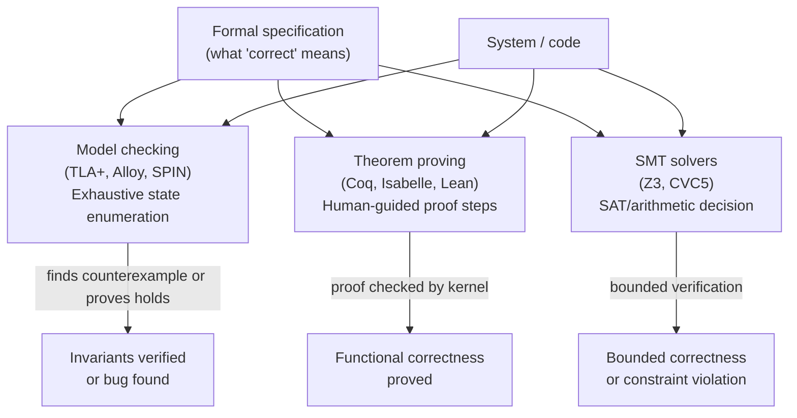

## In simple terms

Tests check that a program works for the inputs you tried. Formal verification proves that it works for *all* possible inputs — using mathematical reasoning that proves theorems. If a cryptographic protocol is formally verified, you know it is correct even in adversarial conditions that no human tester would think to try. The trade-off: verification requires a formal specification (you must write down exactly what "correct" means) and significant expert effort.

## The Visual Map



## More detail

**Model checking:** exhaustively enumerate all reachable states of a finite-state system and check that invariants hold. Tools: TLA+ (Leslie Lamport), Alloy, SPIN. Scales to ~10¹⁰ states using symbolic techniques (BDD, SAT). AWS uses TLA+ to verify distributed system designs — it found critical bugs in S3 and EBS designs before implementation.

**Theorem proving (interactive):** a human works with a proof assistant (Coq, Isabelle, Lean, Agda) to construct a formal proof; the proof checker verifies every step. Can handle infinite-state systems and complex mathematics. The **seL4** microkernel was fully verified in Isabelle: its C implementation is proved correct with respect to its abstract specification and memory-safe (no buffer overflow, no use-after-free) by construction.

**Automated theorem proving (SMT solvers):** Z3, CVC5 — decide the satisfiability of logical formulas over arithmetic, arrays, and bit-vectors. Used by CBMC (bounded model checker for C), Dafny (verifying programming language), and AWS Zelkova (IAM policy analysis).

**What you can verify:**
- **Safety** — "the system never enters a bad state" (no deadlock, no privilege escalation).
- **Liveness** — "the system eventually reaches a good state" (every request is eventually served).
- **Functional correctness** — "this sort always returns a sorted permutation of the input."
- **Security properties** — "the key is never revealed to an attacker" (proved for TLS 1.3 handshake in ProVerif/CryptoVerif).

## Under the Hood

Manual model checking: BFS over all reachable states of a simple mutual-exclusion protocol, verifying the invariant holds everywhere:

```python
from collections import deque

# State: (lock_holder, waiting_A, waiting_B)
# lock_holder: None, 'A', or 'B'
INITIAL = (None, False, False)

def transitions(state):
    lock, wait_A, wait_B = state
    nexts = []
    # A tries to acquire
    if not wait_A and lock is None:
        nexts.append(('A', True, wait_B))         # A gets lock
    elif not wait_A:
        nexts.append((lock, True, wait_B))         # A queues
    # A releases
    if lock == 'A':
        nexts.append((None, False, wait_B))
    # B tries to acquire
    if not wait_B and lock is None:
        nexts.append((lock, wait_A, True))         # B gets lock
    elif not wait_B:
        nexts.append((lock, wait_A, True))
    # B releases
    if lock == 'B':
        nexts.append((None, wait_A, False))
    return nexts

def invariant(state):
    lock, wait_A, wait_B = state
    return not (lock == 'A' and lock == 'B')       # mutual exclusion

visited, queue, violated = set(), deque([INITIAL]), False
while queue:
    s = queue.popleft()
    if s in visited: continue
    visited.add(s)
    if not invariant(s):
        violated = True; break
    for t in transitions(s): queue.append(t)

print(f"States explored:    {len(visited)}")
print(f"Invariant violated: {violated}")
print(f"Mutual exclusion:   {'PROVED' if not violated else 'BROKEN'}")
```

## Engineering Trade-offs

- **Testing vs formal verification.** Tests find bugs; formal verification proves their absence. Verification costs 5–20× more per line of code but provides guarantees impossible with testing — valuable for cryptographic implementations, safety-critical code, and security kernels.
- **Model checking vs theorem proving.** Model checking is push-button for finite systems but hits a state-space explosion for complex systems. Theorem proving handles infinite systems and complex properties but requires expert human effort. SMT solvers occupy the middle: powerful for bounded verification, limited for unbounded proofs.
- **Spec quality is the limit.** "Formally verified" means "meets the specification". A wrong or incomplete spec leaves bugs undetected. Specifying what "correct" means is often as hard as writing the code itself — and writing the spec down forces clarity about requirements.
- **Continuous vs milestone use.** TLA+ for design-level verification of a protocol catches bugs before implementation at low cost. Full Isabelle/Coq proofs for a kernel take person-years. The right tool depends on the assurance requirement and the budget.

## Real-world examples

- **AWS uses TLA+** to verify distributed service designs; it found critical bugs in EBS and S3 before a single line of production code was written.
- **seL4** — the world's most analysed OS kernel — is used in drones, automotive systems, and classified government infrastructure.
- **TLS 1.3** was designed alongside a formal security proof in ProVerif and CryptoVerif — an unusual case where the protocol and its proof were developed in parallel.
- **Ethereum smart contracts** are verified using Certora Prover and the K framework to prevent multi-million-dollar exploits.

## Common misconceptions

- **"Formal verification means the software has no bugs."** It means the implementation meets the *specification*. If the spec is wrong or incomplete, bugs remain. "Verified" always means "verified against a particular specification."
- **"Formal verification is only for academics."** AWS, Microsoft (Hyper-V), Google (Android Verified Boot), and DARPA programmes routinely use formal methods in production-critical systems.

## Try it yourself

BFS model checking: verify a mutual-exclusion protocol holds over all reachable states:

```bash
python3 -c "
from collections import deque

# States: idle, locked_A, locked_B, locked_AB (the forbidden state)
# Transitions: A or B can acquire/release the lock
# Invariant: 'locked_AB' is never reachable

def transitions(state):
    if state == 'idle':
        return ['locked_A', 'locked_B']  # either can acquire
    if state == 'locked_A':
        return ['idle', 'locked_AB']     # A releases OR (bad impl) B also acquires
    if state == 'locked_B':
        return ['idle', 'locked_BA']     # B releases OR (bad impl) A also acquires
    return []

# Safe version: proper mutex — B waits, cannot acquire while A holds
def safe_transitions(state):
    if state == 'idle':
        return ['locked_A', 'locked_B']
    if state == 'locked_A':
        return ['idle']   # only A can release; B blocked
    if state == 'locked_B':
        return ['idle']   # only B can release; A blocked
    return []

visited, q = set(), deque(['idle'])
while q:
    s = q.popleft()
    if s in visited: continue
    visited.add(s)
    for t in safe_transitions(s): q.append(t)

print(f'States reachable: {visited}')
print(f'Mutual exclusion holds: {\"locked_AB\" not in visited and \"locked_BA\" not in visited}')
print(f'States explored: {len(visited)} (state space is exhausted)')
"
```

## Learn next

- [Cryptography](/t/cryptography) — formal verification is how we know cryptographic protocols like TLS 1.3 are correct.
- [Type theory](/t/type-theory) — the logical foundation; dependent types bring formal verification into everyday programming.
- [Lambda calculus](/t/lambda-calculus) — the mathematical basis for proof assistants like Coq and Lean.
