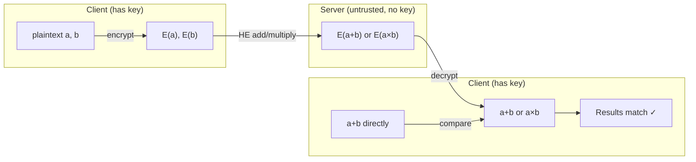

## In simple terms

Normally, to process data you must decrypt it first — meaning the cloud server you send it to can see it. Homomorphic encryption lets you send encrypted data to a server, the server performs computations on the ciphertext, and when you decrypt the result you get the correct answer — without the server ever seeing your data. Think of a locked box with a slot: you can pass inputs in, the server manipulates the contents through the box, and you unlock it to get the result.

## The Visual Map



## More detail

**Levels of homomorphism:**
- **Partially Homomorphic (PHE)** — supports one operation type (add OR multiply). Example: Paillier encryption supports unlimited additions; RSA (textbook, unpadded) supports multiplications. Used in e-voting (summing votes).
- **Somewhat Homomorphic (SHE)** — supports both operations but only a bounded number of times before noise corrupts the result.
- **Fully Homomorphic (FHE)** — supports unlimited additions AND multiplications, enabling arbitrary computation. Invented by Craig Gentry in 2009. Requires **bootstrapping** to refresh the noise periodically.

**How it works (simplified):** most FHE schemes add a small random **noise** to ciphertexts during encryption. Additions are cheap and add little noise. Multiplications amplify noise. Eventually noise grows too large to decrypt correctly — bootstrapping decrypts and re-encrypts under a fresh noise budget, but at high cost.

**Practical FHE schemes:**
- **CKKS** — approximate arithmetic over real/complex numbers. Used for machine learning inference on encrypted data (floating-point).
- **BFV / BGV** — exact arithmetic over integers. Used for privacy-preserving statistics.
- **TFHE / FHEW** — gate bootstrapping; very fast per gate but limited to boolean circuits. Used for encrypted database queries.

**Practical status (2026):** FHE is 100–100,000× slower than plaintext computation. Microsoft SEAL, OpenFHE, and Google's transpiler make it accessible. Practical for: encrypted ML inference (CKKS), private set intersection, encrypted database queries. Not yet practical for real-time general applications.

## Under the Hood

Additive homomorphism with a toy one-time-pad mask — demonstrates `Dec(E(a) + E(b)) = a + b`:

```python
import secrets

MOD = 2**31

def keygen():
    return secrets.randbelow(MOD)

def encrypt(key: int, m: int) -> int:
    return (m + key) % MOD       # mask plaintext

def decrypt(key: int, c: int) -> int:
    return (c - key) % MOD       # unmask

def he_add(c1: int, c2: int) -> int:
    return (c1 + c2) % MOD       # server: no key needed

key1, key2 = keygen(), keygen()
a, b = 42, 17
ca, cb = encrypt(key1, a), encrypt(key2, b)

c_sum = he_add(ca, cb)           # server adds ciphertexts
result = decrypt((key1 + key2) % MOD, c_sum)   # client decrypts with combined key

print(f"a={a}, b={b}, a+b={a+b}")
print(f"E(a)={ca}, E(b)={cb}  (server cannot reverse without keys)")
print(f"Server computes E(a)+E(b) = {c_sum}")
print(f"Client decrypts:           {result}")
print(f"Matches a+b: {result == a + b}")
```

## Engineering Trade-offs

- **Security vs performance.** FHE provides the strongest privacy guarantee — the server is truly blind to the data. The cost is orders-of-magnitude overhead. PHE (addition only) is practical today for specific tasks (e-voting, encrypted statistics).
- **CKKS vs BFV.** CKKS is faster and suited for ML (tolerates small rounding errors); BFV is exact but slower. The choice depends on whether your computation needs bit-exact results.
- **FHE vs secure multi-party computation (MPC).** MPC splits secrets across multiple parties; FHE processes encrypted data at a single server. MPC requires coordination overhead between parties; FHE requires no server-side secrets but is computationally heavier.
- **FHE vs trusted execution environments (TEE).** TEEs (Intel SGX, AMD SEV) run code in a hardware-encrypted enclave — much faster than FHE but rely on hardware trust and have had side-channel vulnerabilities. FHE is purely mathematical.

## Real-world examples

- **Microsoft SEAL** is used for privacy-preserving analytics in Azure; researchers use it for encrypted genomic data analysis.
- **Google's Private Join and Compute** uses partially homomorphic encryption for privacy-preserving set intersection (e.g., ad attribution without sharing raw user IDs).
- **E-voting:** some voting protocols use Paillier's additive HE to tally encrypted votes without decrypting individual ballots.
- **Encrypted ML inference:** Zama.ai's Concrete ML allows training a model normally and running inference on FHE-encrypted inputs.

## Common misconceptions

- **"Homomorphic encryption means the server can't store your data."** HE means the server can't *understand* your data — but it does receive and process ciphertexts. You're protecting the semantic content, not the transmission.
- **"FHE is not practical yet."** It is practical for bounded, offline workloads — encrypted ML inference, private set intersection. It is not practical for latency-sensitive, general-purpose computation.

## Try it yourself

Additive homomorphism: the server adds encrypted values without seeing them:

```bash
python3 -c "
import secrets
MOD = 2**31

def enc(key, m): return (m + key) % MOD
def dec(key, c): return (c - key) % MOD
def he_add(c1, c2): return (c1 + c2) % MOD

k1, k2 = secrets.randbelow(MOD), secrets.randbelow(MOD)
a, b = 42, 17
ca, cb = enc(k1, a), enc(k2, b)
c_sum = he_add(ca, cb)
result = dec((k1+k2)%MOD, c_sum)

print(f'a={a}, b={b}')
print(f'E(a)={ca}, E(b)={cb}  (meaningless to server)')
print(f'Server HE-add = {c_sum}')
print(f'Decrypted result = {result}  (== a+b: {result==a+b})')
"
```

## Learn next

- [Cryptography](/t/cryptography) — the foundation; HE is a specialised construction built on hard problems.
- [Zero trust](/t/zero-trust) — HE takes "never trust" to its logical extreme: process data without ever decrypting it.
- [Post-quantum cryptography](/t/post-quantum-cryptography) — lattice-based FHE (LWE) is also quantum-resistant; the same hard problems underlie both.
