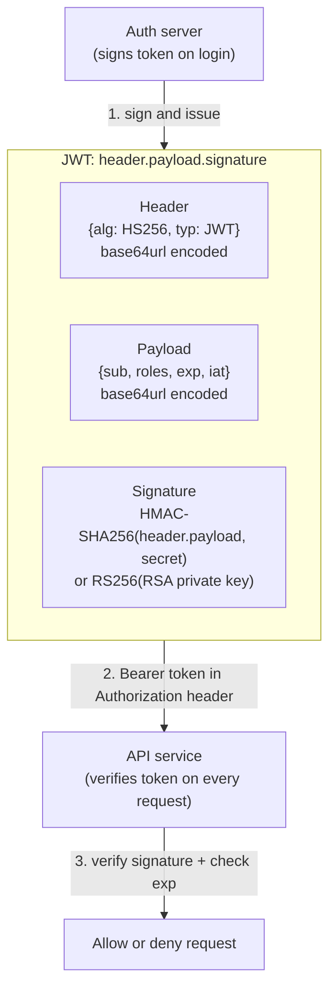

## In simple terms

A JWT is a three-part token (`header.payload.signature`) that proves identity without a server-side session lookup. The server signs the payload with its secret key; anyone can verify the signature but only the key holder can create valid tokens. When a microservice receives a JWT, it validates the signature locally — no round-trip to a session store needed.

## The Visual Map



## More detail

**Structure — three base64url-encoded JSON blobs joined by dots:**
- **Header:** algorithm (`alg`) and token type (`typ: JWT`). Common: `HS256` (symmetric HMAC-SHA256), `RS256` (RSA asymmetric), `ES256` (ECDSA).
- **Payload (claims):** registered claims — `sub` (subject), `exp` (expiry), `iat` (issued-at), `iss` (issuer), `aud` (audience). Plus arbitrary application claims (user ID, roles).
- **Signature:** over `base64url(header) + "." + base64url(payload)`. Changing a payload byte invalidates the signature.

**Verification steps (never skip any):**
1. Decode and check the header `alg` — reject `alg: none` outright.
2. Verify the signature using the correct key for the stated algorithm.
3. Check `exp` has not passed.
4. Check `iss` matches the expected issuer.
5. Check `aud` matches your service (prevents token substitution attacks).

**HS256 vs RS256:**
- **HS256** — HMAC with a shared secret. Simple, fast, symmetric. All verifying services need the secret, so token issuance and verification share trust. Good for single-service use.
- **RS256 / ES256** — asymmetric. Auth server signs with private key; services verify with public key. Scales to many services without sharing secrets. The private key never leaves the auth server.

**Common vulnerabilities:**
- `alg: none` attack — some early libraries accepted tokens with no signature if `alg` was `none`. Always validate `alg` before verification.
- **Key confusion attack** — RS256 public key used as HS256 secret. Reject if `alg` doesn't match expected.
- **Missing `exp` check** — tokens last forever, no revocation needed.
- **Storing JWTs in `localStorage`** — accessible to XSS. Prefer `HttpOnly` cookies for browser clients.

## Under the Hood

JWT generation and verification using only Python stdlib — HS256 (HMAC-SHA256):

```python
import base64, hmac, hashlib, json, time

def b64url(data: bytes) -> str:
    return base64.urlsafe_b64encode(data).rstrip(b'=').decode()

def decode_b64url(s: str) -> bytes:
    return base64.urlsafe_b64decode(s + '==')

def make_jwt(payload: dict, secret: bytes) -> str:
    header  = b64url(json.dumps({"alg":"HS256","typ":"JWT"}).encode())
    body    = b64url(json.dumps(payload).encode())
    sig_msg = f"{header}.{body}".encode()
    sig     = b64url(hmac.new(secret, sig_msg, hashlib.sha256).digest())
    return f"{header}.{body}.{sig}"

def verify_jwt(token: str, secret: bytes) -> dict | None:
    parts = token.split('.')
    if len(parts) != 3: return None
    h, b, s = parts
    expected = b64url(hmac.new(secret, f"{h}.{b}".encode(), hashlib.sha256).digest())
    if not hmac.compare_digest(expected, s): return None
    payload = json.loads(decode_b64url(b))
    if payload.get('exp', float('inf')) < time.time(): return None
    return payload

secret = b"super-secret-key-32-bytes-minimum"
token = make_jwt({"sub": "user123", "roles": ["admin"],
                  "exp": int(time.time()) + 3600}, secret)
print("Token:", token[:50], "...")
print()
h, b, _ = token.split('.')
print("Header: ", json.loads(decode_b64url(h)))
print("Payload:", json.loads(decode_b64url(b)))
print()
print("Valid:    ", verify_jwt(token, secret) is not None)
print("Wrong key:", verify_jwt(token, b"wrong-key") is None)
tampered_payload = b64url(json.dumps({"sub":"user123","roles":["superadmin"],"exp":int(time.time())+3600}).encode())
tampered = token.split('.')[0] + '.' + tampered_payload + '.' + token.split('.')[2]
print("Tampered: ", verify_jwt(tampered, secret) is None)
```

## Engineering Trade-offs

- **Stateless JWTs vs server sessions.** JWTs require no session store, ideal for microservices. The trade-off: you cannot revoke a token before it expires without a token blocklist — reintroducing server-side state. Short expiry times (15 min access token + refresh token) mitigate this.
- **HS256 vs RS256.** HS256 is simpler and faster; RS256 allows public verification without secret sharing. In microservice architectures with many verifying services, RS256 is strongly preferred.
- **JWT payload size.** JWTs are sent with every request. Bloating the payload with roles/permissions increases bandwidth. Keep payloads minimal; fetch permissions on the server if they're large.
- **Cookie vs Authorization header.** `Authorization: Bearer <jwt>` is accessible to JavaScript and vulnerable to XSS theft. `HttpOnly; SameSite=Strict; Secure` cookies are invisible to JS and CSRF-resistant, but require SPA-friendly handling.

## Real-world examples

- Auth0, Okta, and AWS Cognito issue JWTs (specifically OIDC ID tokens and access tokens) after authentication.
- Kubernetes RBAC uses JWTs (service account tokens) to authenticate API calls from pods.
- GitHub Actions uses ephemeral RS256 JWTs (OIDC tokens) so workflows can authenticate to AWS/GCP without stored secrets.
- Firebase uses HS256 JWTs for mobile app authentication.

## Common misconceptions

- **"JWT payloads are encrypted."** They are only base64url-encoded — anyone who receives the token can read the payload. Use JWE (JSON Web Encryption) if the payload is sensitive.
- **"JWT = secure session."** A JWT proves the token was issued by the signer. It doesn't prove the user is still active or hasn't been compromised since issuance. Plan for revocation.

## Try it yourself

Sign, inspect, and verify a JWT — then tamper with the payload to see the signature fail:

```bash
python3 -c "
import base64, hmac, hashlib, json, time

b64 = lambda b: base64.urlsafe_b64encode(b).rstrip(b'=').decode()
dec = lambda s: base64.urlsafe_b64decode(s+'==')

def sign(payload, key):
    h = b64(json.dumps({'alg':'HS256','typ':'JWT'}).encode())
    p = b64(json.dumps(payload).encode())
    s = b64(hmac.new(key, f'{h}.{p}'.encode(), hashlib.sha256).digest())
    return f'{h}.{p}.{s}'

def verify(tok, key):
    h,p,s = tok.split('.')
    ok = hmac.compare_digest(b64(hmac.new(key,f'{h}.{p}'.encode(),hashlib.sha256).digest()),s)
    return json.loads(dec(p)) if ok else None

key = b'secret'
tok = sign({'sub':'alice','roles':['admin'],'exp':int(time.time())+3600}, key)
print('Valid:   ', verify(tok,key) is not None)
print('Bad key: ', verify(tok,b'other') is None)
parts=tok.split('.')
tampered=parts[0]+'.'+b64(json.dumps({'sub':'alice','roles':['superadmin'],'exp':int(time.time())+3600}).encode())+'.'+parts[2]
print('Tampered:', verify(tampered,key) is None)
payload=json.loads(dec(parts[1]))
print('Payload: ', payload)
"
```

## Learn next

- [OAuth](/t/oauth) — JWTs are the access token format used in OAuth 2.0 and OIDC flows.
- [Authorization](/t/authorization) — JWTs carry the claims (roles, scopes) that drive authorisation decisions.
- [Authentication](/t/authentication) — the login flow that issues a JWT in the first place.
- [TLS](/t/tls) — JWTs are sent over TLS; without it, they can be stolen in transit.
