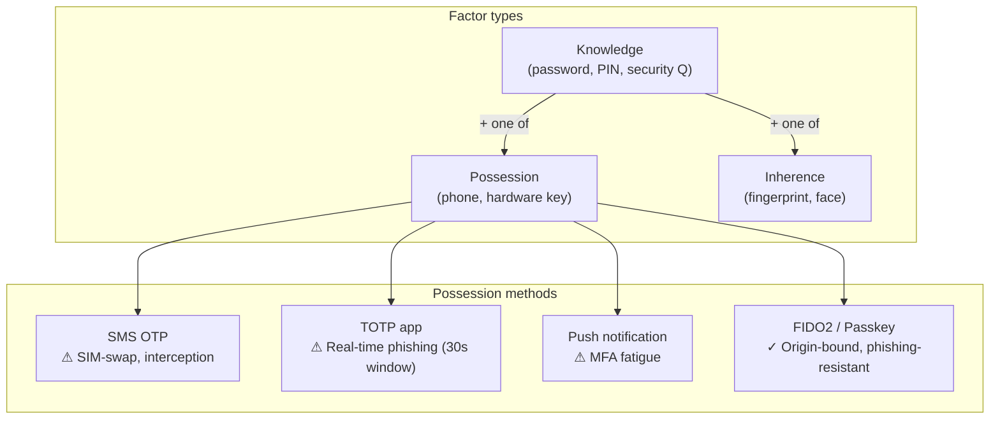

## In simple terms

A password is a single point of failure — if it leaks, the account is compromised. Multi-factor authentication requires at least two independent factors: something you **know** (password), something you **have** (phone or hardware key), or something you **are** (biometric). Stealing just the password is no longer enough. The critical question is not whether to use MFA but which factor to use — they differ enormously in phishing resistance.

## The Visual Map



## More detail

**TOTP (RFC 6238):** the authenticator app computes `HMAC-SHA1(secret, floor(time/30))` and displays 6 digits. The server accepts the current and adjacent windows (±30 s) to tolerate clock skew. Simple to implement and widely supported. Weakness: a phishing site can capture the code in real time and replay it within the 30-second window.

**FIDO2 / WebAuthn:** the hardware or platform key signs a challenge that **includes the origin** (`https://bank.com`). A phishing site (`https://bank-login.evil.com`) gets a response that is cryptographically useless on the real site. This makes FIDO2 the only currently phishing-resistant factor. Passkeys are device-bound FIDO2 credentials that sync via iCloud/Google Password Manager, making the UX competitive with passwords.

**Push MFA (Duo, Microsoft Authenticator):** the user approves a push notification. Convenience-first, but vulnerable to **MFA fatigue** (bombing the user with requests until they accidentally approve). Mitigation: number matching (show a code in the push that the user must match to the login page number).

**SMS OTP:** the weakest MFA method. Vulnerable to SIM-swap (attacker transfers victim's number), SS7 attacks (telecom infrastructure), and interception. Still better than no MFA for most users, but should not be used for high-value accounts.

**Coverage reality:** MFA of any type reduces account takeover by ~99.9% (Microsoft, Google data). Even SMS OTP, the weakest form, blocks the vast majority of credential-stuffing attacks.

## Under the Hood

TOTP code generation (RFC 6238) and time-window validation:

```python
import hmac, hashlib, struct, time, base64

def totp(secret_b32: str, t: float = None) -> int:
    key     = base64.b32decode(secret_b32)
    counter = int((t or time.time())) // 30
    mac     = hmac.new(key, struct.pack('>Q', counter), hashlib.sha1).digest()
    offset  = mac[-1] & 0xf
    code    = struct.unpack('>I', mac[offset:offset+4])[0] & 0x7fffffff
    return code % 1_000_000

def verify_totp(secret: str, submitted: int, skew: int = 1) -> bool:
    now = time.time()
    for delta in range(-skew, skew + 1):
        if totp(secret, now + delta * 30) == submitted:
            return True
    return False

SECRET = "JBSWY3DPEHPK3PXP"
now    = int(time.time())
code   = totp(SECRET, now)
print(f"Current code:  {code:06d}  (valid for {30 - now % 30}s)")
print(f"Previous code: {totp(SECRET, now - 30):06d}  (expired)")
print(f"Next code:     {totp(SECRET, now + 30):06d}  (not yet valid)")
print()
print(f"Submitted current: valid={verify_totp(SECRET, code)}")
print(f"Submitted old code: valid={verify_totp(SECRET, totp(SECRET, now - 60))}")
```

## Engineering Trade-offs

- **Phishing resistance vs deployment friction.** FIDO2/passkeys are the most secure but require hardware support or OS integration. TOTP is universally deployable via any authenticator app. The right choice depends on the threat model: target accounts worth attacking with real-time phishing need FIDO2.
- **Recovery codes.** Every MFA system must provide an out-of-band recovery path (backup codes, admin bypass). Recovery is the most common path attackers use to bypass MFA — recovery codes must be stored and distributed as securely as passwords.
- **MFA fatigue mitigation.** Push MFA should require number matching (contextual approval), not just tap-to-approve. Algorithms that rate-limit push attempts are also important.
- **Trusted device registration.** Many systems remember devices for 30 days after MFA, trading security for user friction. The trade-off: a stolen authenticated device bypasses MFA until the session expires.

## Real-world examples

- Google's 2023 report: enforcing security keys for all employees reduced phishing-related account takeovers to zero.
- GitHub now requires all contributors to enable MFA; it drove adoption from ~16% to >98%.
- Microsoft reports that MFA blocks >99.9% of automated account-compromise attacks.
- iCloud accounts were targeted via TOTP phishing proxies (AiTM — adversary in the middle) — real-time TOTP relay attacks are stopped by FIDO2.

## Common misconceptions

- **"Any MFA is equally secure."** The difference between SMS OTP and FIDO2 is enormous — one is vulnerable to real-time phishing, the other is not. For high-value accounts, choose method carefully, not just "has MFA."
- **"MFA is annoying, so users will disable it."** Passkeys (FIDO2 with biometric) are faster than password+OTP and increasingly frictionless — the UX argument against MFA is rapidly expiring.

## Try it yourself

Generate TOTP codes and see the time-window behaviour:

```bash
python3 -c "
import hmac, hashlib, struct, time, base64

def totp(secret, t=None):
    key = base64.b32decode(secret)
    ctr = int((t or time.time())) // 30
    mac = hmac.new(key, struct.pack('>Q', ctr), hashlib.sha1).digest()
    off = mac[-1] & 0xf
    return struct.unpack('>I', mac[off:off+4])[0] & 0x7fffffff % 10**6

S = 'JBSWY3DPEHPK3PXP'
now = time.time()
print(f'Previous: {totp(S,now-30):06d}  (expired {int(now%30)}s ago)')
print(f'Current:  {totp(S,now):06d}  (valid for {30-int(now%30)}s)')
print(f'Next:     {totp(S,now+30):06d}  (starts in {30-int(now%30)}s)')
print()
print('Factor phishing resistance:')
for m,r in [('SMS OTP','No - SIM-swap + interception'),
            ('TOTP app','No - 30s replay window'),
            ('Push notify','No - MFA fatigue'),
            ('FIDO2/Passkey','YES - origin-bound')]:
    print(f'  {m:<20} {r}')
"
```

## Learn next

- [Authentication](/t/authentication) — MFA adds a second factor on top of first-factor (password) authentication.
- [Public-key cryptography](/t/public-key-cryptography) — FIDO2 uses an asymmetric key pair; the public key is registered, private key stays on device.
- [Zero trust](/t/zero-trust) — MFA is a core control in zero trust; device posture and network context are evaluated alongside credentials.
- [OAuth](/t/oauth) — OIDC-based login flows trigger MFA at the identity provider level.
