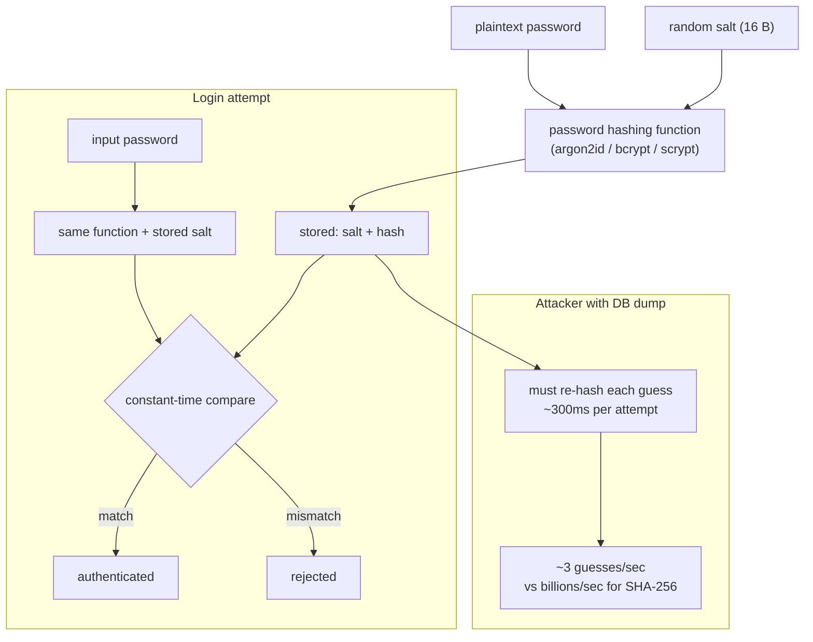

## In simple terms

You should never store the password the user typed. Instead, run it through a **password hashing function** — a one-way, deliberately slow algorithm with a random per-user **salt** — and store only the result. To log in, hash the new attempt and compare. A leaked database is then a list of guesses to check, not a list of usable passwords.

## The Visual Map



## More detail

A password hash is not a general-purpose hash. SHA-256 is too fast — an attacker with a GPU can try billions per second. The right algorithms are designed to be expensive in CPU time *and* memory, with **tunable cost**:

| Algorithm    | Notes |
|--------------|-------|
| **Argon2id** | OWASP's first recommendation (2026). Winner of PHC contest. Memory-hard + side-channel resistant. |
| **scrypt**   | Memory-hard, widely supported in stdlib (Python, Node). |
| **bcrypt**   | Older, still acceptable; 72-byte input limit, no memory hardness. |
| **PBKDF2**   | FIPS-approved; use only when policy requires it. |
| **SHA-256 / MD5** | **Not password hashes.** Never use for this purpose. |

Each user gets a unique random **salt** (16+ bytes) stored alongside the hash. Identical passwords produce different stored values, defeating rainbow tables.

Many systems also add a **pepper** — a secret kept outside the database (e.g. in a KMS) applied via HMAC before hashing. A pure DB leak then yields nothing even from identical-password entries.

The cost parameter is tuned to take ~300–1000 ms on your hardware. Increase it over time as hardware gets faster.

When checking: always use **constant-time comparison** (`hmac.compare_digest`) to prevent timing attacks; rate-limit login attempts; consider checking against HaveIBeenPwned's k-anonymity API.

## Under the Hood

Python's stdlib includes `hashlib.scrypt` — the same algorithm recommended for new deployments:

```python
import hashlib, secrets, time, hmac

def hash_password(password: str) -> tuple[bytes, bytes]:
    salt = secrets.token_bytes(16)
    # n=2^14, r=8, p=1 is the minimum; tune n upward until ~300ms on your hardware
    h = hashlib.scrypt(password.encode(), salt=salt, n=16384, r=8, p=1)
    return salt, h

def verify_password(password: str, salt: bytes, stored: bytes) -> bool:
    attempt = hashlib.scrypt(password.encode(), salt=salt, n=16384, r=8, p=1)
    return hmac.compare_digest(attempt, stored)   # constant-time

salt, stored = hash_password("hunter2")
print("correct:", verify_password("hunter2", salt, stored))
print("wrong:  ", verify_password("wrong",   salt, stored))

t0 = time.perf_counter()
verify_password("hunter2", salt, stored)
print(f"time per check: {(time.perf_counter()-t0)*1000:.0f}ms")
# SHA-256 of the same string would take < 0.001ms — five orders of magnitude faster for an attacker
```

The `n` (CPU/memory cost) parameter doubles the work each time it increments by a power of 2. You can double it every 18 months as hardware improves without changing stored hashes — just re-hash on the next login.

## Engineering Trade-offs

- **Speed-hardness tradeoff.** Legitimate users verify once at login (~300 ms is fine) while an attacker checking millions of candidates cannot amortise the cost. Too fast = unsafe; too slow = bad UX and server load.
- **Memory hardness vs CPU hardness.** Argon2id and scrypt are hard to accelerate on GPUs because they require large amounts of RAM per guess. bcrypt is only CPU-hard, so GPU farms crack it much faster — this is why bcrypt is no longer the first recommendation.
- **Pepper vs HSM.** A pepper (server-side secret) adds a second line of defence against a DB-only breach, but must itself be protected. An HSM or KMS keeps the pepper out of the application process entirely at the cost of operational complexity.
- **Upgrading old hashes.** Changing the algorithm requires re-hashing on the next login (when the plaintext is available), not a bulk migration. A progressive strategy — check old algo first, re-hash if it passes — bridges the transition without forcing a password reset.

## Real-world examples

- The 2012 LinkedIn breach: 6.5 million SHA-1 hashes, no salt. Most cracked within days.
- The 2013 Adobe breach: passwords encrypted with a single key (not hashed), letting attackers correlate identical passwords across all users.
- Django, Rails, Laravel, and ASP.NET Core all default to Argon2id or bcrypt out of the box.

## Common misconceptions

- **"Hashing means encrypting."** Encryption is reversible with the key; hashing is one-way.
- **"A complex password makes hashing unnecessary."** Slow hashing buys time even when passwords are weak; it is layered protection.

## Try it yourself

Measure the cost difference between a fast hash and a proper password hash:

```bash
python3 -c "
import hashlib, secrets, time, hmac

password = b'hunter2'
salt = secrets.token_bytes(16)

t0 = time.perf_counter()
fast = hashlib.sha256(password).hexdigest()
print(f'SHA-256:  {(time.perf_counter()-t0)*1000:.4f}ms  {fast[:20]}...')

t0 = time.perf_counter()
slow = hashlib.scrypt(password, salt=salt, n=16384, r=8, p=1)
print(f'scrypt:   {(time.perf_counter()-t0)*1000:.0f}ms')

attempt = hashlib.scrypt(b'hunter2', salt=salt, n=16384, r=8, p=1)
print('correct match:', hmac.compare_digest(slow, attempt))
attempt2 = hashlib.scrypt(b'wrong', salt=salt, n=16384, r=8, p=1)
print('wrong match:  ', hmac.compare_digest(slow, attempt2))
"
```

Notice the 3–5 order-of-magnitude time difference — that gap is what makes brute-forcing impractical even on modern hardware.

## Learn next

- [Authentication](/t/authentication) — the flow that uses password hashes at login.
- [Cryptography](/t/cryptography) — the broader primitive family password hashing is part of.
- [Public-key cryptography](/t/public-key-cryptography) — passkeys, the alternative to passwords entirely.
