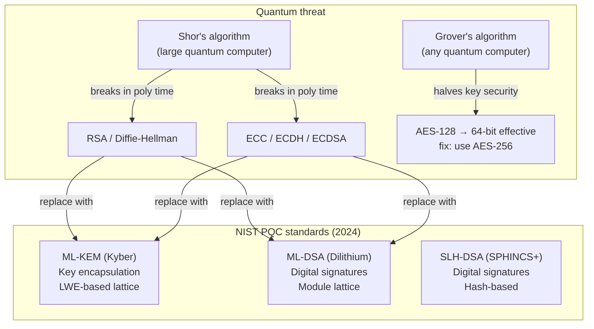

## In simple terms

All public-key cryptography in use today (RSA, ECC/ECDH, Diffie-Hellman) can be broken by a sufficiently large quantum computer running Shor's algorithm. Post-quantum cryptography (PQC) replaces these with algorithms based on mathematical problems that have no known quantum speedup — primarily **lattice problems** like Learning With Errors (LWE). NIST standardised three algorithms in 2024: ML-KEM (key encapsulation), ML-DSA and SLH-DSA (signatures).

## The Visual Map



## More detail

**Why quantum computers break classical public-key crypto:** Shor's algorithm (1994) factors large integers and solves discrete logarithms in polynomial time. A quantum computer with ~4000 error-corrected logical qubits could break RSA-2048; a larger one breaks P-256. Current quantum computers (2026) have noisy qubits far from this scale, but the **"harvest now, decrypt later"** threat is real: adversaries collecting today's encrypted traffic can decrypt it once quantum hardware arrives.

**NIST PQC standardisation:**
- **ML-KEM (FIPS 203)** — lattice-based key encapsulation mechanism. Replaces ECDH in TLS key exchange. Fast, compact keys (~800 bytes). Based on Module-LWE.
- **ML-DSA (FIPS 204)** — lattice-based digital signatures. Replaces ECDSA in certificates and code signing.
- **SLH-DSA (FIPS 205)** — hash-based signatures (no lattice). Extremely conservative security assumption; large signatures (~7 KB). Backup if lattice attacks improve.

**Why lattices:** the Learning With Errors (LWE) problem — given noisy linear equations `b = As + e mod q`, find `s` — has no known quantum speedup. The CKKS homomorphic encryption scheme is also LWE-based, meaning FHE and PQC share mathematical foundations.

**Transition strategy:** TLS 1.3 already supports **hybrid key exchange** (X25519Kyber768) — run both classical and post-quantum simultaneously. If either is broken, the other provides security. Chrome and Firefox enabled hybrid PQC in 2024.

**Symmetric crypto:** Grover's algorithm halves the effective security of symmetric ciphers (AES-128 → 64-bit effective). Use AES-256 and SHA-384/SHA-512. This is a much smaller concern than the public-key catastrophe.

## Under the Hood

The Learning With Errors (LWE) problem — the hardness basis of ML-KEM:

```python
import random

random.seed(42)
q, n, e_max = 97, 4, 3   # small params; ML-KEM uses q=3329, n=256

s = [random.randint(0, 1) for _ in range(n)]          # secret (small binary)
A = [[random.randint(0, q-1) for _ in range(n)]        # public matrix
     for _ in range(n)]
b = [(sum(A[i][j]*s[j] for j in range(n))              # b = As + e mod q
     + random.randint(-e_max, e_max)) % q
     for i in range(n)]

print(f"Public A[0]: {A[0]}")
print(f"Public b:    {b}")
print(f"Secret s:    {s}  ← never published")
print()
print("Verification (each b[i] ≈ A[i]·s mod q with small error):")
for i in range(n):
    dot = sum(A[i][j]*s[j] for j in range(n)) % q
    err = (b[i] - dot) % q
    err = err if err < q//2 else err - q
    print(f"  b[{i}]={b[i]:3d}, A[{i}]·s={dot:3d}, error={err:+d}")

print()
print("Attacker sees A and b but not s.")
print("Finding s from these noisy equations is the LWE problem —")
print("hard even for quantum computers (no known poly-time algorithm).")
```

## Engineering Trade-offs

- **Performance vs security margin.** ML-KEM is fast and compact; ML-DSA signature sizes are larger (~2.4 KB vs ~64 bytes for Ed25519). SLH-DSA is very conservative but has ~7 KB signatures — impractical for per-packet use.
- **Hybrid mode during transition.** Running X25519 + Kyber-768 simultaneously provides security against both classical and quantum adversaries. The cost is ~twice the key exchange computation and ~1 KB extra data — acceptable for TLS.
- **Harvest-now-decrypt-later urgency.** For long-lived secrets (government records, medical data, infrastructure credentials intended to remain confidential for 20+ years), the transition to PQC is urgent now, even though quantum computers can't break RSA today.
- **Certificate size impact.** ML-DSA certificates are ~10× larger than ECDSA certificates — a concern for certificate chain transmission latency and bandwidth, especially for mobile.

## Real-world examples

- Apple added ML-KEM to iMessage's PQ3 protocol in 2024, the first major consumer app to deploy post-quantum cryptography.
- Signal added PQXDH (X25519 + Kyber-1024) to its messaging protocol in 2023.
- Chrome and Firefox deployed X25519Kyber768 hybrid TLS key exchange in 2024.
- NIST FIPS 203/204/205 were published August 2024 — the standards are now final.

## Common misconceptions

- **"We don't need PQC yet — quantum computers aren't powerful enough."** The harvest-now-decrypt-later threat is real today for data with long confidentiality requirements. The right time to transition is before the quantum threat matures.
- **"AES is quantum-safe, so we're fine."** AES-256 and SHA-512 are quantum-safe for symmetric use — but the public-key algorithms (TLS key exchange, certificate signing, SSH) are all vulnerable to Shor's algorithm and must be replaced.

## Try it yourself

Learning With Errors: verify that the secret satisfies the noisy equations — the hardness problem underpinning ML-KEM:

```bash
python3 -c "
import random
random.seed(42)
q,n,emax = 97,4,3

s = [random.randint(0,1) for _ in range(n)]
A = [[random.randint(0,q-1) for _ in range(n)] for _ in range(n)]
b = [(sum(A[i][j]*s[j] for j in range(n))+random.randint(-emax,emax))%q for i in range(n)]

print('Public matrix A[0]:', A[0])
print('Public vector b:   ', b)
print('Secret s:          ', s, '(never published)')
print()
for i in range(n):
    dot = sum(A[i][j]*s[j] for j in range(n))%q
    err = (b[i]-dot)%q; err = err if err<q//2 else err-q
    print(f'b[{i}]={b[i]:3d}  A[{i}]*s mod q={dot:3d}  error={err:+d}')
print()
print('Attacker sees only A and b — finding s is the LWE problem (quantum-hard)')
"
```

## Learn next

- [Cryptography](/t/cryptography) — the broader context; PQC replaces specific classical algorithms, not the whole field.
- [Elliptic-curve cryptography](/t/elliptic-curve-cryptography) — what PQC replaces in TLS and SSH.
- [TLS](/t/tls) — TLS 1.3 is the first protocol deploying hybrid classical+PQC key exchange at scale.
