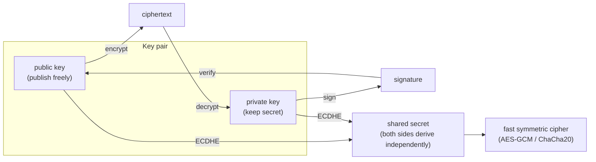

## In simple terms

**Public-key cryptography** lets two strangers agree on a shared secret over a public wire, and lets a sender prove they wrote a message without ever sharing a password. Each party has two mathematically linked keys: a **public key** published to the world, and a **private key** kept secret. Anyone can encrypt to the public key — only the holder of the matching private key can decrypt. Conversely, the private key signs a message, and anyone with the public key can verify the signature.

## The Visual Map



## More detail

The breakthrough (Diffie–Hellman, 1976; RSA, 1977; elliptic curves, 1985) was finding maths where operations are easy in one direction and infeasible in reverse. Two families dominate today:

- **RSA** — security rests on integer factorisation. Well understood, slow, large keys (2048+ bits).
- **Elliptic Curve Cryptography (ECC)** — security rests on the discrete log problem on elliptic curves. Modern, fast, tiny keys (256 bits ≈ RSA-3072). **Curve25519** (key exchange) and **Ed25519** (signatures) are the contemporary defaults.

Three jobs public-key crypto does:

1. **Key exchange** — derive a shared symmetric key over a public network. Ephemeral Diffie–Hellman (ECDHE) is the standard. Both sides then switch to AES-GCM or ChaCha20-Poly1305 for bulk data — public-key crypto is far too slow to encrypt traffic directly.
2. **Digital signatures** — private key signs, public key verifies. Used for software signing, signed commits, signed JWTs, CA-signed TLS certificates.
3. **Encryption to a recipient** — encrypt with their public key, only they can decrypt. Used by PGP/GPG, `age`, and most end-to-end messaging.

A persistent challenge: **authenticating the public key itself**. If an attacker substitutes their public key for the recipient's, the encryption works — for the attacker. Solutions include **certificate authorities** (the web's PKI), **web-of-trust** (PGP), and **trust-on-first-use + key pinning** (SSH).

A coming concern: **post-quantum cryptography**. Sufficiently powerful quantum computers would break RSA and ECC. NIST has standardised post-quantum schemes (ML-KEM for key encapsulation, ML-DSA for signatures) and rollout has begun in TLS via hybrid suites.

## Under the Hood

Diffie–Hellman key exchange — both sides derive the same shared secret without ever transmitting it:

```python
import secrets

# Toy DH over a small prime; real DH uses a 2048-bit modulus or Curve25519
p = 2**31 - 1   # Mersenne prime
g = 7           # generator

a = secrets.randbelow(p - 2) + 2   # Alice's private key
b = secrets.randbelow(p - 2) + 2   # Bob's private key

A = pow(g, a, p)   # Alice's public value  (sent over the wire)
B = pow(g, b, p)   # Bob's public value    (sent over the wire)

alice_secret = pow(B, a, p)   # Alice computes: B^a mod p = g^(ba) mod p
bob_secret   = pow(A, b, p)   # Bob computes:   A^b mod p = g^(ab) mod p

print(f"Alice public: {A}")
print(f"Bob   public: {B}")
print(f"Alice shared: {alice_secret}")
print(f"Bob   shared: {bob_secret}")
print(f"Match (g^ab == g^ba): {alice_secret == bob_secret}")
```

This modular-exponentiation trick — easy to compute forward, infeasible to reverse (the discrete log problem) — is the mathematical core of both classical DH and elliptic-curve variants.

## Engineering Trade-offs

- **Asymmetric key exchange vs symmetric bulk encryption.** RSA/ECC key operations take microseconds each; encrypting a gigabyte with RSA would take minutes. The standard answer is hybrid encryption: asymmetric for the key, symmetric for the data.
- **RSA vs ECC.** RSA is universally understood and supported; ECC provides equivalent security at 1/8th the key size and is faster. For new systems, ECC (Curve25519/Ed25519) is the default; RSA is kept for compatibility.
- **Key authenticity vs key secrecy.** A key can be perfectly secret but you still need to know *whose* key it is. Certificate authorities, key servers, and TOFU all make different trade-offs on trust centralisation and verifiability.
- **Post-quantum transition cost.** ML-KEM and ML-DSA keys are 10–100× larger than ECC keys and slower to operate. The hybrid approach (ECDHE + ML-KEM simultaneously) provides a smooth transition but doubles handshake size during the migration period.

## Real-world examples

- A browser opening `https://wikipedia.org` does ECDHE to derive a session key, then verifies Wikipedia's certificate via the CA chain — a cascade of public-key operations.
- `git commit -S` signs the commit with Ed25519 or RSA; GitHub displays "Verified" after checking the public key.
- **Passkeys** (WebAuthn) sign a fresh challenge from the server with a per-site private key locked in the device's secure enclave — a digital signature, not a password.
- Signal's end-to-end encryption uses X3DH (a public-key handshake) followed by the Double Ratchet (a stream of symmetric keys derived from it).

## Common misconceptions

- **"Public-key crypto is used for bulk encryption."** It is used for *key exchange* and *signatures* far more than direct encryption. Direct asymmetric encryption is too slow for anything bigger than a symmetric key.
- **"A longer RSA key is always more secure."** ECC at 256 bits gives equivalent security to RSA-3072. Algorithm choice matters more than key size.
- **"My private key is safe if I encrypt it with a password."** Only as safe as the password and the KDF. Hardware-backed keys (Secure Enclave, YubiKey, TPM) are dramatically stronger.

## Try it yourself

Run Diffie–Hellman key agreement and watch both sides arrive at the same secret without sharing their private keys:

```bash
python3 -c "
import secrets
p, g = 2**31 - 1, 7
a = secrets.randbelow(p-2)+2   # Alice private
b = secrets.randbelow(p-2)+2   # Bob private
A, B = pow(g,a,p), pow(g,b,p)  # public values (sent over the wire)
alice = pow(B,a,p)
bob   = pow(A,b,p)
print(f'Alice sends: ...{A % 10**9}  Bob sends: ...{B % 10**9}')
print(f'Alice shared: ...{alice % 10**6}')
print(f'Bob   shared: ...{bob   % 10**6}')
print(f'Same secret: {alice == bob}')
print('Private keys were never transmitted')
"
```

Both sides compute `g^(ab) mod p` via different routes — commutative modular exponentiation. Breaking this requires solving the discrete log problem, for which no efficient algorithm exists.

## Learn next

- [Cryptography](/t/cryptography) — the full primitive toolbox.
- [TLS](/t/tls) — public-key crypto assembled into the protocol securing the web.
- [Certificate authority](/t/certificate-authority) — the infrastructure that authenticates public keys.
- [Elliptic-curve cryptography](/t/elliptic-curve-cryptography) — the modern, compact variant dominating new deployments.
