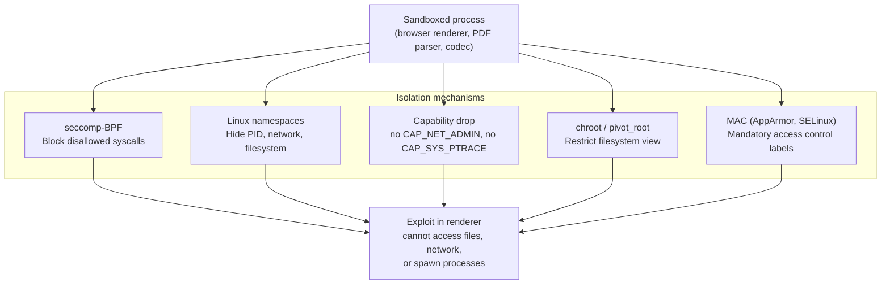

## In simple terms

A sandbox limits what a process can do even if it is completely compromised. The browser's JavaScript engine runs in a sandboxed renderer process: even if an attacker exploits a V8 bug and gets arbitrary code execution inside the renderer, they still can't read files, open network connections, or spawn processes — because seccomp, namespaces, and capability restrictions block those syscalls. The attacker needs a second **sandbox escape** vulnerability, which is much harder to find.

## The Visual Map



## More detail

**seccomp-BPF (secure computing mode):** the kernel enforces a per-process BPF (Berkeley Packet Filter) program that runs on every syscall and either allows or kills the process. Chrome's renderer is allowed ~50 syscalls (read, write, mmap, futex, etc.); `fork`, `execve`, `open`, and `connect` are blocked. An attacker with arbitrary code execution cannot call blocked syscalls — the kernel enforces this in hardware.

**Linux namespaces:** the kernel virtualises resources per-process-group. Namespace types:
- `pid` — the sandboxed process sees only itself (PID 1) in its namespace.
- `net` — a separate network stack with no interfaces; the process cannot make network connections.
- `mount` — a private filesystem view, possibly with a minimal tmpfs only.
- `user` — the process has root inside the namespace but maps to an unprivileged UID on the host.

**Capability dropping:** Linux root is divided into ~40 capabilities (`CAP_NET_BIND_SERVICE`, `CAP_PTRACE`, `CAP_SYS_ADMIN`, etc.). Sandboxed processes drop all capabilities at startup — a compromised process cannot escalate privileges even if it runs as root inside a user namespace.

**macOS sandbox (Seatbelt / pledge):** macOS uses sandbox profiles (Seatbelt) based on SBPL; OpenBSD uses `pledge()` to declare exactly which syscall categories a process needs. After calling `pledge("stdio rpath")`, any attempt to open a network socket kills the process.

**Defence in depth:** sandboxing is the key mechanism that makes modern browser security feasible. Chrome's multi-process architecture has a privileged broker process and multiple renderer processes, each sandboxed. An RCE in the renderer still needs a separate sandbox escape.

## Under the Hood

Simulating a seccomp-style syscall allowlist:

```python
RENDERER_ALLOWED = frozenset({
    'read', 'write', 'close', 'mmap', 'munmap',
    'exit', 'futex', 'clock_gettime', 'nanosleep',
})

def seccomp_check(process: str, syscall: str) -> str:
    if syscall in RENDERER_ALLOWED:
        return f"ALLOW  {syscall}"
    return f"KILL   {syscall}  ← process terminated"

attacker_wants = ['read', 'execve', 'fork', 'connect', 'open', 'kill']
print(f"Renderer seccomp filter ({len(RENDERER_ALLOWED)} of ~350 syscalls allowed):")
for sc in attacker_wants:
    print(f"  {seccomp_check('renderer', sc)}")

print()
print(f"Allowed syscalls: {len(RENDERER_ALLOWED)}")
print(f"Typical Linux process: ~350 syscalls")
print(f"Attack surface reduction: {100*(1-len(RENDERER_ALLOWED)/350):.0f}%")
print()
print("An attacker with RCE in the renderer still cannot:")
print("  - execve a shell (execve blocked)")
print("  - read /etc/passwd (open blocked)")
print("  - connect to a C2 server (connect blocked)")
print("  - spawn a child process (fork blocked)")
```

## Engineering Trade-offs

- **Syscall allowlist tightness vs application compatibility.** A very tight allowlist requires deep knowledge of every syscall the application legitimately needs. Adding a new feature may require updating the seccomp profile — otherwise it fails silently with EPERM or kills the process.
- **Namespace overhead.** User namespaces and PID namespaces have near-zero runtime overhead; mount namespaces have some setup cost. Network namespace setup is heavier but effectively prevents network access from sandboxed code.
- **Sandbox escape surface.** The remaining attack surface is the interface between sandbox and broker (IPC). Chrome's mojo IPC has historically had sandbox escape vulnerabilities. The sandbox reduces the attack surface but doesn't eliminate it.
- **macOS pledge vs Linux seccomp.** OpenBSD's `pledge()` API is simpler: the application declares its needs in a single call. Linux seccomp BPF is more powerful and fine-grained but requires writing a BPF program — libseccomp simplifies this.

## Real-world examples

- **Chrome/Chromium:** the renderer, GPU process, network service, and utility processes each have different seccomp profiles; the renderer is the most restricted.
- **Firefox:** uses process isolation (seccomp, user namespaces, Windows job objects) via the RLBox sandbox for font rendering, media decoding, and WebAssembly.
- **Android:** each app runs in its own UID + SELinux label; system services use seccomp-bpf.
- **OpenBSD:** `pledge()` and `unveil()` are used throughout the OS — ssh, httpd, and many daemons constrain themselves on startup.

## Common misconceptions

- **"Running in a container means it's sandboxed."** Docker containers share the host kernel and have many syscalls available. They provide namespace isolation but not the tight seccomp profile of a browser sandbox. A kernel vulnerability still escapes a container.
- **"Root in a container is safe."** A process running as UID 0 inside a user namespace is still unprivileged on the host, but many container deployments map root to real root — eliminating this protection.

## Try it yourself

Simulate what a seccomp filter blocks in a sandboxed renderer process:

```bash
python3 -c "
ALLOWED = {'read','write','close','mmap','munmap','exit','futex','clock_gettime'}
ATTACKER_WANTS = ['execve','fork','connect','open','kill','mprotect','ptrace']

print(f'Renderer: {len(ALLOWED)} of ~350 syscalls allowed')
print()
for sc in ATTACKER_WANTS:
    verdict = 'ALLOW' if sc in ALLOWED else 'KILL (seccomp blocks)'
    print(f'  {sc:<15} {verdict}')
print()
blocked = [s for s in ATTACKER_WANTS if s not in ALLOWED]
print(f'{len(blocked)}/{len(ATTACKER_WANTS)} attacker syscalls blocked')
print(f'RCE in renderer cannot spawn shell, open files, or connect to C2')
"
```

## Learn next

- [Container](/t/container) — containers use namespaces and cgroups but with less syscall restriction than a browser sandbox.
- [Side-channel attack](/t/side-channel-attack) — sandboxes don't prevent side channels (cache timing, Spectre) — a separate class of attack.
- [Capability-based security](/t/capability-based-security) — the OS-level model that sandboxing implements.
