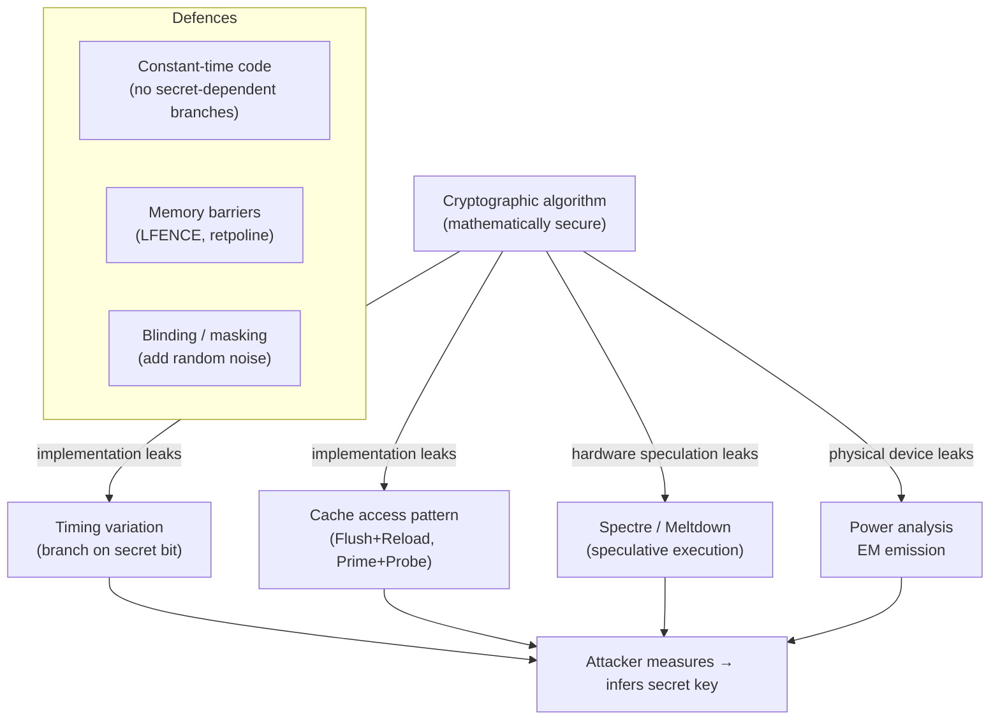

## In simple terms

A lock can be mathematically unbreakable but still have a flaw: if it clicks slightly earlier when the first digit is correct, an attacker can time their guesses and crack the combination one digit at a time. Side-channel attacks work the same way on computers — instead of breaking the math of AES or RSA, they measure how long it takes, which cache lines were accessed, or how much power was drawn, and infer the secret key from those observations.

## The Visual Map



## More detail

**Timing attacks:** if a function returns faster when a password is wrong at the first byte, an attacker can iterate bytes one at a time, measuring time. A naive `==` comparison in Python short-circuits on first mismatch — 256 attempts per byte × 32 bytes = 8192 guesses instead of 2²⁵⁶.

**Cache side channels (Flush+Reload):** shared memory and last-level cache allow one process to detect which cache lines another process has accessed. AES lookup tables cause cache accesses that depend on the key — an attacker co-located on the same CPU core can reconstruct the key by measuring cache access patterns.

**Spectre (CVE-2017-5753):** speculative execution allows the CPU to execute instructions before checking a bounds condition. If the speculative path accesses secret data, it loads that data into cache — even if the CPU discards the result, the cache state is observable. Spectre affects every modern out-of-order CPU. It allows JavaScript running in a browser to read the browser process's memory.

**Meltdown (CVE-2017-5754):** a specific variant where user-space code could read kernel memory by exploiting the race between access-permission checks and speculative execution. Fixed by kernel page-table isolation (KPTI) at a 5–30% performance cost on affected workloads.

**Power and EM analysis:** smart cards and embedded crypto chips leak key bits through measurable power consumption or electromagnetic emission. **Differential Power Analysis (DPA)** correlates power traces with hypothetical key guesses using statistical analysis. Countermeasures: random masking (XOR the input with a fresh random value at each operation, process both shares, combine at output).

## Under the Hood

Timing attack: variable-time string comparison leaks the position of first mismatch — constant-time comparison prevents it:

```python
import time, hmac, hashlib

def insecure_compare(a: bytes, b: bytes) -> bool:
    for x, y in zip(a, b):
        if x != y:
            return False        # returns early → leaks position of first mismatch
    return len(a) == len(b)

def secure_compare(a: bytes, b: bytes) -> bool:
    return hmac.compare_digest(a, b)   # always touches all bytes

secret = b"secret-token-abc"

def measure(func, attempt: bytes, n: int = 10_000) -> float:
    t0 = time.perf_counter()
    for _ in range(n): func(secret, attempt)
    return (time.perf_counter() - t0) * 1e6 / n   # microseconds per call

print("Insecure comparison — first byte timing:")
for char in [ord('s'), ord('a'), ord('z')]:   # 's' is the correct first byte
    attempt = bytes([char]) + b'?' * (len(secret) - 1)
    t = measure(insecure_compare, attempt)
    note = " ← correct prefix, exits later" if char == ord('s') else ""
    print(f"  first byte '{chr(char)}': {t:.3f} μs{note}")

print()
print("Constant-time comparison — first byte timing:")
for char in [ord('s'), ord('a'), ord('z')]:
    attempt = bytes([char]) + b'?' * (len(secret) - 1)
    t = measure(secure_compare, attempt)
    print(f"  first byte '{chr(char)}': {t:.3f} μs  (all ~equal)")
```

## Engineering Trade-offs

- **Constant-time code vs readability.** Constant-time implementations look strange: no early returns, no secret-dependent branches, bitwise operations instead of conditionals. The performance cost is small for most operations; the correctness risk of writing it wrong is high. Use vetted libraries (libsodium, BoringSSL) rather than rolling your own.
- **KPTI vs performance.** Kernel page-table isolation (Meltdown mitigation) costs 5–30% on syscall-heavy workloads (databases, containers). AMD CPUs are not vulnerable to Meltdown (KPTI can be disabled for AMD); Intel CPUs need it.
- **Spectre mitigations vs performance.** Retpoline, IBRS, and LFENCE barriers add overhead to every indirect branch. Browsers added timer coarsening and `SharedArrayBuffer` restrictions to reduce Spectre exploitability in JavaScript, accepting minor precision losses.
- **Physical attack surface.** Power and EM attacks require physical proximity or co-location; relevant for embedded crypto (smart cards, HSMs, IoT) but not for cloud services. Cloud-adjacent attacks (cross-VM cache side channels) are relevant in shared-CPU hosting.

## Real-world examples

- The 2018 Spectre/Meltdown disclosure affected every Intel CPU made since 1995. Browser vendors shipped mitigations within days; OS vendors within weeks.
- The 2003 OpenSSL RSA timing attack (Bram Cohen / David Brumley) showed that network-measurable timing differences in RSA decryption (0.3 ms at 10 Mbit/s) were sufficient to recover a 1024-bit private key.
- Sony's PlayStation 3 key extraction used ECDSA nonce reuse (a different class of implementation flaw than timing, but leaks the private key from a single pair of signatures).
- AWS Nitro Enclaves use memory encryption and physical isolation specifically to block power and EM attacks on customer keys.

## Common misconceptions

- **"HTTPS prevents side-channel attacks."** HTTPS encrypts the content; side channels exploit the implementation of that encryption. A poorly implemented TLS stack can leak the session key via timing even though the plaintext is encrypted.
- **"Only hardware hackers need to worry about side channels."** Software-only Spectre attacks run in the browser sandbox without any hardware access. Every web browser and cloud VM is an attack target.

## Try it yourself

Compare timing of variable-time vs constant-time comparisons — see the measurable difference:

```bash
python3 -c "
import time, hmac

secret = b'secret-token-abc'

def insecure(a, b):
    for x,y in zip(a,b):
        if x!=y: return False
    return len(a)==len(b)

def secure(a, b):
    return hmac.compare_digest(a, b)

def measure(fn, attempt, n=10000):
    t = time.perf_counter()
    for _ in range(n): fn(secret, attempt)
    return (time.perf_counter()-t)*1e6/n

print('Insecure (early-exit):')
for c in [ord(\"s\"), ord(\"a\"), ord(\"z\")]:
    a = bytes([c])+b\"?\"*(len(secret)-1)
    print(f\"  first byte {chr(c)!r}: {measure(insecure,a):.3f} us\")

print()
print('Constant-time:')
for c in [ord(\"s\"), ord(\"a\"), ord(\"z\")]:
    a = bytes([c])+b\"?\"*(len(secret)-1)
    print(f\"  first byte {chr(c)!r}: {measure(secure,a):.3f} us (uniform)\")
"
```

## Learn next

- [Cryptography](/t/cryptography) — side channels attack implementations, not the math; understanding both is essential for secure crypto engineering.
- [Sandbox](/t/sandbox) — sandboxes restrict syscalls but do not prevent cache-based side channels like Spectre.
- [Elliptic-curve cryptography](/t/elliptic-curve-cryptography) — Ed25519's design explicitly avoids timing leaks; ECDSA nonce reuse leaks the private key.
- [Speculative execution](/t/speculative-execution) — the CPU optimization that makes Spectre and Meltdown possible.
