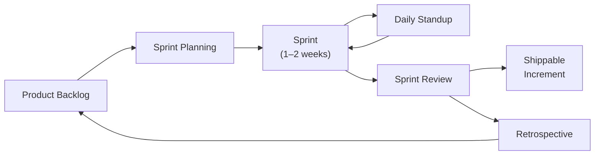

## In simple terms

**Agile** is a way of building software in short loops: plan a tiny slice, build it, ship it, see how it landed, adjust, repeat. The opposite is the older "waterfall" model where you wrote a 300-page spec, built the whole thing, and then discovered six months later that you'd misunderstood what users wanted. Agile replaces that with a continuous conversation between the team and reality — each iteration is a small bet, and you collect the winnings (or cut the losses) every one to two weeks.

## The Visual Map



## More detail

The term was crystallised in the 2001 **Agile Manifesto**, four short value statements:

> Individuals and interactions over processes and tools
> Working software over comprehensive documentation
> Customer collaboration over contract negotiation
> Responding to change over following a plan

— with the explicit footnote that the right side has value but the left side is valued more.

Specific named methodologies under the agile umbrella:

- **Scrum** — sprints (typically 1–2 weeks), defined roles (Product Owner, Scrum Master, Dev Team), ceremonies (planning, standup, retrospective, review).
- **Kanban** — continuous flow on a board with WIP limits; no fixed-length iterations.
- **XP (Extreme Programming)** — pair programming, TDD, continuous integration, small releases. The technical practices that aged best.
- **SAFe / LeSS / Disciplined Agile** — scaled agile for large organisations.

Common practices across methodologies:

- **User stories** — small, user-centric work items.
- **Daily standup** — 15-minute team sync.
- **Retrospective** — regular reflection on what's working and what isn't.
- **Continuous integration / delivery** — every change is integrated and shippable.
- **Backlog grooming** — keep the upcoming work list clean and prioritised.

Agile changed the default way software is built across the industry. Even teams that don't say "agile" out loud have adopted iteration, short feedback loops, and continuous integration — all originally agile ideas.

The 2020s pushback: **post-agile**, **shape-up** (Basecamp), **continuous delivery** (Accelerate / DORA). The thread: focus on outcomes (deploy frequency, lead time, change-failure rate, mean time to recovery) over rituals.

## Under the Hood

A backlog prioritised with the **MoSCoW** method, then sliced into a capacity-bounded sprint — a pattern every agile team implements in some tool (Jira, Linear, a spreadsheet):

```python
#!/usr/bin/env python3
stories = [
    ("Login system",  "Must",   8),
    ("Dark mode",     "Could",  3),
    ("Export to PDF", "Should", 5),
    ("OAuth login",   "Must",   5),
    ("Bulk import",   "Should", 8),
    ("Email alerts",  "Won't",  2),
]

order = {"Must": 0, "Should": 1, "Could": 2, "Won't": 3}
ranked = sorted(stories, key=lambda s: (order[s[1]], -s[2]))

print(f"{'Story':<20} {'Priority':<8} Points")
print("-" * 38)
for story, prio, pts in ranked:
    print(f"{story:<20} {prio:<8} {pts}")

cap, total = 20, 0
print(f"\nSprint (≤{cap} pts):")
for story, prio, pts in ranked:
    if prio in ("Must", "Should") and total + pts <= cap:
        print(f"  ✓ {story} ({pts} pts)")
        total += pts
print(f"  Total: {total}/{cap} pts")
```

## Engineering Trade-offs

**Why iterative development wins:**
- Short feedback cycles surface misunderstandings *before* they compound — a two-week miss costs two weeks, not eighteen months.
- Shippable increments mean stakeholders see progress; trust and course-correction are continuous.
- Small batches are statistically easier to debug and revert than big-bang releases.

**Where agile struggles:**
- Upfront cost and timeline estimation is genuinely harder — problematic for fixed-price contracts or hardware co-development.
- The feedback loop depends on consistent stakeholder availability; if the Product Owner is absent or decisions require committee consensus, iterations stall.
- Scales poorly without explicit coordination structures: 50+ engineers running independent Scrum teams produce integration chaos (the root problem SAFe tries to solve, controversially).
- Without a strong **Definition of Done**, velocity becomes a vanity metric — teams inflate story points, and "done" means "works on my machine."
- Technical debt accumulates when sprint velocity is rewarded over code health; refactoring rarely fits neatly in a backlog item.

**Dark side:** "Agile" has become a brand. Many organisations practice Cargo Cult Agile — adopting the ceremonies (standups, story points) without the values (working software, adapting to feedback). Heavyweight scaling frameworks (SAFe) often restore exactly the bureaucracy agile was invented to remove.

## Real-world examples

- **Spotify's** mid-2010s model (squads, tribes, chapters, guilds) was hugely influential, even though Spotify themselves have since moved past most of it.
- **Basecamp's Shape Up** — a deliberate alternative to Scrum: six-week cycles, written pitches, betting tables. Influential among smaller teams.
- The **DORA / Accelerate** research (annual State of DevOps report) shows that the practices most correlated with organisational performance are technical (CI/CD, monitoring, trunk-based development) rather than ceremonial.
- Many high-performing teams in 2026 do continuous flow (Kanban-ish) with backlog grooming and weekly demos — often labelled "agile" loosely, but mechanically quite different from Scrum.

## Common misconceptions

- **"Agile means no planning."** It means *short* planning cycles, not zero. Good agile teams plan constantly — they just plan one iteration at a time, not the whole project upfront.
- **"Agile and waterfall are the only options."** There's a continuum. Most modern teams blend agile practices with longer-form roadmapping; few pure examples of either extreme exist in production.

## Try it yourself

Simulate a sprint burndown to see how iteration cadence and scope interact:

```bash
python3 - <<'EOF'
total, days = 40, 10
done_daily = [3, 5, 4, 6, 3, 0, 0, 8, 5, 6]
done = 0
print(f"Sprint: {total} pts over {days} days\n")
print(f"{'Day':>4} {'Done':>6} {'Left':>6} {'Ideal':>6}")
print("-" * 28)
for i, d in enumerate(done_daily, 1):
    done += d
    left = total - done
    ideal = total - round(total / days * i)
    flag = "  << behind" if left > ideal + 3 else ""
    print(f"{i:>4} {done:>6} {left:>6} {ideal:>6}{flag}")
EOF
```

## Learn next

- [CI/CD](/t/ci-cd) — the technical practice (automated build, test, deploy) that makes short agile iterations safe to ship
- [Code review](/t/code-review) — how agile teams maintain quality without a formal QA gate at the end of a waterfall phase
- [Mob programming](/t/mob-programming) — an extreme XP collaboration technique where the whole team works on one thing at once
- [DORA metrics](/t/dora-metrics) — the four measurements (deploy frequency, lead time, change-failure rate, MTTR) that tell you whether your agile process is actually working
