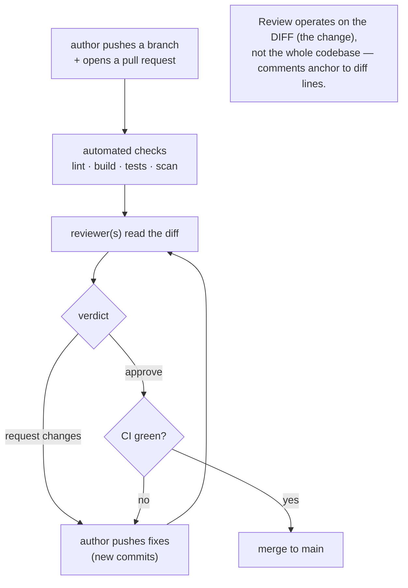

## In simple terms

**Code review** is the practice of having another engineer read your proposed change before it's merged. They check for bugs, ask questions, suggest improvements, and learn what's changing in the codebase. Done well, it catches issues no test would have caught and makes the whole team smarter.

## The Visual Map



## More detail

The dominant workflow is the **pull request** (or merge request) on GitHub, GitLab, or Bitbucket:

1. A developer pushes a branch and opens a PR with a description.
2. Automated checks run (lint, tests, security scans).
3. One or more reviewers read the diff, comment, and either approve or request changes.
4. The author addresses feedback in new commits.
5. Once approved and green, the PR is merged.

**Good reviewers** look for correctness (edge cases, off-by-one), design fit, test coverage, readability, safety (concurrency, security, error handling), and — only when it matters — performance. They *avoid* bikeshedding style (let formatters and linters decide), "I'd have written it differently" without a concrete reason, and demanding everything in one round.

**Good authors** keep PRs small and focused (a few hundred lines, one logical change), write a clear description (what changed, why, what to look at first), self-review before requesting review, and respond to every comment — even just "done" or "good point, fixed in 3a1b9".

## Under the Hood

Review tools operate on a **unified diff**, and a review comment is *anchored to a line in that diff*. Here is how a tool maps each diff line to a new-file line number, so a comment can attach to exactly the right place:

```python
#!/usr/bin/env python3
"""How a PR comment anchors to a diff line: walk the hunk, track line numbers."""
import re

diff = '''@@ -8,7 +8,7 @@ def withdraw(balance, amount):
     if amount <= 0:
         raise ValueError("amount must be positive")
-    if amount > balance:
+    if amount >= balance:
         raise ValueError("insufficient funds")
     balance -= amount
     return balance'''

lines = diff.splitlines()
new_line = int(re.search(r'\+(\d+)', lines[0]).group(1))   # hunk starts at new-file line 8

print(f"{'newln':>5}  {'kind':7} code")
for line in lines[1:]:
    tag, text = line[0], line[1:]
    if tag == '+':                       # added line: exists in the new file
        print(f"{new_line:>5}  added   {text}"); new_line += 1
    elif tag == '-':                     # removed: no new-file line number
        print(f"{'-':>5}  removed {text}")
    else:                                # context: present in both
        print(f"{new_line:>5}  context {text}"); new_line += 1

print("\nreview comment -> new-file line 10:")
print("  '>= rejects withdrawing your exact balance; this should stay >'")
```

The changed line lands on new-file **line 10**, which is the anchor a reviewer's comment attaches to — and the bug is real: `>=` makes withdrawing your *entire* balance raise "insufficient funds." This line-anchoring over a diff is exactly how GitHub and GitLab thread review comments.

## Engineering Trade-offs

**Thoroughness vs. velocity**
Deep review catches more bugs and design problems, but slow or nitpicky review becomes a bottleneck that frustrates authors and delays delivery. The lever is *PR size*: small, focused diffs get fast, thorough review; giant PRs get rubber-stamped because no one can hold them in their head. Keeping changes small is the single biggest factor in review quality.

**Gatekeeping rigor vs. team throughput**
Requiring approvals enforces a quality bar and shared ownership, but mandatory multi-reviewer gates on every change can stall a team — especially if reviewers are a scarce senior few. Many teams scale this with lightweight rules (one approval for small changes, code-owners only for sensitive areas) to keep the gate without the jam.

**Synchronous vs. asynchronous review**
Asynchronous PR review fits distributed teams and lets reviewers batch their attention, but round-trips add latency (push, wait, address, wait again). Synchronous review — pair or mob programming — is real-time review with zero latency and instant knowledge transfer, at the cost of two-plus people on one task at once. Different trades for different work.

**Catching bugs vs. teaching and alignment**
Treating review purely as bug-hunting undervalues its biggest long-term payoffs: spreading knowledge so no module has a single owner, and propagating standards by example. But emphasising teaching can slow a specific PR. The healthiest reviews do both — and the DORA research finds peer review correlates with *both* higher delivery performance and better developer well-being, one of the few practices that improves both at once.

## Real-world examples

- An open-source contribution to a major project is almost entirely shaped by review feedback before it merges — review *is* the contribution process.
- A logic bug that would take an hour to debug in production is spotted in five seconds by a reviewer reading the diff — like the `>`/`>=` change above.
- **Pair and mob programming** are, in effect, continuous real-time code review.
- Google's well-documented review culture (small CLs, readability reviews, code owners) is widely cited as a model for scaling review across tens of thousands of engineers.

## Common misconceptions

- **"Review is for finding bugs."** It's at least as much about teaching, knowledge sharing, and design alignment; the bug-catching is almost a side effect of careful reading.
- **"Only senior people should review."** Anyone can leave a useful comment, and reviewing others' code is one of the fastest ways to learn a codebase and grow.
- **"Approving means I'm certain it's correct."** Review reduces risk; it doesn't prove correctness. That's why review and automated [testing](/t/testing) are complementary, not substitutes.

## Try it yourself

See the unit a reviewer actually works with — the diff. This creates a tiny repo, makes a change that introduces a subtle bug, and shows the `git diff` a reviewer would read:

```bash
# requires: git
tmp=$(mktemp -d); cd "$tmp"; git init -q
git config user.email d@e.com && git config user.name reviewer-demo

cat > bank.py << 'PY'
def withdraw(balance, amount):
    if amount > balance:
        raise ValueError("insufficient funds")
    return balance - amount
PY
git add bank.py && git commit -q -m "initial"

sed -i 's/amount > balance/amount >= balance/' bank.py    # introduce the bug
echo "--- the diff a reviewer sees: ---"
git --no-pager diff -- bank.py

cd /; rm -rf "$tmp"
```

The diff shows one line changing `>` to `>=`. A reviewer reading it should ask: "doesn't `>=` now reject withdrawing your exact balance?" — catching, in seconds, a bug that an example test for the boundary case might also miss. That focused diff is the entire surface area of a review.

## Learn next

- [Version control](/t/version-control) — review flows through branches and commits; the diff that review reads comes straight from here.
- [Git](/t/git) — the tool whose pull-request model structures nearly all modern code review.
- [Testing](/t/testing) — the automated half of a team's quality gate; review and tests catch different classes of problems.
