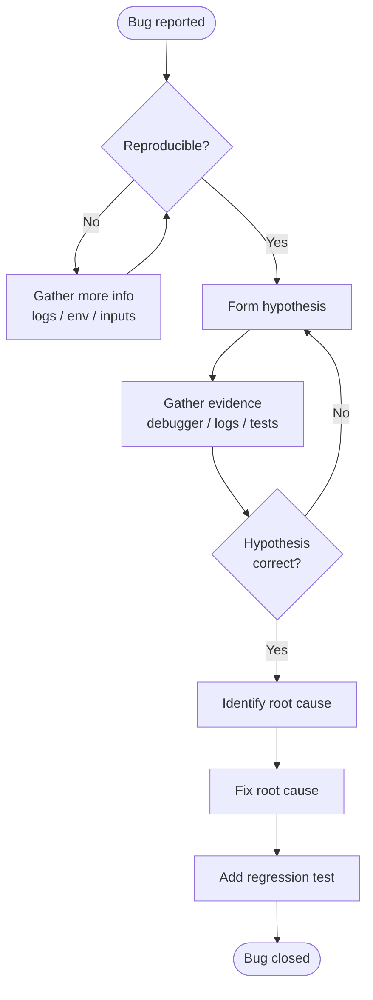

## In simple terms

A bug is when the program does something other than what you intended. Debugging is the art of figuring out exactly *why* — and it is one of the most underrated skills in software engineering. The process: reproduce the bug reliably, form a hypothesis about the cause, find evidence that confirms or refutes it, and repeat until you find the root cause (not just a symptom). Then fix the root cause, not the symptom.

## The Visual Map



## More detail

**The debugging process:**
1. **Reproduce** — can you make the bug happen reliably? A bug you can't reproduce is almost impossible to fix. Narrow down: which inputs trigger it? Which environment? Which version?
2. **Understand the expected behaviour** — what *should* the code do? Read the spec, the test, the documentation.
3. **Hypothesize** — form a specific hypothesis about the cause: "I think the problem is in the date parsing when the year is a leap year."
4. **Gather evidence** — use a debugger, add logging, write a failing test, inspect state. Try to *falsify* your hypothesis.
5. **Binary search** — if you have a large space, bisect it. `git bisect` finds the commit that introduced a bug by binary-searching commits. Comment out half the code. Narrow down to the smallest failing case.
6. **Fix the root cause** — fix the *underlying* bug, not a workaround. Add a regression test so the bug cannot silently return.

**Debugger capabilities:**
- **Breakpoints** — pause execution at a specific line; inspect variables and call stack.
- **Stepping** — step into (enter function), step over (execute line), step out (finish current function).
- **Watch expressions** — monitor a variable's value continuously.
- **Conditional breakpoints** — break only when `i == 42`.
- **Post-mortem debugging** — analyse a core dump after a crash: `gdb ./program core`, `lldb --core core.dump`.
- **Remote debugging** — connect a debugger to a running process on another machine: gdbserver, `dlv` for Go, Python's `debugpy`.

**Printf/logging debugging:** adding print statements is the oldest technique and often fastest for simple bugs. Prefer structured logging (`logger.debug("state", {"user": id, "count": n})`) over bare prints in production code — it can be enabled dynamically without a redeploy.

**Common bug patterns:**
- **Off-by-one errors** — loop runs one too many or too few times.
- **Null/undefined dereference** — accessing a field on null.
- **Race conditions** — non-deterministic ordering of concurrent operations.
- **Integer overflow** — `int` wraps around to negative.
- **Mismatched assumption** — your code assumes a list is sorted, but it isn't.
- **Memory corruption** — writing beyond an array bound corrupts adjacent data (C/C++).

Effective debugging (using a debugger, systematic hypothesis testing, binary search) is dramatically faster than random trial-and-error. Studies suggest programmers spend 50% or more of their time debugging, yet it is rarely taught explicitly as a skill.

**Scientific method applied:** never make two changes at once — you won't know which one fixed it. Keep notes. The best debuggers reason most carefully about what evidence implies.

**Rubber duck debugging:** explaining the problem aloud forces you to articulate your assumptions precisely — which frequently reveals the bug before the explanation is finished.

## Under the Hood

Python exposes its tracing mechanism via `sys.settrace` — the same hook that debuggers like `pdb` build on. Every time the interpreter reaches a new line, it calls the tracer function with the current stack frame:

```python
import sys

def tracer(frame, event, arg):
    if event == "line":
        # frame.f_locals is a snapshot of all local variables
        locals_snapshot = {k: v for k, v in frame.f_locals.items()}
        print(f"  line {frame.f_lineno:3}: {locals_snapshot}")
    return tracer  # return self to keep tracing

def sum_list(nums):
    total = 0
    for n in nums:
        total += n
    return total

sys.settrace(tracer)
result = sum_list([10, 20, 30])
sys.settrace(None)
print(f"Result: {result}")
```

This is how `pdb.set_trace()` works at the Python level. At the C level, debuggers use platform-specific mechanisms: the `INT 3` (0xCC) instruction on x86 overwrites one byte of code and triggers a CPU exception, which the OS routes to the attached debugger.

## Engineering Trade-offs

**Interactive debugger (breakpoints + stepping) vs printf/logging:**
- Debugger lets you inspect *any* state at runtime without modifying the code; pausing execution on a server or in a race-condition scenario is often impractical.
- Printf/logging is always available, works in production, and creates a permanent audit trail — but you must know in advance what to log.
- Structured logging (with log levels) is the production-safe compromise: high-verbosity logging at `DEBUG` level is compiled in but gated off, enabled on demand.

**Binary search (bisect) vs systematic stepping:**
- `git bisect` finds a regression in O(log n) commits; stepping through code finds a bug in O(depth of call stack). Use bisect for "worked before, broken now"; use stepping for "never worked."
- For large codebases, hypothesis-driven bisection ("is the bug in the network layer?") beats exhaustive stepping.

**Address Sanitizer / Valgrind vs pure runtime debugging:**
- ASAN catches memory bugs (buffer overflow, use-after-free) at the point of occurrence — not where the corruption manifests, which may be much later. ~2× performance overhead in tests; not usable in production.
- Valgrind's memcheck is more thorough but ~20–50× slower; suited for offline analysis only.

**Regression tests as debugging artifacts:** a failing test that reproduces the bug is the most valuable debugging output — it documents the bug, proves the fix, and prevents recurrence. Debugging without writing a test is, at best, temporary.

## Real-world examples

- `git bisect run npm test` — automatically binary-searches thousands of commits to find the one that broke a test; used routinely in Linux kernel development.
- Chrome DevTools debugger: JavaScript breakpoints, call stack inspection, memory heap snapshots — the primary tool for frontend debugging.
- gdb with ASAN (Address Sanitizer): finds memory corruption bugs (buffer overflows, use-after-free) by instrumenting memory accesses at compile time.
- Valgrind: dynamic analysis tool that detects memory leaks and uninitialised memory reads in C/C++ programs.

## Common misconceptions

- **"Print statements are a bad debugging technique."** They are often the fastest path to understanding program state. The key is removing them after the fix (or replacing with proper logging).
- **"A bug fix that passes tests is correct."** It might fix the symptom without addressing the root cause. Always add a specific regression test that would have caught the original bug.

## Try it yourself

Binary search is the core of `git bisect` and of narrowing down a failing input. This script simulates the technique — finding the first value where a condition breaks:

```bash
python3 - <<'EOF'
def is_broken(n):
    return n * n > 1000  # simulates a threshold bug

lo, hi = 0, 100
iterations = 0
while lo < hi:
    mid = (lo + hi) // 2
    iterations += 1
    if is_broken(mid):
        hi = mid
    else:
        lo = mid + 1

print(f"First failing value: {lo}  ({lo}^2 = {lo*lo})")
print(f"Found in {iterations} iterations (linear scan would need {lo} steps)")
EOF
```

## Learn next

- [Observability](/t/observability) — structured logging, tracing, and metrics tell you what's happening in production when you can't attach a debugger
- [Logging](/t/logging) — the practice of recording events at runtime; good log structure makes post-mortem debugging far faster
- [Test-driven development](/t/test-driven-development) — writing a failing test *before* fixing a bug is the cleanest way to confirm root cause and prevent regression
