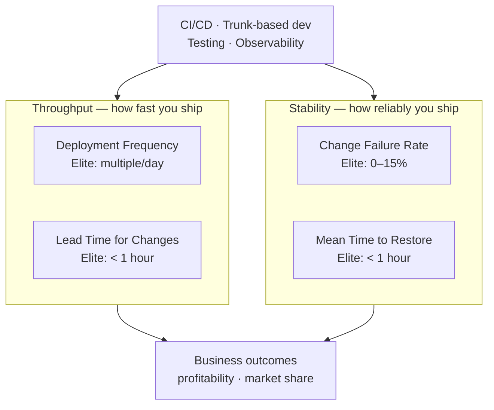

## In simple terms

How do you know if your engineering team is improving? DORA (DevOps Research and Assessment) identified four metrics through six years of research (the State of DevOps Reports) that distinguish elite software delivery teams from low performers: how often you deploy, how quickly changes go from commit to production, how often deployments fail, and how fast you recover from failures. Elite teams deploy multiple times per day with under 15% failure rate; low performers deploy once a month and take a week to recover from failures.

## The Visual Map



## More detail

**The four DORA metrics:**

**1. Deployment Frequency (DF):** how often does your team deploy code to production? Elite: on-demand, multiple per day. High: once per week to once per month. Low: once per month to once per six months. Frequent deployments reduce batch size — smaller changes equal less risk and easier rollback — and force automation.

**2. Lead Time for Changes (LTFC):** elapsed time from code committed to running in production. Includes code review, CI pipeline, staging, deployment. Elite: under 1 hour. High: 1 day to 1 week. Low: 1 month to 6 months. Long lead times hide feedback; developers don't learn whether their change worked until days later.

**3. Change Failure Rate (CFR):** percentage of deployments that cause a production incident requiring a hotfix, rollback, or patch. Elite: 0–15%. High: 16–30%. Low: 46–60%. High CFR indicates insufficient testing or review. Elite teams deploy more *and* have lower failure rates — automation and testing quality are the lever.

**4. Mean Time to Restore (MTTR):** how long to recover from a production incident. Elite: under 1 hour. High: under 1 day. Low: 1 week to 1 month. MTTR is determined by observability, runbooks, on-call process, and deployment automation (easy rollback).

**The research finding:** DORA's research (2014–present, now part of Google Cloud) found that elite performance on all four metrics is strongly correlated with:
- Organisational performance (profitability, market share, ROI on IT investment).
- Employee wellbeing (burnout, satisfaction).
- Lean practices (trunk-based development, continuous testing, loosely coupled architecture).

**Fifth metric (2021 addition) — Reliability:** the original four focus on delivery; reliability covers SLO adherence once deployed. Elite teams measure and meet reliability SLOs.

**What to optimise first:** DF and LTFC are *capabilities* (how your pipeline is built). CFR and MTTR are *outcomes* that follow. Improve deployment automation → reduces LTFC. Better testing and code review → reduces CFR. Better observability and on-call process → reduces MTTR.

**Trunk-based development** is one of the strongest predictors of elite DORA performance: committing directly to main or using very short-lived branches (under 1 day) eliminates integration pain and keeps LTFC low. Long-lived feature branches inflate LTFC and cause merge debt.

DORA metrics are the empirically validated framework for measuring software delivery effectiveness. Unlike vanity metrics (lines of code, story points, velocity), DORA metrics predict business outcomes and provide a shared vocabulary for engineering leadership conversations about investment in CI/CD, testing, and on-call processes.

## Under the Hood

This script simulates 30 days of deployment telemetry and computes all four DORA metrics — the same calculation any DORA dashboard (SPACE, Accelerate, LinearB) does against real deployment logs:

```python
#!/usr/bin/env python3
import random
from datetime import datetime, timedelta

random.seed(42)
start = datetime(2026, 5, 17)
deployments = []

for day in range(30):
    for _ in range(random.randint(2, 4)):   # 2–4 deploys per day
        deploy = start + timedelta(days=day, hours=random.randint(8, 18))
        commit = deploy - timedelta(minutes=random.randint(20, 90))
        failed = random.random() < 0.08    # 8% failure rate
        mttr   = random.randint(5, 45) if failed else 0
        deployments.append({
            "lead_time_min": (deploy - commit).seconds // 60,
            "failed": failed,
            "mttr_min": mttr,
        })

n = len(deployments)
failures = [d for d in deployments if d["failed"]]
print("=== DORA Metrics (30-day window) ===")
print(f"Deployment Frequency : {n/30:.1f}/day      (elite ≥ 1/day)")
print(f"Lead Time for Changes: {sum(d['lead_time_min'] for d in deployments)/n:.0f} min avg  (elite < 60 min)")
print(f"Change Failure Rate  : {len(failures)/n*100:.1f}%          (elite < 15%)")
if failures:
    avg_mttr = sum(d['mttr_min'] for d in failures) / len(failures)
    print(f"Mean Time to Restore : {avg_mttr:.0f} min avg  (elite < 60 min)")
```

## Engineering Trade-offs

**What DORA gets right:**
- Grounded in empirical research across 30,000+ practitioners — not consultant opinion.
- The four metrics are *balanced*: you cannot game deployment frequency without hurting CFR, so the system resists Goodhart's Law better than single-metric targets.
- They correlate with business outcomes, giving engineering teams a credible argument for investment in tooling and automation.

**Where DORA is limited:**
- **Causal direction is fuzzy:** high performers have good metrics because they have good practices, but measuring the metrics doesn't cause the improvement. The practices (CI/CD, testing, TBD) are the actual levers.
- **Measurement is non-trivial:** LTFC requires linking commits to deployments across repos, pipelines, and environments — non-trivial in a polyrepo or with canary deployments.
- **CFR definition varies:** a feature flag rollout that causes a bug is a deployment; so is a config change. Teams define "incident" differently; numbers aren't directly comparable across organisations.
- **MTTR penalises rare, deep outages:** a team with 1 outage/year that takes 2 hours to fix scores worse than a team with 12 outages that each take 30 minutes. Both are defensible.
- **Not applicable below a certain scale:** a solo developer's personal project doesn't need DORA dashboards.

## Real-world examples

- Google's DORA team surveys 30,000+ practitioners annually; the State of DevOps Report is the primary industry benchmark.
- Google Cloud's research found that elite performers are 6× more likely to exceed their organisational performance goals.
- Netflix publishes deployment frequency (thousands per day) and MTTR (minutes) as cultural benchmarks.
- GitHub's own engineering team tracks DORA metrics; they deploy 200+ times/day to github.com.

## Common misconceptions

- **"High deployment frequency means more outages."** The research shows the opposite: elite teams deploy more *and* have lower failure rates, because their automation and testing are better.
- **"DORA metrics are only for large companies."** A two-person startup can track LTFC and CFR; the benefit of fast feedback and low failure rate applies at any scale.

## Try it yourself

Edit the four numbers below to assess your team's DORA tier:

```bash
python3 - <<'EOF'
your_metrics = {
    "Deployment frequency (deploys/day)": 2.5,
    "Lead time for changes (hours)":      0.7,
    "Change failure rate (%)":            5.0,
    "Mean time to restore (hours)":       0.5,
}

thresholds = {
    "Deployment frequency (deploys/day)": ([1.0, 1/7, 1/30], True),
    "Lead time for changes (hours)":      ([1, 24, 168],      False),
    "Change failure rate (%)":            ([15, 30, 45],      False),
    "Mean time to restore (hours)":       ([1, 24, 168],      False),
}
labels = ["Elite", "High", "Medium", "Low"]

print(f"{'Metric':<42} {'Value':>8}  Tier")
print("-" * 60)
for name, value in your_metrics.items():
    bounds, higher_better = thresholds[name]
    tier = "Low"
    for i, bound in enumerate(bounds):
        if (higher_better and value >= bound) or (not higher_better and value <= bound):
            tier = labels[i]
            break
    print(f"{name:<42} {value:>8}  {tier}")
EOF
```

## Learn next

- [Chaos engineering](/t/chaos-engineering) — deliberately injecting failures to build confidence and lower MTTR before incidents happen unexpectedly
- [Error budget](/t/error-budget) — the SRE complement to DORA: quantifies how much unreliability is acceptable and makes the CFR/MTTR trade-off explicit
- [Toil](/t/toil) — the manual, repetitive operational work that inflates MTTR and LTFC; eliminating toil is the operational path to elite DORA scores
