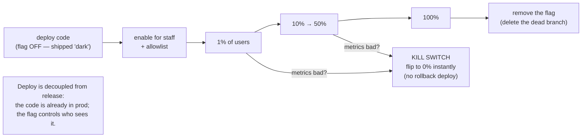

## In simple terms

A **feature flag** (or feature toggle) is an `if` statement wired to a switch you can flip without changing code. Instead of "deploy the new checkout flow and everyone gets it instantly," you deploy it *behind a flag* that's off, then turn it on — for yourself, for 1% of users, for everyone — whenever you choose. The big idea: **deploying code and releasing a feature become two separate actions.** Code ships to production dark, gets switched on gradually, and can be switched off instantly if something goes wrong.

## The Visual Map



## More detail

At its simplest a flag is a boolean checked at runtime:

```
if (flags.isEnabled("new-checkout", user)) {
  renderNewCheckout();
} else {
  renderOldCheckout();
}
```

The power comes from *where the value comes from* — a configuration service that can target by user, percentage, region, or plan, changeable in real time. That enables several patterns: **gradual rollout** (1% → 10% → 100%, watching metrics — closely related to [canary releases](/t/deployment)), **kill switch** (instantly disable a misbehaving feature with no rollback deploy), **trunk-based development** (merge unfinished work behind an off flag, avoiding long-lived branches), **A/B testing** (variants to different cohorts), and **entitlements** (gate premium features by tier).

Flags come in flavours with very different lifespans: short-lived **release** flags (delete after rollout) versus long-lived **ops** and **permission** flags. The main hazard is **flag debt** — old flags that linger create a combinatorial explosion of untested code paths, a concrete form of [technical debt](/t/technical-debt) — so disciplined teams track and remove them.

## Under the Hood

The trick to percentage rollouts is **consistent bucketing**: hash the flag name plus the user id into a stable 0–99 bucket, and enable the flag when the bucket is below the rollout percentage. The same user always lands in the same bucket, so they never flicker between old and new as you ramp up:

```python
#!/usr/bin/env python3
"""Percentage rollout via consistent hashing — the core of every flag system."""
import hashlib

def is_enabled(flag, user_id, percent):
    h = hashlib.sha1(f"{flag}:{user_id}".encode()).hexdigest()
    bucket = int(h, 16) % 100          # stable 0..99 for this (flag, user)
    return bucket < percent            # in the rollout iff below the threshold

flag = "new-checkout"
users = [f"user{i}" for i in range(1000)]
for pct in [0, 10, 50, 100]:
    enabled = sum(is_enabled(flag, u, pct) for u in users)
    print(f"  rollout {pct:3d}% -> {enabled}/1000 users enabled")

# A user's decision is STABLE as the rollout grows — no flickering:
u = "user42"
print("\nuser42 as rollout grows 10->50%:", [is_enabled(flag, u, p) for p in [10, 20, 30, 40, 50]])
```

About 10% of users are enabled at 10%, ~50% at 50%, all at 100% — and `user42` stays enabled once their bucket is crossed, because `bucket < percent` only ever flips on as `percent` rises. That monotonic, deterministic property is exactly what makes "ramp from 1% to 100%" a smooth, observable dial rather than a random reshuffle each step.

## Engineering Trade-offs

**Decoupling deploy from release vs. added complexity**
Flags let you ship code continuously and release on a separate schedule — derisking launches, enabling instant kill switches, and supporting trunk-based development. The cost is a permanent layer of indirection: behaviour now depends on runtime config, so "what does production actually do?" requires knowing the flag state, and reproducing a bug means reproducing the exact flag configuration.

**Safety of gradual rollout vs. flag debt**
Ramping behind a flag with a kill switch is far safer than a big-bang release. But every flag is a branch in the code, and `2^N` flags is `2^N` possible combinations — most never tested together. Release flags that aren't deleted after rollout become untested dead code paths and a maintenance tax. The practice only stays net-positive with disciplined cleanup.

**Targeting power vs. testing surface**
Rich targeting (by user, region, plan, percentage) is what makes flags more than a config boolean — it enables canaries, A/B tests, and entitlements. But each targeting dimension multiplies the states your system can be in, and bugs that only appear for "users in region X at 30% rollout on plan Y" are genuinely hard to find and reproduce.

**Build vs. buy**
A boolean read from config is trivial to build in-house. Real-time updates, audit logs, percentage targeting, and consistent bucketing across services are not — which is why platforms like LaunchDarkly exist. Small teams often start in-house and migrate once flag *management* (not the `if`) becomes the bottleneck.

## Real-world examples

- A team dark-launches a rewritten search backend behind a flag, ramps 1% → 100% over a week while watching latency and error rates, and flips it to 0% the instant a problem appears — no rollback deploy needed.
- **LaunchDarkly, Unleash, and Flagsmith** are dedicated feature-flag platforms; many companies also build a simple in-house version first.
- A **premium feature** shown only to paid users via a permission flag tied to their subscription tier — a long-lived flag, not a release toggle.
- **Trunk-based development** at scale (Google, Facebook) relies on flags so half-finished features can live on `main` switched off, avoiding long-lived merge-hell branches.

## Common misconceptions

- **"Feature flags are just config booleans."** The targeting, real-time updates, consistent bucketing, and lifecycle management are what make them a *practice* rather than a one-off `if`.
- **"Flags are free."** Each adds a code branch; left uncleaned, they accumulate into untested combinations and real maintenance cost — flag debt is a recognised failure mode.
- **"A kill switch is the same as a rollback."** A kill switch flips config in seconds with the code already deployed; a rollback re-deploys an old build (minutes, and it reverts *everything* in that build, not just the one feature).

## Try it yourself

See targeting and the kill switch in action: an allowlisted beta user gets the new experience even at 0% rollout, ordinary users flip on as the percentage rises, and 0% disables it for everyone instantly:

```bash
python3 - << 'EOF'
import hashlib
def bucket(flag, user):
    return int(hashlib.sha1(f"{flag}:{user}".encode()).hexdigest(), 16) % 100

def serve(flag, user, percent, allowlist=()):
    if user in allowlist:                       # explicit targeting beats percentage
        return "NEW (allowlisted)"
    return "NEW" if bucket(flag, user) < percent else "old"

flag = "search-v2"
for u in ["alice", "bob", "carol", "dave"]:
    print(f"  {u:6} @10%={serve(flag,u,10):3}  @50%={serve(flag,u,50):3}  "
          f"beta(allowlist alice)={serve(flag, u, 0, {'alice'})}")

print("  KILL SWITCH @0%:", [serve(flag, u, 0) for u in ['alice','bob','carol','dave']])
EOF
```

`alice` sees `NEW` via the allowlist even at 0%; `carol` flips from `old` to `NEW` as the rollout reaches 50% (her bucket is in that band); and the kill switch at 0% serves `old` to everyone — instantly, with no deploy. Notice each user's result at a given percentage is *deterministic* and stable: that's the consistent-bucketing property from the Under-the-Hood example doing its job.

## Learn next

- [CI/CD](/t/ci-cd) — flags complete the pipeline by decoupling *deploy* from *release*, so continuous deployment can ship code dark and release it safely later.
- [Deployment](/t/deployment) — gradual strategies like canary releases that flags implement at the application layer.
- [Technical debt](/t/technical-debt) — uncleaned flags are a concrete, compounding form of debt; understanding it explains why flag lifecycle discipline matters.
