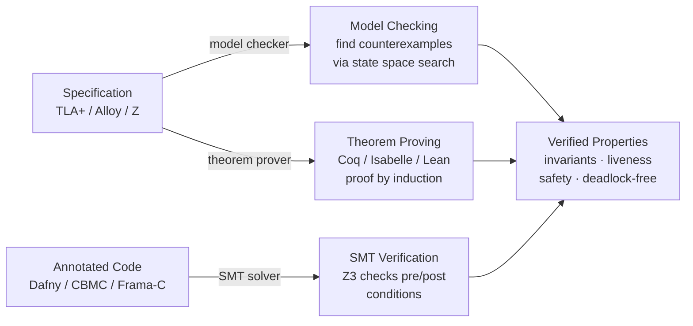

## In simple terms

Testing shows a program works for the cases you tried. Formal methods prove it works for *all* cases — using mathematics. You write a precise specification of what the system should do (in a language like TLA+, Z, or Alloy), and then use tools to check whether the implementation matches. Formal methods find bugs at the design level — distributed protocol race conditions, state machine deadlocks, invariant violations — before a single line of production code is written.

## The Visual Map



## More detail

Formal methods span a spectrum of rigour and tool support:

**Lightweight formal methods (specification and model checking):**
- **TLA+ (Temporal Logic of Actions):** Leslie Lamport's language for specifying concurrent and distributed systems. You describe the system as a state machine with actions; TLC (the model checker) explores all reachable states and verifies invariants and temporal properties. AWS uses TLA+ to verify designs of S3, DynamoDB, and EBS protocols.
- **Alloy:** a relational modelling language based on first-order logic with a SAT-based model finder (Alloy Analyser). Good for modelling access control, data structures, and protocols. Bounded verification — finds counterexamples up to a given model size.
- **SPIN/Promela:** model checker for concurrent systems (process communication, mutual exclusion protocols). Verifies LTL (Linear Temporal Logic) properties.

**Heavyweight formal methods (theorem proving):**
- **Coq / Rocq:** dependent type theory proof assistant. CompCert (verified C compiler) and seL4 (verified microkernel) are verified in Coq. Proofs are machine-checked; the Coq kernel is the only trusted component.
- **Isabelle/HOL:** used for seL4 verification and the Formal Mathematics library. Higher-Order Logic with a powerful automation layer (Sledgehammer, auto).
- **Lean 4:** rapidly growing proof assistant with an ambitious goal (Lean Mathlib formalises undergraduate mathematics). Mathlib has ~130,000 theorem statements.

**SMT-based verification:**
- **Dafny:** a verifying programming language — annotate functions with pre/postconditions and loop invariants; Dafny compiles to verification conditions solved by Z3. Engineers write real code with formal annotations.
- **CBMC:** bounded model checker for C. Verifies absence of buffer overflows, division by zero, and user assertions for up to N loop iterations.
- **AWS Zelkova / IAM policy analysis:** Z3-based tool that formally verifies IAM policy properties ("can any principal outside our account access this S3 bucket?").

**The specification gap:** formal methods are most effective at finding design-level bugs — not implementation bugs. A TLA+ spec of a distributed protocol catches race conditions; the spec doesn't verify the Java implementation. Tools like Dafny bridge this gap by coupling spec and code.

**Cost-benefit:** lightweight formal methods (TLA+ for protocol design, Alloy for access control models) add days to weeks of upfront work and pay back by eliminating entire classes of distributed system bugs. Heavyweight methods (seL4-style Isabelle verification) require months to years and are justified only for safety-critical or security-critical components.

Formal methods are how the highest-assurance systems are built. seL4's verification means its security properties hold unconditionally — not "we tested a lot" but "we proved it." Increasingly, lightweight formal methods (TLA+, Dafny) are applicable to everyday engineering.

## Under the Hood

Model checking works by exhaustively exploring the state space of a system. This Python script implements a tiny model checker and verifies the mutual-exclusion property of a two-process lock protocol — the same class of check TLC performs on a TLA+ spec:

```python
from collections import deque

# State: (lock_holder, process_0_state, process_1_state)
# lock_holder: -1 = free, 0 or 1 = held by that process
# process states: 0=idle, 1=waiting, 2=critical
IDLE, WAIT, CRIT = 0, 1, 2

def transitions(state):
    lock, p0, p1 = state
    nexts = []
    # Process 0
    if p0 == IDLE:                       nexts.append((lock, WAIT, p1))
    if p0 == WAIT and lock == -1:        nexts.append((0, CRIT, p1))
    if p0 == CRIT:                       nexts.append((-1, IDLE, p1))
    # Process 1 (symmetric)
    if p1 == IDLE:                       nexts.append((lock, p0, WAIT))
    if p1 == WAIT and lock == -1:        nexts.append((1, p0, CRIT))
    if p1 == CRIT:                       nexts.append((-1, p0, IDLE))
    return nexts

initial = (-1, IDLE, IDLE)
visited, queue = {initial}, deque([initial])
while queue:
    s = queue.popleft()
    for nxt in transitions(s):
        if nxt not in visited:
            visited.add(nxt)
            queue.append(nxt)

# Safety invariant: both processes cannot be in the critical section simultaneously
violations = [(l, p0, p1) for l, p0, p1 in visited if p0 == CRIT and p1 == CRIT]
print(f"States explored : {len(visited)}")
print(f"Mutex invariant : {'HOLDS' if not violations else f'VIOLATED: {violations}'}")
```

An equivalent TLA+ invariant looks like:
```
Mutex == ~(pc[0] = "critical" /\ pc[1] = "critical")
```

## Engineering Trade-offs

**Where formal methods win:**
- Proves safety for *all* inputs and interleavings — exhaustive in a way that testing cannot be for concurrent or distributed systems.
- Finds design-level bugs (protocol races, deadlocks, invariant violations) before a line of production code is written.
- AWS reported finding 7 bugs in existing distributed protocol designs using TLA+, some of which would have caused data loss.

**Where formal methods add friction:**
- **Specification cost:** writing a formal spec is engineering work; maintaining spec-code sync is ongoing overhead.
- **Scalability (model checking):** state space explosion — a 10-process system may have 10^20 states. Partial-order reduction and abstraction help but don't eliminate the problem.
- **Scalability (theorem proving):** seL4's proof took ~11 person-years. Proof maintenance across kernel versions is expensive.
- **Specification gap:** a verified spec is only as correct as the spec itself. The spec can be wrong; the proof only shows the implementation matches the spec.
- **Skill barrier:** TLA+ is learnable; Coq/Isabelle proofs require significant investment. Most engineering teams will not write machine-checked proofs outside safety-critical domains.

**Rule of thumb:** TLA+ / Alloy for protocol and access-control design is within reach of any senior engineer. Full theorem-proving verification is justified for security kernels, safety-critical firmware, and cryptographic primitives.

## Real-world examples

- AWS uses TLA+ to verify every distributed protocol before implementation; engineers found 7 bugs in existing designs that would have caused data loss.
- seL4 microkernel: 9,000 lines of C formally verified in 200,000 lines of Isabelle proof; verifying from scratch takes 7+ hours.
- CompCert (verified C compiler) is used in aviation software (Airbus A350) where compiler bugs are unacceptable.
- Facebook/Meta uses Z3 for type-checking and analysis in Hack and the Infer static analysis tool.

## Common misconceptions

- **"Formal methods require PhDs to use."** TLA+ can be learned by a skilled engineer in a week. AWS engineers who are not formal methods researchers use it routinely for protocol design.
- **"Formal methods only verify the spec, not the code."** Dafny, CBMC, and Frama-C verify the actual code (with annotations). seL4's verification includes a proof that the C implementation refines the abstract specification.

## Try it yourself

Run the model checker from *Under the Hood* — it explores every reachable state of a 2-process mutex and verifies the safety invariant:

```bash
python3 - <<'EOF'
from collections import deque

IDLE, WAIT, CRIT = 0, 1, 2

def transitions(lock, p0, p1):
    nexts = []
    if p0 == IDLE:                 nexts.append((lock, WAIT, p1))
    if p0 == WAIT and lock == -1:  nexts.append((0, CRIT, p1))
    if p0 == CRIT:                 nexts.append((-1, IDLE, p1))
    if p1 == IDLE:                 nexts.append((lock, p0, WAIT))
    if p1 == WAIT and lock == -1:  nexts.append((1, p0, CRIT))
    if p1 == CRIT:                 nexts.append((-1, p0, IDLE))
    return nexts

start = (-1, IDLE, IDLE)
visited, queue = {start}, deque([start])
while queue:
    s = queue.popleft()
    for n in transitions(*s):
        if n not in visited:
            visited.add(n)
            queue.append(n)

bad = [(l,p0,p1) for l,p0,p1 in visited if p0==CRIT and p1==CRIT]
print(f"States explored : {len(visited)}")
print(f"Mutex invariant : {'HOLDS' if not bad else f'VIOLATED in {len(bad)} states'}")
print()

# Now break the protocol: allow both to acquire without checking
def broken_transitions(lock, p0, p1):
    nexts = list(transitions(lock, p0, p1))
    if p0 == WAIT:  nexts.append((0, CRIT, p1))   # skip lock check!
    if p1 == WAIT:  nexts.append((1, p0, CRIT))
    return nexts

visited2, queue2 = {start}, deque([start])
while queue2:
    s = queue2.popleft()
    for n in broken_transitions(*s):
        if n not in visited2:
            visited2.add(n)
            queue2.append(n)

bad2 = [(l,p0,p1) for l,p0,p1 in visited2 if p0==CRIT and p1==CRIT]
print("After removing lock check:")
print(f"States explored : {len(visited2)}")
print(f"Mutex invariant : {'HOLDS' if not bad2 else f'VIOLATED in {len(bad2)} states'}")
EOF
```

## Learn next

- [Formal verification](/t/formal-verification) — the broader practice of verifying software correctness, of which model checking and theorem proving are specific techniques
- [Type theory](/t/type-theory) — the logical foundation shared by proof assistants like Coq and Lean; propositions-as-types connects logic and programming language theory
- [Lambda calculus](/t/lambda-calculus) — the mathematical model of computation that underpins functional programming languages and proof assistant core calculi
